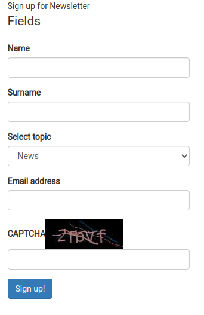

# Step 5 — Create a newsletter form

!!! tip
    You can find all filed used and modified in this step on [GitHub.](ADD)

The final step of this tutorial assists you in adding to the home page a Form block for signing up to a newsletter.

### Add a Form block

Start with creating a Form Content item.
In the **Forms Panel**, click **Create** and select **Form**.
Enter the title, eg. "Sign up for Newsletter" and click **Create a form**.

In the Form Builder, add and configure (using the **Basic** and **Validation** tabs) the following form fields:

|Form field|Name|Required|Additional properties|
|-----|----|--------|---------------------|
|Single line input|Name|yes|Minimum length = 3|
|Single line input|Surname|no|Minimum length = 3|
|Dropdown|Select topic|yes|Options:</br>- News</br>- Tips </br> - Articles|
|Email|Email address|yes|—|
|Captcha|CAPTCHA|yes|—|
|Button|Sign up!|—|Action: Show a message</br>Message to display: Thank you!|

The configuration should look like this:


After adding all fields, go to the previous menu and click **Publish**.
Now you can edit the Page and add a Form block below the Random block.
Edit the block and select the form you created. Click **Submit**.

The Page should refresh with the Form block.



It clearly differs from the page design, so let's proceed with customizing the block's layout.

### Change the block template

First, add a new template for the Form block that will align it with the Random block.
Create an `app/resources/views/blocks/form/newsletter.html.twig` file:

``` html+twig
<div class="row">
    <div class="block-form {{ block_class }}">
        {{ fos_httpcache_tag('relation-location-' ~ locationId) }}
        {{ render(controller('ez_content:viewLocation', {
            'locationId': locationId,
            'viewType': 'embed'
        })) }}
        <style type="text/css">{{ block_style|raw }}</style>
    </div>
</div>
```

Append the new template to the block by adding to `app/config/layouts.yml`.
Add the following configuration under the `blocks` key at the same level as other block names, eg. `random`:

``` yaml hl_lines="3"
blocks:
#...
    form:
        views:
            newsletter:
                template: blocks/form/newsletter.html.twig
                name: Newsletter Form View
```

Now you have to apply the template to the block.
Go back to editing the Page.
Edit the Form block again, and in the **Design** tab, select the **Newsletter Form View**.
Click **Submit**.

The block remains unchanged, but the results will be visible when you add CSS styling.

### Change the field template 

At this point, you need to change the field template.
This will result in alternating the position and design of the Form fields.

Create an `app/resources/views/form_field.html.twig` file:

``` html+twig

    
    
        
        
        
            
                {{ form(form) }}
            
        
    

```

Next, assign the template to the Page.
In `app/config/views.yml`, at the same level as `pagelayout` and `user`, add:

``` yaml
ezpublish:
    system:
        site_group:
            field_templates:
                - { templates: "form_field.html.twig", priority: 30 }
```

Clear the cache by running `bin/console cache:clear` and refresh the Page to see the results.

### Configure the Form field

Before applying the final styling of the block, you need to configure the [CAPTCHA field](../../guide/extending_form_builder.md#captcha-field).
In `app/config/config.yml`, under the `gregwar_captcha` key, add the following configuration:

``` yaml
gregwar_captcha:
    width: 150
    invalid_message: Please, enter again.
    reload: true
    length: 4
   
```
The configuration resizes the CAPTCHA image (line 3), changes the error message (line 4), enables the user to reload the code (line 5), and changes shortens the code to four elements (line 6).

### Add stylesheet

The remaining step in configuring the block is adding the CSS styling.
Add the following code to `web/assets/css/style.css`:

``` css
/* Newsletter Form block */
.block-form {
    border: 2px solid #8b7f7b;
    border-radius: 5px;
    padding: 0 25px 25px 25px;
    margin-top: 15px;
}

.block-form .ezstring-field {
    display: inline-block;
    font-variant: small-caps;
    font-size: 1.2em;
    width: 100%;
    text-align: right;
    padding-top: 20px;
}

.block-form .col-form-label {
    display: none;
}

.block-form .form-group {
    font-variant: small-caps;
    font-size: 1em;
    margin-top: 12px;
}

.captcha_image {
    padding-left: 10px;
    padding-bottom: 10px;
}

.captcha_reload {
    font-variant: all-small-caps;
    padding-left: 5px;
}

.btn-primary {
    background-color: rgb(103,85,80);
    border-color: rgb(103,85,80);
    margin-top: 15px;
    margin-bottom: -20px;
}

.block-form h3 {
    font-variant: all-small-caps;
    text-align: center;
}
```

Your newsletter form block is ready.


### Manage the submissions

You can view all submissions in the Back Office.
Go to **Forms Panel**. From the Content Tree, select the Form and view the **Submissions** tab.
There, after selecting submission(s), click **Download** or **Delete**.
To see details about a submission, click **View**.


## Congratulations!

You have finished the tutorial and created your first customized Page.

You have learned how to:

- Create and customize a Page
- Make use of existing blocks and adapt them to your needs
- Plan content airtime using the Content Scheduler block
- Create custom blocks
- Use Forms and Form Builder
- Apply custom styling to blocks
- Configure a bundle


