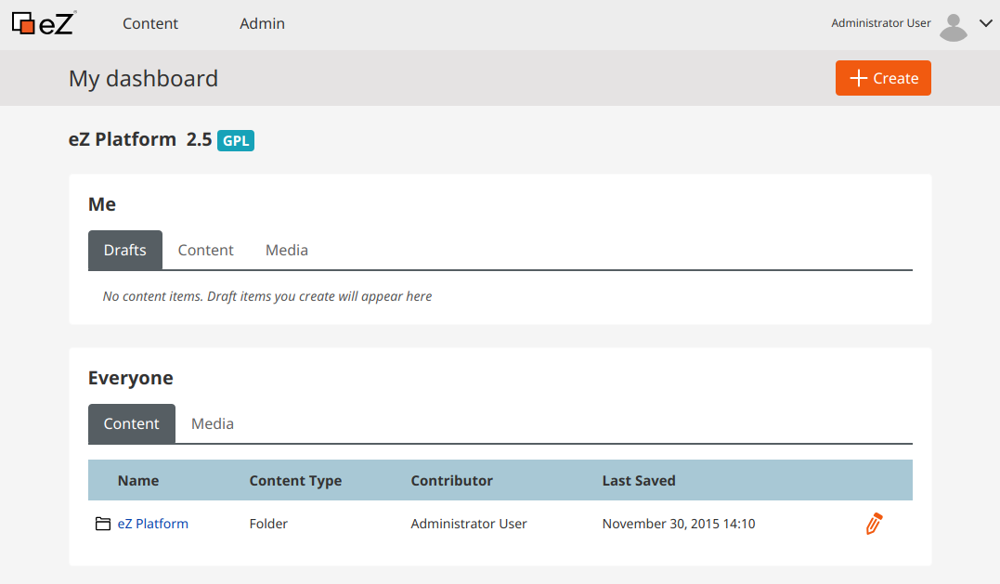
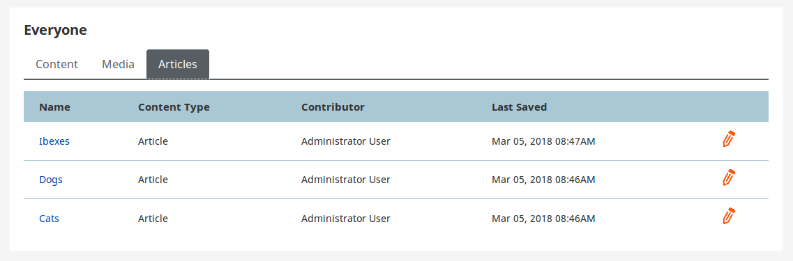

# Step 1 - Creating a Dashboard tab

The Dashboard is the front page that you visit after logging in to the Back Office.
You can also get to it from any other page by selecting the site logo in the top left corner.
By default, the Dashboard contains two blocks: "My content" and "Common content", which list Content items and Media.
The "Me" block additionally lists the current user's drafts.



In this step you will add a new tab to the "Common content" block in the Dashboard.
This tab, called "Articles", will list ten most recently modified Content items of the Content Type `article`.

!!! tip

    To be able to view the results of this step, create a few Content items of the type "Article".

## Register a service

First, add the following block to `config/services.yaml`. Place the block indented, under the `services` key:

``` yml
App\Tab\Dashboard\Everyone\EveryoneArticleTab:
    autowire: true
    autoconfigure: true
    public: false
    tags:
        - { name: ezplatform.tab, group: dashboard-everyone }
```

The tags indicate that this is a Dashboard tab that will be placed in the "Common content" block.

This configuration points to the `EveryoneArticleTab.php` file, which you now need to create.

## Create a tab

Create an `EveryoneArticleTab.php` file in `src/Tab/Dashboard/Everyone`:

``` php hl_lines="17 47"
<?php

namespace App\Tab\Dashboard\Everyone;

use eZ\Publish\API\Repository\SearchService;
use eZ\Publish\Core\Pagination\Pagerfanta\ContentSearchAdapter;
use EzSystems\EzPlatformAdminUi\Tab\AbstractTab;
use EzSystems\EzPlatformAdminUi\Tab\OrderedTabInterface;
use EzSystems\EzPlatformAdminUi\Tab\Dashboard\PagerContentToDataMapper;
use eZ\Publish\API\Repository\Values\Content\Query\Criterion;
use eZ\Publish\API\Repository\Values\Content\Query\SortClause;
use eZ\Publish\API\Repository\Values\Content\LocationQuery;
use Pagerfanta\Pagerfanta;
use Symfony\Contracts\Translation\TranslatorInterface;
use Twig\Environment;

class EveryoneArticleTab extends AbstractTab implements OrderedTabInterface
{
    /** @var PagerContentToDataMapper */
    protected $pagerContentToDataMapper;

    /** @var SearchService */
    protected $searchService;

    public function __construct(
        Environment $twig,
        TranslatorInterface $translator,
        PagerContentToDataMapper $pagerContentToDataMapper,
        SearchService $searchService
    ) {
        parent::__construct($twig, $translator);

        $this->pagerContentToDataMapper = $pagerContentToDataMapper;
        $this->searchService = $searchService;
    }

    public function getIdentifier(): string
    {
        return 'everyone-article';
    }

    public function getName(): string
    {
        return 'Articles';
    }

    public function getOrder(): int
    {
        return 300;
    }

    public function renderView(array $parameters): string
    {
        $page = 1;
        $limit = 10;

        $query = new LocationQuery();

        $query->sortClauses = [new SortClause\DateModified(LocationQuery::SORT_DESC)];
        $query->query = new Criterion\LogicalAnd([
            new Criterion\ContentTypeIdentifier('article'),
        ]);

        $pager = new Pagerfanta(
            new ContentSearchAdapter($query,
                $this->searchService
            )
        );
        $pager->setMaxPerPage($limit);
        $pager->setCurrentPage($page);

        return $this->twig->render('@ezdesign/ui/dashboard/tab/all_content.html.twig', [
            'data' => $this->pagerContentToDataMapper->map($pager),
        ]);
    }
}
```

!!! tip

    The tab extends `AbstractTab`.
    There are also [other tab types that you can extend](../../guide/extending/extending_tabs.md).

The tab also implements `OrderedTabInterface` (see line 17), which enables you to define the order in which the tab is displayed in the Dashboard.
This is done using the `getOrder` method (see line 47).

The rendering is done using the built-in `all_content.html.twig` template,
which ensures the tab looks the same as the existing tabs.

## Check results

!!! tip

    If you cannot see the results or encounter an error, clear the cache and reload the application.

At this point you can go to the Dashboard in the Back Office, select the site logo in the top left corner.
In the "Common content" block you can see the new "Articles" tab with the first ten articles in the Repository.


