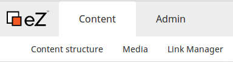
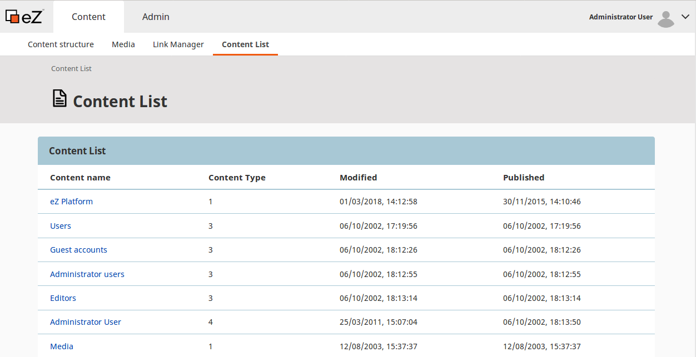

# Step 2 - Creating a top menu item

The next thing you will extend in this tutorial is the top menu.



You will add a "Content list" item under "Content". It will list all Content items existing in the Repository.
You will be able to filter the list by Content Types using a drop-down menu.

## Add an event subscriber

The first step is to add an event subscriber.

Create a `MyMenuSubscriber.php` file in `src/EventSubscriber`. It will be registered automatically:

``` php hl_lines="14 26"
[[= include_file('code_samples/back_office/menu/content_list/src/EventSubscriber/MyMenuSubscriber.php') =]]
```

This subscriber subscribes to the `ConfigureMenuEvent::MAIN_MENU` event (see line 14).

Line 26 points to the new route that you need to add to the routing file.

## Add routing

Add the following block to `config/routes.yaml`:

``` yaml hl_lines="5"
[[= include_file('code_samples/back_office/menu/content_list/config/routes.yaml', 4, 10) =]]
```

## Create a controller

As you can see in the code above, the next step is creating a controller that will take care of the article list view.

In `src/Controller` create an `AllContentListController.php` file (it will be registered automatically):

```php hl_lines="41"
[[= include_file('code_samples/back_office/menu/content_list/src/Controller/AllContentListController.php') =]]
```

The highlighted line 41 indicates the template that will be used to display the list.

## Add a template

Finally, create an `all_content_list.html.twig` file in `templates/list`:

``` html+twig
[[= include_file('code_samples/back_office/menu/content_list/templates/list/all_content_list.html.twig') =]]
```

## Check results

!!! tip

    If you cannot see the results or encounter an error, clear the cache and reload the application.

At this point you can go to the Back Office and under "Content" you will see the new "Content list" item.
Select it and you will see the list of all Content items in the Repository.


