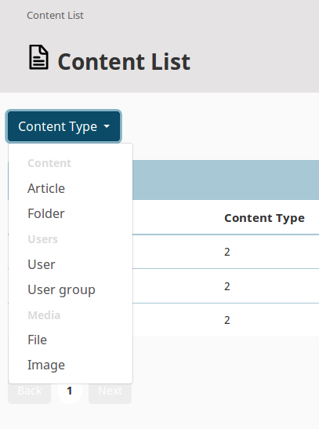

# Step 3a - Filtering the content list

In this step you will enable the content list to be filtered by Content Types.  The following tutorial requires the completed [Step 2 - Creating a content list](2_creating_a_content_list.md).

## Update routing

First, modify the route to the content list page.
In `config/routes.yaml` add the `contentTypeIdentifier` parameter and set its default value:

``` yml hl_lines="2 5"
all_content_list.list:
    path: /all_content_list/{page}/{contentTypeIdentifier}
    defaults:
        page: 1
        contentTypeIdentifier: false
        _controller: App\Controller\AllContentListController::listAction
```

## Modify the controller

Introduce changes to `src/Controller/AllContentListController.php`, so that it takes the selected Content Type into account.

First, provide the new `contentTypeIdentifier` parameter in the `listAction` function:
`public function listAction($contentTypeIdentifier = false, $page = 1)`.

Add the following block inside the `listAction` function, after defining `$criterions`:

``` php
if ($contentTypeIdentifier) {
    $criterions[] = new Criterion\ContentTypeIdentifier($contentTypeIdentifier);
}
```

After the lines setting the `$paginator` parameters, add the following code block:

``` php
$contentTypes = [];
$contentTypeGroups = $this->contentTypeService->loadContentTypeGroups();
foreach ($contentTypeGroups as $group) {
    $contentTypes[$group->identifier] = $this->contentTypeService->loadContentTypes($group);
}
```

Finally, provide the new parameter to `$this->render`, after `articles`:

``` php
'contentTypes' => $contentTypes,
```

??? tip "Complete controller code"

    ``` php hl_lines="25 33 34 35 45 46 47 48 49 54"
    <?php

    namespace App\Controller;

    use EzSystems\EzPlatformAdminUiBundle\Controller\Controller;
    use eZ\Publish\API\Repository\SearchService;
    use eZ\Publish\API\Repository\ContentTypeService;
    use eZ\Publish\API\Repository\Values\Content\Query\Criterion;
    use eZ\Publish\API\Repository\Values\Content\LocationQuery;
    use eZ\Publish\Core\Pagination\Pagerfanta\LocationSearchAdapter;
    use Pagerfanta\Pagerfanta;

    class AllContentListController extends Controller
    {
        private $searchService;

        private $contentTypeService;

        public function __construct(SearchService $searchService, ContentTypeService $contentTypeService)
        {
            $this->searchService = $searchService;
            $this->contentTypeService = $contentTypeService;
        }

        public function listAction($contentTypeIdentifier = false, $page = 1)
        {
            $query = new LocationQuery();

            $criterions = [
                new Criterion\Visibility(Criterion\Visibility::VISIBLE),
            ];

            if ($contentTypeIdentifier) {
                $criterions[] = new Criterion\ContentTypeIdentifier($contentTypeIdentifier);
            }

            $query->query = new Criterion\LogicalAnd($criterions);

            $paginator = new Pagerfanta(
                new LocationSearchAdapter($query, $this->searchService)
            );
            $paginator->setMaxPerPage(8);
            $paginator->setCurrentPage($page);

            $contentTypes = [];
            $contentTypeGroups = $this->contentTypeService->loadContentTypeGroups();
            foreach ($contentTypeGroups as $group) {
                $contentTypes[$group->identifier] = $this->contentTypeService->loadContentTypes($group);
            }

            return $this->render('list/all_content_list.html.twig', [
                'totalCount' => $paginator->getNbResults(),
                'articles' => $paginator,
                'contentTypes' => $contentTypes,
            ]);
        }
    }
    ```

## Change the template

The last thing to do is to update the template by adding a drop-down menu for choosing Content Types.

Add the following block to `templates/list/all_content_list.html.twig`
inside `<section class="container my-4">`:

``` html+twig
<div class="my-4">
    <div class="dropdown">
        <button class="btn btn-secondary dropdown-toggle" type="button" id="contentTypeFilter" data-toggle="dropdown" aria-haspopup="true" aria-expanded="false">
            Content Type
        </button>
        <div class="dropdown-menu" aria-labelledby="contentTypeFilter">
            
            <h6 class="dropdown-header">{{ group }}</h6>
                
                    <a class="dropdown-item" href="{{ path('all_content_list.list', { 'contentTypeIdentifier': type.identifier }) }}">{{ type.name }}</a>
                
            
        </div>
    </div>
</div>
```

??? tip "Complete template code"

    ``` html+twig hl_lines="20 21 22 23 24 25 26 27 28 29 30 31 32 33 34"
    

    {{ 'Content List'|trans }}

    
        
    

    
        
    

    
        <section class="container my-4">
            <div class="my-4">
                <div class="dropdown">
                    <button class="btn btn-secondary dropdown-toggle" type="button" id="contentTypeFilter" data-toggle="dropdown" aria-haspopup="true" aria-expanded="false">
                        Content Type
                    </button>
                    <div class="dropdown-menu" aria-labelledby="contentTypeFilter">
                        
                        <h6 class="dropdown-header">{{ group }}</h6>
                            
                                <a class="dropdown-item" href="{{ path('all_content_list.list', { 'contentTypeIdentifier': type.identifier }) }}">{{ type.name }}</a>
                            
                        
                    </div>
                </div>
            </div>
            <div class="ez-table-header">
                <div class="ez-table-header__headline">{{ "Content List"|trans }}</div>
            </div>
            <table class="table">
                <thead>
                <tr>
                    <th>{{ 'Content name'|trans }}</th>
                    <th>{{ 'Content Type'|trans }}</th>
                    <th>{{ 'Modified'|trans }}</th>
                    <th>{{ 'Published'|trans }}</th>
                </tr>
                </thead>
                <tbody>
                
                    <tr>
                        <td><a href={{path('ez_urlalias', {'contentId': article.contentInfo.id})}}>{{ ez_content_name(article.contentInfo) }}</a></td>
                        <td>{{ article.contentInfo.contentTypeId }}</td>
                        <td>{{ article.contentInfo.modificationDate|ez_full_datetime }}</td>
                        <td>{{ article.contentInfo.publishedDate|ez_full_datetime }}</td>
                    </tr>
                
                </tbody>
            </table>
            {{ pagerfanta(articles, 'ez') }}
        </section>
    
    ```

## Check results

!!! tip

    If you cannot see the results or encounter an error, clear the cache and reload the application.

At this point you should see a drop-down menu at the top of the content list.
Select a Content Type and the list will filter to show only Content items of this type.


