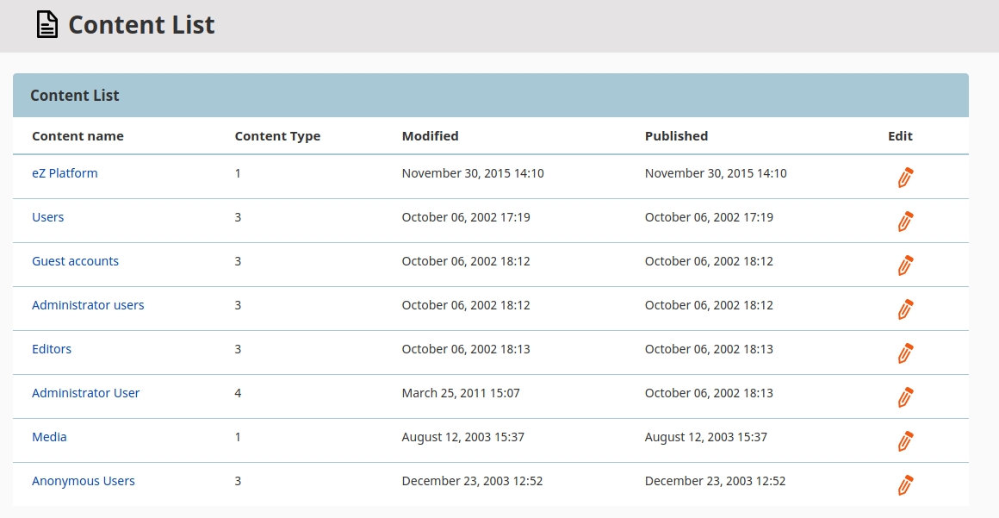

# Step 3b - Adding an edit button

In this step you will add an edit button to the content list. The following tutorial is requires the completed [Step 2 - Creating a top menu item](2_creating_a_content_list.md).

## Modify the controller

Introduce changes to `src/Controller/AllContentListController.php`, so that it enables content editing from the content list.

First, inject the `EzSystems\EzPlatformAdminUi\Form\Factory\FormFactory` service into your controller.

To do so, add the new `FormFactory $formFactory` parameter and the `$this->formFactory = $formFactory;` argument to the `__construct` function:

```php hl_lines="4 9"
[[= include_file('code_samples/back_office/menu/content_list_edit_button/src/Controller/AllContentListController.php', 21, 31) =]]
```

Next, provide a new use statement for `FormFactory` parameter:

```php
[[= include_file('code_samples/back_office/menu/content_list_edit_button/src/Controller/AllContentListController.php', 5, 6) =]]
```

Create an underlying form for handling requests for content editing.
Add the following code line after e.g. the lines setting the `$paginator` parameters:

```php
[[= include_file('code_samples/back_office/menu/content_list_edit_button/src/Controller/AllContentListController.php', 44, 45) =]]
```

Finally, provide the new parameter to `$this->render`. It can be added after e.g. `articles`:

``` php
[[= include_file('code_samples/back_office/menu/content_list_edit_button/src/Controller/AllContentListController.php', 48, 49) =]]
```

<details class="tip">
<summary>Complete controller code</summary>
```php hl_lines="6 20 25 30 45 49"
[[= include_file('code_samples/back_office/menu/content_list_edit_button/src/Controller/AllContentListController.php') =]]
```
</details>

## Change the template

The last thing to do is to add the edit button to the content list template.
All the code blocks below should be added to `templates/list/all_content_list.html.twig`.

First, add a `<th>{{ 'Edit'|trans }}</th>` header to the content list table inside `<section class="container my-4">`:

```html+twig  hl_lines="8"
[[= include_file('code_samples/back_office/menu/content_list_edit_button/templates/list/all_content_list.html.twig', 22, 32) =]]
```

Next, add the edit button as a new `<td>` tag inside `<section class="container my-4">`:

```html+twig
[[= include_file('code_samples/back_office/menu/content_list_edit_button/templates/list/all_content_list.html.twig', 39, 50) =]]
```

After that, add a hidden form for redirecting to the content edit page by adding the following code block inside ``, right under `<section class="container my-4">`:

```html+twig
[[= include_file('code_samples/back_office/menu/content_list_edit_button/templates/list/all_content_list.html.twig', 56, 64) =]]
```

Finally, add a JavaScript block with js listeners at the end of the twig file:

```html+twig
[[= include_file('code_samples/back_office/menu/content_list_edit_button/templates/list/all_content_list.html.twig', 66, 69) =]]
```

<details class="tip">
<summary>Complete template code</summary>
``` html+twig hl_lines="30 40 41 42 43 44 45 46 47 48 49 50 57 58 59 60 61 62 63 64 67 68 69"
[[= include_file('code_samples/back_office/menu/content_list_edit_button/templates/list/all_content_list.html.twig') =]]
```
</details>

## Check results

!!! tip

    If you cannot see the results or encounter an error, clear the cache and reload the application.

At this point you should see the edit button beside each Content item in the content list.
Select the edit button to change your Content items.


