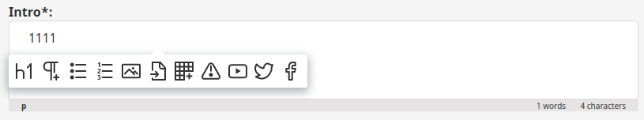
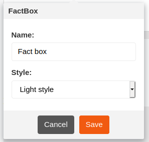

# Step 4 - Creating a custom tag

The RichText Field contains some built-in elements you can use, such as an image or a table.
You can also add custom tags that will enable you to add additional elements to RichText Fields.

In this step you will add a custom tag, which will enable you to create a special note box called a Factbox.

See full documentation of custom tags in [Extending the Online Editor](../../extending/extending_online_editor.md#custom-tags).

## Configure the custom tag

First, create a file that will contain the configuration for the custom tags.
Add file `custom_tags.yaml` to `config/packages`:

``` yaml hl_lines="5 25"
[[= include_file('code_samples/back_office/custom_tags/factbox/config/packages/custom_tags.yaml') =]]
```

The configuration first lists all custom tags that you have in the configuration (line 5) - in this case `factbox`.
`factbox` is then configured. Line 25 points to the template used to render the tag.
Then attributes of the custom tag are listed. These attributes can be set when adding the tag to a RichText Field.

## Create a template

Next, create the template that is referred to in the configuration.
In `templates/field_type/ezrichtext/custom_tag` add the following `factbox.html.twig` file:

``` html+twig
[[= include_file('code_samples/back_office/custom_tags/factbox/templates/field_type/ezrichtext/custom_tag/factbox.html.twig') =]]
```

## Add labels

Finally, add labels to the custom tag's editing interface.
Provide them in a `translations/custom_tags.en.yaml` file:

``` yaml
[[= include_file('code_samples/back_office/custom_tags/factbox/translations/custom_tags.en.yaml') =]]
```

## Check results

!!! tip

    If you cannot see the results or encounter an error, clear the cache and reload the application.

At this point you can go to the Back Office and start editing any Content with a RichText Field (e.g. a Folder or an Article).
Click Add (plus icon) on the left side of the RichText Field, and from the list of available tags select the FactBox tag icon (exclamation mark icon).



Provide a name and select a style.



You can now edit the content of the Factbox:


