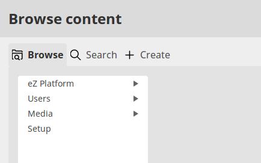
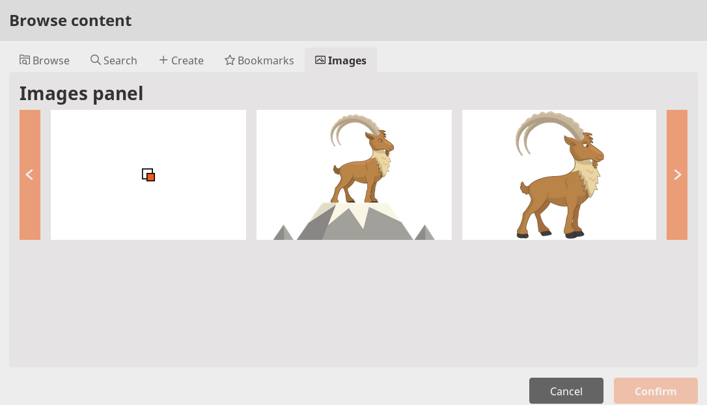

# Step 5 - Creating a UDW tab

The Universal Discovery Widget (UDW) is a separate React module.
By default it contains two tabs: Browse and Search.



In this step you will add a new tab called Images which will display all Content items of the type 'Image'
using a gallery of thumbnails.

!!! tip

    To be able to view the results of this step, create a few Content items of the type "Image".

## Add a tab

First add a `src/EzSystems/ExtendingTutorialBundle/Resources/public/js/add.tab.js` which governs the creation of the new tab:

``` js hl_lines="11"
(function (global, eZ) {
    eZ = eZ || {};
    eZ.adminUiConfig = eZ.adminUiConfig || {};
    eZ.adminUiConfig.universalDiscoveryWidget = eZ.adminUiConfig.universalDiscoveryWidget || {};
    eZ.adminUiConfig.universalDiscoveryWidget.extraTabs = eZ.adminUiConfig.universalDiscoveryWidget.extraTabs || [];

    eZ.adminUiConfig.universalDiscoveryWidget.extraTabs.push({
        id: 'images',
        title: 'Images',
        iconIdentifier: 'image',
        panel: eZ.modules.ImagesPanel, // React component that represents content of a tab
        attrs: {}
    });

})(window, window.eZ);
```

The highlighted line indicates the actual panel inside the tab that will display the images.

## Provide ReactJS development files

Next you need to provide a set of files that will later be compiled into the module:

- `images.service.js` handles fetching the data
- `images.panel.js` renders the panel inside the tab
- `images.list.js` renders the image list
- `image.js` renders a single image

Place all these files in `src/EzSystems/ExtendingTutorialBundle/Resources/ui-dev/src`:

### `images.service.js`

``` js
const handleRequestResponse = response => {
    if (!response.ok) {
        throw Error(response.statusText);
    }

    return response.json();
};

export const getImages = ({token, siteaccess, contentId}, callback) => {
    const body = JSON.stringify({
        ViewInput: {
            identifier: 'images',
            public: false,
            LocationQuery: {
                Criteria: {},
                FacetBuilders: {},
                SortClauses: {},
                Filter: { ContentTypeIdCriterion: 5 }
            }
        }
    });
    const request = new Request('/api/ezp/v2/views', {
        method: 'POST',
        headers: {
            'Accept': 'application/vnd.ez.api.View+json; version=1.1',
            'Content-Type': 'application/vnd.ez.api.ViewInput+json; version=1.1',
            'X-Siteaccess': siteaccess,
            'X-CSRF-Token': token,
        },
        body,
        mode: 'cors',
    });

    fetch(request)
        .then(handleRequestResponse)
        .then(callback)
        .catch(error => console.log('error:load:images', error));
};

export const loadImageContent = ({token, siteaccess, contentId}, callback) => {
    const body = JSON.stringify({
        ViewInput: {
            identifier: `image-content-${contentId}`,
            public: false,
            ContentQuery: {
                Criteria: {},
                FacetBuilders: {},
                SortClauses: {},
                Filter: { ContentIdCriterion: contentId }
            }
        }
    });
    const request = new Request('/api/ezp/v2/views', {
        method: 'POST',
        headers: {
            'Accept': 'application/vnd.ez.api.View+json; version=1.1',
            'Content-Type': 'application/vnd.ez.api.ViewInput+json; version=1.1',
            'X-Siteaccess': siteaccess,
            'X-CSRF-Token': token,
        },
        body,
        mode: 'cors',
    });

    fetch(request)
        .then(handleRequestResponse)
        .then(callback)
        .catch(error => console.log('error:load:images', error));
};
```

### `images.panel.js`

``` js
import React from 'react';
import ImagesList from './images.list';

const ImagesPanel = (props) => {
    const wrapperAttrs = {className: 'c-images-panel'};

    if (!props.isVisible) {
        wrapperAttrs.hidden = true;
    }

    return (
        <div {...wrapperAttrs}>
            <h1>Images panel</h1>
            <ImagesList {...props} />
        </div>
    );
};

export default ImagesPanel;
```

### `images.list.js`

``` js
import React, { Component } from 'react';
import Image from './image';
import { getImages } from './images.service';
import './css/images.list.css';

class ImagesList extends Component {
    constructor(props) {
        super(props);

        this.updateImagesState = this.updateImagesState.bind(this);
        this.showPrevPage = this.showPrevPage.bind(this);
        this.showNextPage = this.showNextPage.bind(this);
        this.state = {
            images: [],
            page: 0,
            itemsPerPage: 5,
            maxPageIndex: 0
        };
    }

    componentDidMount() {
        getImages(this.props.restInfo, this.updateImagesState);
    }

    updateImagesState(response) {
        const images = response.View.Result.searchHits.searchHit.map(item => item.value.Location);
        const perPage = this.state.itemsPerPage;
        const modulo = images.length % perPage;
        const maxPageIndex = modulo ? (images.length - modulo) / perPage : images.length / perPage - 1;

        this.setState({ images, maxPageIndex });
    }

    showPrevPage() {
        this.setState(state => Object.assign({}, state, {
            page: state.page > 0 ? state.page - 1 : 0
        }));
    }

    showNextPage() {
        this.setState(state => Object.assign({}, state, {
            page: state.maxPageIndex > state.page ? state.page + 1 : state.maxPageIndex
        }));
    }

    renderItems() {
        const attrs = {
            className: 'c-images-list__items',
            style: {
                transform: `translate3d(-${this.state.page * this.state.itemsPerPage * 316}px, 0, 0)`
            }
        };

        return (
            <div className="c-images-list__items-wrapper">
                <div {...attrs}>
                    {this.state.images.map(imageLocation => <Image key={imageLocation.id} location={imageLocation} restInfo={this.props.restInfo}/>)}
                </div>
            </div>
        );
    }

    renderPrevBtn() {
        const attrs = {
            className: 'c-images-list__btn--prev',
            onClick: this.showPrevPage
        };

        if (this.state.page <= 0) {
            attrs.disabled = true;
        }

        return (
            <div {...attrs}>
                <svg className="ez-icon">
                    <use xlinkHref="/bundles/ezplatformadminui/img/ez-icons.svg#caret-back"></use>
                </svg>
            </div>
        );
    }

    renderNextBtn() {
        const attrs = {
            className: 'c-images-list__btn--next',
            onClick: this.showNextPage
        };

        if (this.state.page >= this.state.maxPageIndex) {
            attrs.disabled = true;
        }

        return (
            <div {...attrs}>
                <svg className="ez-icon">
                    <use xlinkHref="/bundles/ezplatformadminui/img/ez-icons.svg#caret-next"></use>
                </svg>
            </div>
        );
    }

    render() {
        return (
            <div className="c-images-list">
                {this.renderPrevBtn()}
                {this.renderItems()}
                {this.renderNextBtn()}
            </div>
        );
    }
}

export default ImagesList;
```

### `image.js`

``` js
import React, { Component } from 'react';
import { loadImageContent } from './images.service';
import './css/image.css';

class Image extends Component {
    constructor(props) {
        super(props);

        this.updateVersionInfoState = this.updateVersionInfoState.bind(this);
        this.state = {
            content: null
        };
    }

    componentDidMount() {
        loadImageContent({ ...this.props.restInfo, contentId: this.props.location.ContentInfo.Content._id}, this.updateVersionInfoState);
    }

    updateVersionInfoState(response) {
        this.setState(state => Object.assign({}, state, {
            content: response.View.Result.searchHits.searchHit[0].value.Content
        }));
    }

    render() {
        let src = 'data:image/svg+xml;base64,PD94bWwgdmVyc2lvbj0iMS4wIiBzdGFuZGFsb25lPSJubyI/Pgo8IURPQ1RZUEUgc3ZnIFBVQkxJQyAiLS8vVzNDLy9EVEQgU1ZHIDEuMS8vRU4iICJodHRwOi8vd3d3LnczLm9yZy9HcmFwaGljcy9TVkcvMS4xL0RURC9zdmcxMS5kdGQiPgo8c3ZnIHdpZHRoPSI0MHB4IiBoZWlnaHQ9IjQwcHgiIHZpZXdCb3g9IjAgMCA0MCA0MCIgdmVyc2lvbj0iMS4xIiB4bWxucz0iaHR0cDovL3d3dy53My5vcmcvMjAwMC9zdmciIHhtbG5zOnhsaW5rPSJodHRwOi8vd3d3LnczLm9yZy8xOTk5L3hsaW5rIiB4bWw6c3BhY2U9InByZXNlcnZlIiBzdHlsZT0iZmlsbC1ydWxlOmV2ZW5vZGQ7Y2xpcC1ydWxlOmV2ZW5vZGQ7c3Ryb2tlLWxpbmVqb2luOnJvdW5kO3N0cm9rZS1taXRlcmxpbWl0OjEuNDE0MjE7IiB4PSIwcHgiIHk9IjBweCI+CiAgICA8ZGVmcz4KICAgICAgICA8c3R5bGUgdHlwZT0idGV4dC9jc3MiPjwhW0NEQVRBWwogICAgICAgICAgICBALXdlYmtpdC1rZXlmcmFtZXMgc3BpbiB7CiAgICAgICAgICAgICAgZnJvbSB7CiAgICAgICAgICAgICAgICAtd2Via2l0LXRyYW5zZm9ybTogcm90YXRlKDBkZWcpCiAgICAgICAgICAgICAgfQogICAgICAgICAgICAgIHRvIHsKICAgICAgICAgICAgICAgIC13ZWJraXQtdHJhbnNmb3JtOiByb3RhdGUoLTM1OWRlZykKICAgICAgICAgICAgICB9CiAgICAgICAgICAgIH0KICAgICAgICAgICAgQGtleWZyYW1lcyBzcGluIHsKICAgICAgICAgICAgICBmcm9tIHsKICAgICAgICAgICAgICAgIHRyYW5zZm9ybTogcm90YXRlKDBkZWcpCiAgICAgICAgICAgICAgfQogICAgICAgICAgICAgIHRvIHsKICAgICAgICAgICAgICAgIHRyYW5zZm9ybTogcm90YXRlKC0zNTlkZWcpCiAgICAgICAgICAgICAgfQogICAgICAgICAgICB9CiAgICAgICAgICAgIHN2ZyB7CiAgICAgICAgICAgICAgICAtd2Via2l0LXRyYW5zZm9ybS1vcmlnaW46IDUwJSA1MCU7CiAgICAgICAgICAgICAgICAtd2Via2l0LWFuaW1hdGlvbjogc3BpbiAxLjVzIGxpbmVhciBpbmZpbml0ZTsKICAgICAgICAgICAgICAgIC13ZWJraXQtYmFja2ZhY2UtdmlzaWJpbGl0eTogaGlkZGVuOwogICAgICAgICAgICAgICAgYW5pbWF0aW9uOiBzcGluIDEuNXMgbGluZWFyIGluZmluaXRlOwogICAgICAgICAgICB9CiAgICAgICAgXV0+PC9zdHlsZT4KICAgIDwvZGVmcz4KICAgIDxnIGlkPSJvdXRlciI+CiAgICAgICAgPGc+CiAgICAgICAgICAgIDxwYXRoIGQ9Ik0yMCwwQzIyLjIwNTgsMCAyMy45OTM5LDEuNzg4MTMgMjMuOTkzOSwzLjk5MzlDMjMuOTkzOSw2LjE5OTY4IDIyLjIwNTgsNy45ODc4MSAyMCw3Ljk4NzgxQzE3Ljc5NDIsNy45ODc4MSAxNi4wMDYxLDYuMTk5NjggMTYuMDA2MSwzLjk5MzlDMTYuMDA2MSwxLjc4ODEzIDE3Ljc5NDIsMCAyMCwwWiIgc3R5bGU9ImZpbGw6YmxhY2s7Ii8+CiAgICAgICAgPC9nPgogICAgICAgIDxnPgogICAgICAgICAgICA8cGF0aCBkPSJNNS44NTc4Niw1Ljg1Nzg2QzcuNDE3NTgsNC4yOTgxNSA5Ljk0NjM4LDQuMjk4MTUgMTEuNTA2MSw1Ljg1Nzg2QzEzLjA2NTgsNy40MTc1OCAxMy4wNjU4LDkuOTQ2MzggMTEuNTA2MSwxMS41MDYxQzkuOTQ2MzgsMTMuMDY1OCA3LjQxNzU4LDEzLjA2NTggNS44NTc4NiwxMS41MDYxQzQuMjk4MTUsOS45NDYzOCA0LjI5ODE1LDcuNDE3NTggNS44NTc4Niw1Ljg1Nzg2WiIgc3R5bGU9ImZpbGw6cmdiKDIxMCwyMTAsMjEwKTsiLz4KICAgICAgICA8L2c+CiAgICAgICAgPGc+CiAgICAgICAgICAgIDxwYXRoIGQ9Ik0yMCwzMi4wMTIyQzIyLjIwNTgsMzIuMDEyMiAyMy45OTM5LDMzLjgwMDMgMjMuOTkzOSwzNi4wMDYxQzIzLjk5MzksMzguMjExOSAyMi4yMDU4LDQwIDIwLDQwQzE3Ljc5NDIsNDAgMTYuMDA2MSwzOC4yMTE5IDE2LjAwNjEsMzYuMDA2MUMxNi4wMDYxLDMzLjgwMDMgMTcuNzk0MiwzMi4wMTIyIDIwLDMyLjAxMjJaIiBzdHlsZT0iZmlsbDpyZ2IoMTMwLDEzMCwxMzApOyIvPgogICAgICAgIDwvZz4KICAgICAgICA8Zz4KICAgICAgICAgICAgPHBhdGggZD0iTTI4LjQ5MzksMjguNDkzOUMzMC4wNTM2LDI2LjkzNDIgMzIuNTgyNCwyNi45MzQyIDM0LjE0MjEsMjguNDkzOUMzNS43MDE5LDMwLjA1MzYgMzUuNzAxOSwzMi41ODI0IDM0LjE0MjEsMzQuMTQyMUMzMi41ODI0LDM1LjcwMTkgMzAuMDUzNiwzNS43MDE5IDI4LjQ5MzksMzQuMTQyMUMyNi45MzQyLDMyLjU4MjQgMjYuOTM0MiwzMC4wNTM2IDI4LjQ5MzksMjguNDkzOVoiIHN0eWxlPSJmaWxsOnJnYigxMDEsMTAxLDEwMSk7Ii8+CiAgICAgICAgPC9nPgogICAgICAgIDxnPgogICAgICAgICAgICA8cGF0aCBkPSJNMy45OTM5LDE2LjAwNjFDNi4xOTk2OCwxNi4wMDYxIDcuOTg3ODEsMTcuNzk0MiA3Ljk4NzgxLDIwQzcuOTg3ODEsMjIuMjA1OCA2LjE5OTY4LDIzLjk5MzkgMy45OTM5LDIzLjk5MzlDMS43ODgxMywyMy45OTM5IDAsMjIuMjA1OCAwLDIwQzAsMTcuNzk0MiAxLjc4ODEzLDE2LjAwNjEgMy45OTM5LDE2LjAwNjFaIiBzdHlsZT0iZmlsbDpyZ2IoMTg3LDE4NywxODcpOyIvPgogICAgICAgIDwvZz4KICAgICAgICA8Zz4KICAgICAgICAgICAgPHBhdGggZD0iTTUuODU3ODYsMjguNDkzOUM3LjQxNzU4LDI2LjkzNDIgOS45NDYzOCwyNi45MzQyIDExLjUwNjEsMjguNDkzOUMxMy4wNjU4LDMwLjA1MzYgMTMuMDY1OCwzMi41ODI0IDExLjUwNjEsMzQuMTQyMUM5Ljk0NjM4LDM1LjcwMTkgNy40MTc1OCwzNS43MDE5IDUuODU3ODYsMzQuMTQyMUM0LjI5ODE1LDMyLjU4MjQgNC4yOTgxNSwzMC4wNTM2IDUuODU3ODYsMjguNDkzOVoiIHN0eWxlPSJmaWxsOnJnYigxNjQsMTY0LDE2NCk7Ii8+CiAgICAgICAgPC9nPgogICAgICAgIDxnPgogICAgICAgICAgICA8cGF0aCBkPSJNMzYuMDA2MSwxNi4wMDYxQzM4LjIxMTksMTYuMDA2MSA0MCwxNy43OTQyIDQwLDIwQzQwLDIyLjIwNTggMzguMjExOSwyMy45OTM5IDM2LjAwNjEsMjMuOTkzOUMzMy44MDAzLDIzLjk5MzkgMzIuMDEyMiwyMi4yMDU4IDMyLjAxMjIsMjBDMzIuMDEyMiwxNy43OTQyIDMzLjgwMDMsMTYuMDA2MSAzNi4wMDYxLDE2LjAwNjFaIiBzdHlsZT0iZmlsbDpyZ2IoNzQsNzQsNzQpOyIvPgogICAgICAgIDwvZz4KICAgICAgICA8Zz4KICAgICAgICAgICAgPHBhdGggZD0iTTI4LjQ5MzksNS44NTc4NkMzMC4wNTM2LDQuMjk4MTUgMzIuNTgyNCw0LjI5ODE1IDM0LjE0MjEsNS44NTc4NkMzNS43MDE5LDcuNDE3NTggMzUuNzAxOSw5Ljk0NjM4IDM0LjE0MjEsMTEuNTA2MUMzMi41ODI0LDEzLjA2NTggMzAuMDUzNiwxMy4wNjU4IDI4LjQ5MzksMTEuNTA2MUMyNi45MzQyLDkuOTQ2MzggMjYuOTM0Miw3LjQxNzU4IDI4LjQ5MzksNS44NTc4NloiIHN0eWxlPSJmaWxsOnJnYig1MCw1MCw1MCk7Ii8+CiAgICAgICAgPC9nPgogICAgPC9nPgo8L3N2Zz4K';
        let alt = 'Loading meta data ...';

        if (this.state.content) {
            const imageField = this.state.content.CurrentVersion.Version.Fields.field.find(field => field.fieldTypeIdentifier === 'ezimage').fieldValue;

            src = imageField.uri;
            alt = imageField.fileName;
        }

        return (
            <div className="c-image" data-title={alt} onClick={() => console.log(data)}>
                
            </div>
        );
    }
}

export default Image;
```

Finally, ensure that the new tab is styled by adding the following two files to `src/EzSystems/ExtendingTutorialBundle/Resources/ui-dev/src/css`:

#### `image.css`

``` css
.c-image {
    width: 300px;
    height: 200px;
    background: #fff;
    transition: box-shadow .3s ease-in-out;
    position: relative;
    cursor: pointer;
    display: flex;
}

.c-image:before {
    content: attr(data-title);
    display: flex;
    background: rgba(0,0,0,.75);
    color: #fff;
    width: 300px;
    align-items: center;
    justify-content: center;
    font-weight: 700;
    position: absolute;
    top: 0;
    left: 0;
    right: 0;
    bottom: 0;
    opacity: 0;
    padding: 1rem;
    transition: opacity .3s ease-in-out;
    overflow: hidden;
}

.c-image:hover:before,
.c-image:focus:before {
    opacity: 1;
}

.c-image__thumb {
    display: block;
    max-width: 300px;
    max-height: 200px;
    width: auto;
    height: auto;
    margin: auto;
}
```

#### `images.list.css`

``` css
.c-images-list {
    display: grid;
    grid-template-areas: 'prev list next';
    grid-template-columns: 32px 1fr 32px;
    grid-gap: 16px;
    overflow: hidden;
}

.c-images-list__items-wrapper {
    overflow: hidden;
    max-width: 1564px;
}

[class*="c-images-list__btn--"] {
    display: flex;
    align-items: center;
    justify-content: center;
    background: #f15a10;
    transition: background .2s ease-in-out, opacity .2s ease-in-out;
}

[class*="c-images-list__btn--"]:focus,
[class*="c-images-list__btn--"]:hover {
    background: #ab3f0a;
}

[class*="c-images-list__btn--"][disabled],
[class*="c-images-list__btn--"][disabled]:focus,
[class*="c-images-list__btn--"][disabled]:hover {
    background: #f15a10;
    opacity: .5;
}

[class*="c-images-list__btn--"] .ez-icon {
    fill: #fff;
}

.c-images-list__btn--prev {
    grid-area: prev;
}

.c-images-list__btn--next {
    grid-area: next;
}

.c-images-list__items {
    grid-area: list;
    display: flex;
    flex-wrap: nowrap;
    transition: transform .3s ease-in-out;
}

.c-images-list__items .c-image {
    flex: 0 0 300px;
}

.c-images-list__items .c-image + .c-image {
    margin-left: 1rem;
}
```

## Compile the files

Now you need to make the React module available (in umd version) in the `window` object in the browser.

Place the compiled files in `src/EzSystems/ExtendingTutorialBundle/Resources/public/js/modules`.

??? tip "How to compile the React module"

    If you are not familiar with compiling React modules, you can use the following steps:

    1. Copy the `webpack.*.js` files from `vendor/ezsystems/ezplatform-page-builder/src/bundle/ui-dev`.
    1. Copy the `package.json` and `.babelrc` files from the same folder to your project.
    1. Change values in the `entry` property in `webpack.*.js` to `./src/images.panel.js`, also define module name `ImagesPanel` instead of `PageBuilder` or `Timeline`.
    1. In the terminal, run `npm install`.
    1. Next, run `npm run build`.
    1. Include compiled files in the YAML config, where you can inject the file into any predefined placeholder in the `layout.html.twig` file.

## Add configuration

Next, ensure that the React modules will be correctly initialized.
To do this, add the following instructions to `src/EzSystems/ExtendingTutorialBundle/Resources/config/services.yml`.
This adds JavaScript files into specific zones inside the built-in `layout.html.twig` file.

ReactJS modules (the compiled files) should be placed in the `custom-admin-ui-modules` group,
and configuration in the `custom-admin-ui-config` group.

``` yaml
ezplatform.udw.image.panel.module.js:
    parent: EzSystems\EzPlatformAdminUi\Component\ScriptComponent
    arguments:
        $src: '/bundles/ezsystemsextendingtutorial/js/modules/ImagesPanel.module.js'
    tags:
        - { name: ezplatform.admin_ui.component, group: 'custom-admin-ui-modules' }

ezplatform.udw.add.tab.js:
    parent: EzSystems\EzPlatformAdminUi\Component\ScriptComponent
    arguments:
        $src: '/bundles/ezsystemsextendingtutorial/js/add.tab.js'
    tags:
        - { name: ezplatform.admin_ui.component, group: 'custom-admin-ui-config' }
```

Finally, make sure that the Symfony bundle configuration is imported. In `src/EzSystems/ExtendingTutorialBundle/DependencyInjection` add the following files:

#### `Configuration.php`

``` php
<?php

namespace EzSystems\ExtendingTutorialBundle\DependencyInjection;

use Symfony\Component\Config\Definition\Builder\TreeBuilder;
use Symfony\Component\Config\Definition\ConfigurationInterface;

/**
 * This is the class that validates and merges configuration from your app/config files.
 *
 * To learn more see {@link http://symfony.com/doc/current/cookbook/bundles/configuration.html}
 */
class Configuration implements ConfigurationInterface
{
    /**
     * {@inheritdoc}
     */
    public function getConfigTreeBuilder()
    {
        $treeBuilder = new TreeBuilder();
        $rootNode = $treeBuilder->root('ez_systems_udw_tab_tutorial');

        // Here you should define the parameters that are allowed to
        // configure your bundle. See the documentation linked above for
        // more information on that topic.

        return $treeBuilder;
    }
}
```

#### `EzSystemsExtendingTutorialExtension.php`

``` php
<?php

namespace EzSystems\ExtendingTutorialBundle\DependencyInjection;

use Symfony\Component\DependencyInjection\ContainerBuilder;
use Symfony\Component\Config\FileLocator;
use Symfony\Component\HttpKernel\DependencyInjection\Extension;
use Symfony\Component\DependencyInjection\Loader;

/**
 * This is the class that loads and manages your bundle configuration.
 *
 * @link http://symfony.com/doc/current/cookbook/bundles/extension.html
 */
class EzSystemsExtendingTutorialExtension extends Extension
{
    /**
     * {@inheritdoc}
     */
    public function load(array $configs, ContainerBuilder $container)
    {
        $configuration = new Configuration();
        $config = $this->processConfiguration($configuration, $configs);

        $loader = new Loader\YamlFileLoader($container, new FileLocator(__DIR__.'/../Resources/config'));
        $loader->load('services.yml');
    }
}
```

## Check results

!!! tip

    If you cannot see the results, clear the cache and reload the application.

At this point you can go to the Back Office and choose **Browse** under **Content/Content structure**.
In the UDW a new "Images" tab will appear, listing all Images from the Repository.


