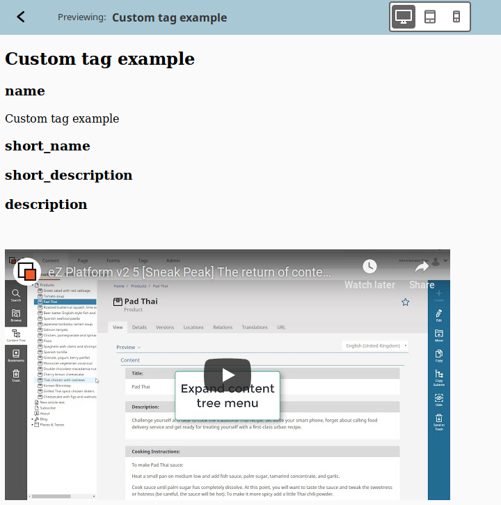

# Step 6 - Creating a custom tag

eZ Platform's RichText Field contains some built-in elements you can use, such as an image or a table.
You can also add custom tags that will enable you to add additional elements to RichText Fields.

In this step you will add a custom tag which will enable you to embed YouTube videos in Fields.

See full documentation of custom tags in [Extending the Online Editor](../../guide/extending/extending_online_editor#custom-tags).

## Configure the custom tag

First, create a file that will contain the configuration for the custom tags.
Add file `custom_tags.yml` to `src/EzSystems/ExtendingTutorialBundle/Resources/config`:

``` yaml hl_lines="5 10 12"
ezpublish:
    system:
        default:
            fieldtypes:
                ezrichtext:
                    custom_tags: [ezyoutube]

ezrichtext:
    custom_tags:
        ezyoutube:
            template: EzSystemsExtendingTutorialBundle:field_type/ezrichtext/custom_tag:ezyoutube.html.twig
            icon: '/bundles/ezplatformadminui/img/ez-icons.svg#video'
            attributes:
                title:
                    type: string
                    required: true
                    default_value: ''
                video_url:
                    type: string
                    required: true
                width:
                    type: number
                    required: true
                    default_value: 640
                height:
                    type: number
                    required: true
                    default_value: 360
                autoplay:
                    type: boolean
                    default_value: false
                align:
                    type: choice
                    required: false
                    default_value: left
                    choices: [left, center, right]
```

The configuration first lists all custom tags that you have in the configuration (line 5) - in this case `ezyoutube`.
`ezyoutube` is then configured. Line 10 points to the template used to render the tag.
Then attributes of the custom tag are listed. These attributes can be set when adding the tag to a RichText Field.

## Create a template

Next, create the template that is referred to in the configuration.
In `src/EzSystems/ExtendingTutorialBundle/Resources/views/field_type/ezrichtext/custom_tag` add the following `ezyoutube.html.twig` file:

``` html+twig
<div style="text-align: {{ params.align }};">
    <iframe
        type="text/html"
        width="{{ params.width }}"
        height="{{ params.height }}"
        src="{{ params.video_url|replace({'https://youtu.be/' : 'https://www.youtube.com/embed/'}) }}?autoplay={{ params.autoplay == 'true' ? 1 : 0 }}"
        frameborder="0">
    </iframe>
</div>
```

## Import configuration

Make sure that the configuration is imported.
Make the following changes to `src/EzSystems/ExtendingTutorialBundle/DependencyInjection/EzSystemsExtendingTutorialExtension.php`:

- Add the following `use` statememnts:

``` php
use Symfony\Component\Config\Resource\FileResource;
use Symfony\Component\DependencyInjection\Extension\PrependExtensionInterface;
use Symfony\Component\Yaml\Yaml;
```

- Add `implements PrependExtensionInterface` to the class name, so it looks like this:

`class EzSystemsExtendingTutorialExtension extends Extension implements PrependExtensionInterface`

- Add a `prepend` function:

``` php
public function prepend( ContainerBuilder $container )
{
    $loader = new Loader\YamlFileLoader($container, new FileLocator(__DIR__ . '/../Resources/config'));
    $loader->load('custom_tags.yml');
}
```

??? tip "Complete file"

    ``` php hl_lines="9 10 11 13 27 28 29 30 31"

    <?php

    namespace EzSystems\ExtendingTutorialBundle\DependencyInjection;

    use Symfony\Component\DependencyInjection\ContainerBuilder;
    use Symfony\Component\Config\FileLocator;
    use Symfony\Component\HttpKernel\DependencyInjection\Extension;
    use Symfony\Component\DependencyInjection\Loader;
    use Symfony\Component\Config\Resource\FileResource;
    use Symfony\Component\DependencyInjection\Extension\PrependExtensionInterface;
    use Symfony\Component\Yaml\Yaml;

    class EzSystemsExtendingTutorialExtension extends Extension implements PrependExtensionInterface
    {
        /**
         * {@inheritdoc}
         */
        public function load(array $configs, ContainerBuilder $container)
        {
            $configuration = new Configuration();
            $config = $this->processConfiguration($configuration, $configs);

            $loader = new Loader\YamlFileLoader($container, new FileLocator(__DIR__.'/../Resources/config'));
            $loader->load('services.yml');
        }

        public function prepend( ContainerBuilder $container )
        {
            $loader = new Loader\YamlFileLoader($container, new FileLocator(__DIR__ . '/../Resources/config'));
            $loader->load('custom_tags.yml');
        }
    }
    ```

## Add labels

Finally, add labels to the custom tag's editing interface.
Provide them in a `src/EzSystems/ExtendingTutorialBundle/Resources/translations/custom_tags.en.yaml` file:

``` yaml
ezrichtext.custom_tags.ezyoutube.label: Youtube
ezrichtext.custom_tags.ezyoutube.description: ''
ezrichtext.custom_tags.ezyoutube.attributes.autoplay.label: Autoplay
ezrichtext.custom_tags.ezyoutube.attributes.height.label: Height
ezrichtext.custom_tags.ezyoutube.attributes.title.label: Title
ezrichtext.custom_tags.ezyoutube.attributes.video_url.label: Video url
ezrichtext.custom_tags.ezyoutube.attributes.width.label: Width
ezrichtext.custom_tags.ezyoutube.attributes.align.label: Align
```

## Check results

!!! tip

    If you cannot see the results or encounter an error, clear the cache and reload the application.

At this point you can go to the Back Office and start editing any Content with a RichText Field (e.g. a Folder or an Article).
When you edit the Field, you can see the new tag appear in the elements menu. Add it and provide a YouTube embed address (obtained through the "Share" link on YouTube).
A player with the video will appear.


