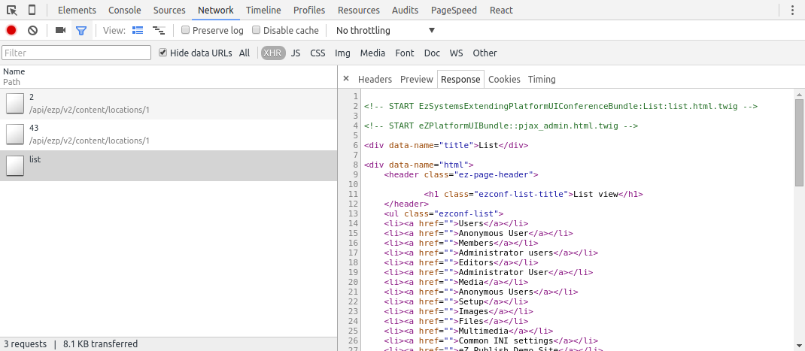

# Build the content list

## Two ways to generate pages in PlatformUI

As written in the [PlatformUI technical introduction](../../guide/extending_ez_platform_ui.md),
pages in PlatformUI can be generated either by the browser based on the REST API (or any other API) responses
or by doing part of the rendering on the server side for instance with some Twig templates called by a Symfony controller.
Both options are perfectly valid and choosing one or the other is mainly a matter of taste.
This step will examine both strategies even if the later steps will be based on the server-side rendering.

## Browser side rendering

In this case, the browser uses the REST API to fetch the necessary objects/structures
and then the logic of transforming that to an HTML page is written in JavaScript and executed by the browser.

### View service to fetch the Location list

#### Minimal view service

The first thing to do is to create a view service. A view service is a component extending `Y.eZ.ViewService`.
So we first need to declare and create a module and then this module will create the minimal view service class:

``` yaml
# yui.yml

ezconf-listviewservice:
     requires: ['ez-serversideviewservice']
     path: %extending_platformui.public_dir%/js/views/services/ezconf-listviewservice.js
```

Then in `ezconf-listviewservice.js` we can write the minimal view service:

``` js
// Minimal ListViewService

YUI.add('ezconf-listviewservice', function (Y) {
    Y.namespace('eZConf');

    Y.eZConf.ListViewService = Y.Base.create('ezconfListViewService', Y.eZ.ViewService, [], {
        initializer: function () {
            console.log("Hey, I'm the ListViewService");
        },
    });
});
```

This is the minimal view service, it only writes a "hello world" message in the console when instantiated but for now it's not used anywhere in the application.

#### Configure the route to use the view service

To really use our view service in the application, we have to change the route
so that the PlatformUI application instantiates and uses the view service when building the page.
To do that, we have to add the route `service` property to hold the constructor function of the view service
so the application plugin that adds the route will also have to require the `ezconf-listviewservice` module:

``` yaml
# yui.yml

ezconf-listapplugin:
     requires: ['ez-pluginregistry', 'plugin', 'base', 'ezconf-listview', 'ezconf-listviewservice'] # the view module has been added
     dependencyOf: ['ez-platformuiapp']
```

After doing that, `Y.eZConf.ListViewService` becomes available in the application plugin code and we can change the `eZConfList` route to:

``` js
// Creating a route with a view service

app.route({
    name: "eZConfList",
    path: "/ezconf/list",
    view: "ezconfListView",
    service: Y.eZConf.ListViewService, // constructor function to use to instantiate the view service
    sideViews: {'navigationHub': true, 'discoveryBar': false},
    callbacks: ['open', 'checkUser', 'handleSideViews', 'handleMainView'],
});
```

After this change, the `Y.eZConf.ListViewService` is used when a user reaches the `eZConfList` route.

#### Fetching Locations from the view service

A view service is responsible for fetching data so it can be rendered.
For a given route, the view service is instantiated the first time the route is accessed and then the same instance is reused.
On that instance, the `_load` method is automatically called. This is where the loading logic should be in most cases.
This method also receives a callback as its only parameter. This callback function should be called once the loading is finished.
Typically, a view service will use the [JavaScript REST Client](http://ezsystems.github.io/javascript-rest-client/) to request [eZ Platform REST API](../../api/rest_api_guide.md).
To do that, a JavaScript REST Client instance is available in the `capi` attribute of the view service.

In this tutorial, we want to display the Content in a flat list and filter this list by Content Types.
For now, let's fetch everything; to do that, the view service will create a REST view to search for every Location in the repository:

``` js
// ezconf-listviewservice.js

YUI.add('ezconf-listviewservice', function (Y) {
    Y.namespace('eZConf');

    Y.eZConf.ListViewService = Y.Base.create('ezconfListViewService', Y.eZ.ViewService, [], {
        initializer: function () {
            console.log("Hey, I'm the ListViewService");
        },

        // _load is automatically called when the view service is configured for
        // a route. callback should be executed when everything is finished
        _load: function (callback) {
            var capi = this.get('capi'), // REST API JavaScript client
                contentService = capi.getContentService(),
                query = contentService.newViewCreateStruct('ezconf-list', 'LocationQuery');

            // searching for "everything"
            query.body.ViewInput.LocationQuery.Criteria = {SubtreeCriterion: "/1/"};
            contentService.createView(query, Y.bind(function (err, response) {
                // parsing the response and storing the location list in the "location" attribute
                var locations;

                locations = Y.Array.map(response.document.View.Result.searchHits.searchHit, function (hit) {
                    var loc = new Y.eZ.Location({id: hit.value.Location._href});

                    loc.loadFromHash(hit.value.Location);
                    return loc;
                });
                this.set('locations', locations);
                callback();
            }, this));
        },
    }, {
        ATTRS: {
            locations: {
                value: [],
            }
        }
    });
});
```

At this point, if you refresh the PlatformUI application and follow the link added [in the previous step](5_configure_the_navigation.md),
you should see a new REST API request to `/api/ezp/v2/views` in the network panel of the browser:


The Locations are built in the application but not yet used anywhere.

#### Passing the Location to the view

Now that we have the Locations, we have to give them to the view.
For that, we have to implement the `_getViewParameters` method in the view service.
This method is automatically called when view service loading is finished,
it should return an object that will be used as a configuration object for the main view.

In our case, we just want to give the Location list to the view, so the `_getViewParameters` method is quite simple:

``` js
// _getViewParameters of the view service

_getViewParameters: function () {
    return {
        locations: this.get('locations'),
    };
},
```

With that code, the view will receive the Location list as an attribute under the name `locations`.

Why implement `_load` and `_getViewParameters` and not `load` and `getViewParameters`?

When implementing a custom view service, you should always implement the protected `_load` and `_getViewParameters` methods,
not their public counterparts `load` and `getViewParameters`.
By implementing the protected versions, you keep the opportunity for a developer to write a plugin to enhance your view service.

### View to display a list of Location

The view now receives the Location list in the `locations` attribute so we have to change the view to take that into account.
For now, let's change it to just display the Location it receives as an unordered HTML list of links to those Locations. To do that, we have to:

1. Declare the `locations` attribute in the view
1. Give that list to the template in a form it can understand
1. Update the template to generate the list

Point 2 is required because Handlebars is not able to understand the complex model objects generated by YUI.
So we have to transform those complex object into plain JavaScript objects. After doing the changes in steps 1 and 2, the view looks like this:

``` js
// ezconf-listview.js

YUI.add('ezconf-listview', function (Y) {
    Y.namespace('eZConf');

    Y.eZConf.ListView = Y.Base.create('ezconfListView', Y.eZ.TemplateBasedView, [], {
        initializer: function () {
            console.log("Hey, I'm the list view");
        },

        render: function () {
            this.get('container').setHTML(
                this.template({
                    locations: this._getJsonifiedLocations(),
                })
            );
            return this;
        },

        _getJsonifiedLocations: function () {
            // to get usable objects in the template
            return Y.Array.map(this.get('locations'), function (loc) {
                return loc.toJSON();
            });
        },
    }, {
        ATTRS: {
            locations: {
                value: [],
            }
        }
    });
});
```

Then the template has to be changed to something like:

``` html
<!-- ezconflistview.hbt -->

<h1 class="ezconf-list-title">List view</h1>

<ul class="ezconf-list">
{{#each locations}}
    <li><a href="{{path 'viewLocation' id=id languageCode=contentInfo.mainLanguageCode}}">{{ contentInfo.name }}</a></li>
{{/each}}
</ul>
```

PlatformUI provides a `path` template helper that allows you to generate a route URL in PlatformUI.
It expects a route name and the route parameters.

##### Results

The resulting code can be been in [the `6_1_list_client` tag on GitHub](https://github.com/ezsystems/ExtendingPlatformUIConferenceBundle/releases/tag/6_1_list_client),
this step result can also be viewed as [a diff between tags `5_navigation` and `6_1_list_client`](https://github.com/ezsystems/ExtendingPlatformUIConferenceBundle/compare/5_navigation...6_1_list_client).

The rest of this tutorial is focused on the server side rendering strategy.
Completing the browser side rendering strategy to get the expected features is left as an exercise.

## Server side rendering

In this case a part of the rendering is delegated to the server.
When building a PlatformUI page this way, the application will just do one or more AJAX request(s) and inject the result in the UI.
The PlatformUI *Admin part* is built this way. To be easily usable in the JavaScript application,
the server response has to be structured so that the application can retrieve and set the page title,
the potential notifications to issue and the actual page content. This is done by generating an HTML fragment, in the following way:

``` html
<!-- Example of server side response -->

<div data-name="title">Title to set in the application</div>
<div data-name="html">
    <p>Page content</p>
</div>
<ul data-name="notification">
    <li data-state="done">I'm a "done" notification to display in the application</li>
</ul>
```

### View service to fetch an HTML fragment

#### Minimal view service

In the case, the minimal view service is exactly the same as the one produced in [the previous Minimal view service paragraph](#minimal-view-service).

#### Configure the route to use the view service

The eZConfList route also has to be configured exactly in the same way as in [the previous Configure the route to use the view service paragraph](#configure-the-route-to-use-the-view-service).

#### Generate the HTML fragment server side

This will be done by a Symfony Controller that will use the Search Service and a Twig template to generate the HTML code.
As you can see in [this GitHub commit](https://github.com/ezsystems/ExtendingPlatformUIConferenceBundle/commit/01c43cee899e295109060ab89a7ea705e8171cd0#diff-2e1a19129e23e2d757512a5da45ffa54R1),
it's a very basic Symfony Controller that extends `EzSystems\PlatformUIBundle\Controller\Controller`.

Extending `EzSystems\PlatformUIBundle\Controller\Controller` is not strictly required.
By doing that, the actions provided by the controller are automatically restricted to authenticated users.
This base controller also provides the base API to handle notifications if needed.

To learn how to write Symfony controllers, please read [the Symfony Controller documentation](http://symfony.com/doc/current/book/controller.html).

The `list` action in `ListController` uses the following Twig template:

``` html
<!-- list.html.twig -->




    <h1 class="ezconf-list-title">List view</h1>



<ul class="ezconf-list">

    <li><a href="">{{ value.valueObject.contentInfo.name }}</a></li>

</ul>


List
```

Again, it's a quite a regular template but to ease the generation of the expected structured HTML fragment,
this template extends `eZPlatformUIBundle::pjax_admin.html.twig` and redefines a few blocks, the main one being `content` where the actual page content is supposed to be generated.

#### Update the view service to fetch the generated HTML fragment

We now have a Symfony Controller able to generate our Location list but this list is not yet available in the application.
As in [Fetching Locations from the view service](#fetching-locations-from-the-view-service)
and [Passing the Location to the view](#passing-the-location-to-the-view), we have to add the code in the view service.
But in the case of a server side rendering, we can reuse `Y.eZ.ServerSideViewService`
which provides the base API to parse an HTML fragment which also provides a ready to use `_getViewParameters` method.
All we have to do then is to implement the loading logic in `_load`:

``` js
// ezconf-listviewservice.js

YUI.add('ezconf-listviewservice', function (Y) {
    Y.namespace('eZConf');

    Y.eZConf.ListViewService = Y.Base.create('ezconfListViewService', Y.eZ.ServerSideViewService, [], {
        initializer: function () {
            console.log("Hey, I'm the ListViewService");
        },

        _load: function (callback) {
            var uri = this.get('app').get('apiRoot') + 'list';

            Y.io(uri, { // YUI helper to do AJAX request, see http://yuilibrary.com/yui/docs/io/
                method: 'GET',
                on: {
                    success: function (tId, response) {
                        this._parseResponse(response); // provided by Y.eZ.ServerSideViewService
                        callback(this);
                    },
                    failure: this._handleLoadFailure, // provided by Y.eZ.ServerSideViewService
                },
                context: this,
            });
        },
    });
});
```

The resulting `_load` method will just do an AJAX request to the action provided by our Symfony controller.

At this point, if you refresh your browser, nothing should have changed but you should see the AJAX request in the network panel of your browser.



### View to handle the server side generated code

#### Change the view to be server side view

To have a visual change, we now have to change the `ListView` to be a server side view.
This operations involves removing some code added in [the Define a View step](4_define_a_view.md).
Basically, the View does not need any template but it will inherit from `Y.eZ.ServerSideView`. As a result, the view module definition becomes:

``` js
// View module definition

ezconf-listview:
    requires: ['ez-serversideview']
    path: %extending_platformui.public_dir%/js/views/ezconf-listview.js
```

And the View component also has to be simplified to:

``` js
// ezconf-listview.js

YUI.add('ezconf-listview', function (Y) {
    Y.namespace('eZConf');

    Y.eZConf.ListView = Y.Base.create('ezconfListView', Y.eZ.ServerSideView, [], {
        initializer: function () {
            console.log("Hey, I'm the list view");
            this.containerTemplate = '<div class="ez-view-ezconflistview"/>'; // make sure we keep the same class on the container
        },
    });
});
```

At this point, you should see the same list as the one that was generated in [Browser side rendering](#browser-side-rendering) section.
The only difference lies in the non-working links being generated in the server side solution.

#### Navigating in the app from the view

There are several ways to fix the link issue. In this step we are going to add some metadata to the generated HTML links,
then we'll change the view to recognize the enhanced links and finally we'll change the server side view to achieve the navigation.

The server side code has no knowledge of the JavaScript application routing mechanism as a result,
it can not directly generate any PlatformUI Application URI, but we know while generating the HTML fragment
that we want each link to allow the navigation to the `viewLocation` route for the Location being displayed.
We can then change the Twig template to add the necessary metadata on each link
so that the application has a way of guessing where the user is supposed to go when clicking on the link:

``` html
<!-- "content" block in the Twig template -->


<ul class="ezconf-list">

    <li><a class="ezconf-list-location" href=""
        data-route-name="viewLocation"
        data-route-id="{{ path('ezpublish_rest_loadLocation', {locationPath: value.valueObject.pathString|trim('/')}) }}"
        data-route-languageCode="{{ value.valueObject.contentInfo.mainLanguageCode }}"
        >{{ value.valueObject.contentInfo.name }}</a></li>

</ul>

```

For each link we are basically saying to the application that the user should directed to the `viewLocation` route for the given Location id and the given language code.

In PlatformUI code, the Locations, Content items and Content Types are identified by their REST id,
that is the REST resource URL which allows you to fetch the object in the REST API.
That's why we are using the `path` Twig template function to build the Location id.

Then we have to change the view to add a special behavior when the user clicks on them.
The view can not directly trigger the navigation to the expected route.
So in this case, we are firing an application level event with all the data we have on the link
and we'll let the view service handle this application level event to take the user to the expected page.
So, we have to configure our view to recognize the click on the links and to fire the `navigateTo` custom event:

``` js
// ezconf-listview.js

YUI.add('ezconf-listview', function (Y) {
    Y.namespace('eZConf');

    Y.eZConf.ListView = Y.Base.create('ezconfListView', Y.eZ.ServerSideView, [], {
        // this is YUI View mechanic to subscribe to DOM events (click, submit,
        // ...) and synthetic event (some custom event provided by YUI) like
        // 'tap' here.
        events: {
            '.ezconf-list-location': {
                // tap is 'fast click' (touch friendly)
                'tap': '_navigateToLocation'
            }
        },

        initializer: function () {
            console.log("Hey, I'm the list view");
            this.containerTemplate = '<div class="ez-view-ezconflistview"/>';
        },

        _navigateToLocation: function (e) {
            var link = e.target;

            e.preventDefault(); // don't want the normal link behavior

            // tell the view service we want to navigate somewhere
            // it's a custom event that will be bubble up to the view service
            // (and the app)
            // the second parameter is the data to add in the event facade, this
            // can be used by any event handler function bound to this event.
            this.fire('navigateTo', {
                route: {
                    name: link.getData('route-name'),
                    params: {
                        id: link.getData('route-id'),
                        languageCode: link.getData('route-languagecode'),
                    }
                }
            });
        },
    });
});
```

The DOM event handling is one of the main YUI View features.
It is documented in [the YUI View guide](http://yuilibrary.com/yui/docs/view/#handling-dom-events).

Now the click on the Location link is transformed in a `navigateTo` event.
After a refresh, the Location list should allow you to the navigate to the expected Location in PlatformUI.

##### Application level events

PlatformUI uses a lot of custom application level events thanks to [the EventTarget YUI component](http://yuilibrary.com/yui/docs/event-custom/).
Those events are very similar to [DOM events](http://yuilibrary.com/yui/docs/event/)
but they are attached to the application components instead of the DOM elements.
Like for DOM events, there is [a bubbling mechanism](http://yuilibrary.com/yui/docs/event-custom/#bubbling).
For instance, here the view is firing an event and unless the propagation of the event is stopped,
it will bubble to the view service and then to the application.
The event basically follows [the components tree until the application](../../guide/extending_ez_platform_ui.md).
**An application level event is way for a deeply nested component to communicate with a higher level component.**

#### Results and next step

The resulting code can be seen in [the `6_2_list_server` tag on GitHub](https://github.com/ezsystems/ExtendingPlatformUIConferenceBundle/releases/tag/6_2_list_server),
this step result can also be viewed as [a diff between tags `5_navigation` and `6_2_list_server`](https://github.com/ezsystems/ExtendingPlatformUIConferenceBundle/compare/5_navigation...6_2_list_server).

The next step is then [to add the pagination](7_paginate_results.md).

------

⬅ Previous: [Configure the navigation](5_configure_the_navigation.md)

Next: [Paginate results](7_paginate_results.md) ➡
