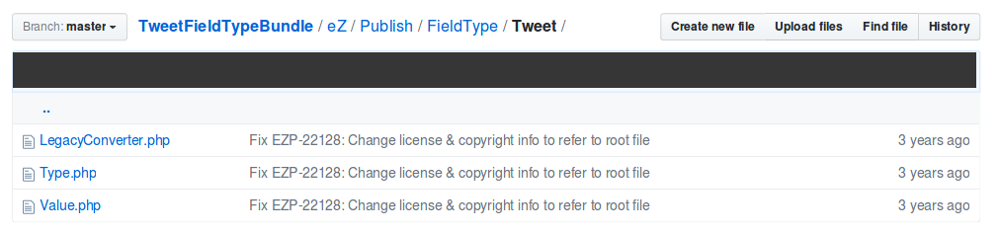
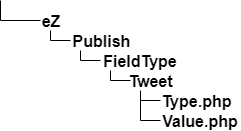

# Step 1 - Create the bundle

!!! tip

    You can find all files used and modified in this step on [GitHub](https://github.com/ezsystems/TweetFieldTypeBundle/tree/step1_create_the_bundle_v2).

FieldTypes, like any other eZ Platform extensions, must be provided as Symfony bundles. This chapter covers the creation and organization of this bundle.

Once you have [installed eZ Platform](../../getting_started/install_ez_platform/), including the creation of a database for the tutorial, [configured a server](../../getting_started/requirements/), and [started the web server](../../getting_started/install_ez_platform/#use-phps-built-in-server), you need to create a code base for the tutorial.

The Field Type will be placed in a [Symfony bundle](http://symfony.com/doc/4.3/bundles.html).
You can get started with a bundle using the built-in Symfony bundle generator.
Then you will configure the bundle to be able to write the code you need to create a Field Type.

## Generate the bundle

From the eZ Platform root, run the following:

``` bash
bin/console generate:bundle --namespace=EzSystems/TweetFieldTypeBundle --dir=src --format=yml --no-interaction
```

Our bundle should now be generated. Navigate to `src/EzSystems/TweetFieldTypeBundle` and you should see the following structure:

``` bash
$ ls -l src/EzSystems/TweetFieldTypeBundle
Controller/
DependencyInjection/
EzSystemsTweetFieldTypeBundle.php
Resources/
Tests/
```

!!! note

    If the `generate:bundle` command returns an error about registering the bundle namespace in `composer.json`, add the following line to the `composer.json` file within the `psr-4` section:

    ```
    "EzSystems\\TweetFieldTypeBundle\\": "src/EzSystems/TweetFieldTypeBundle/"
    ```

    Then execute the following command to regenerate the autoload files:

    ```
    $ composer dump-autoload
    ```

Feel free to delete the Controller folder, since you won’t use it in this tutorial. It could have been useful, had our Field Type required an interface of its own.
Also, you can safely delete the `Resources/views/Default` folder and `Resources/config/routing.yaml` file, as they won't be needed. You should remove the `ez_systems_tweet_field_type` entry from the `app/config/routing.yaml` file as well.

## Structure the bundle

At this point, you have a basic application-specific Symfony bundle. First you will create the structure for the Field Type.

To make it easier to move around the code, you will to some extent mimic the structure that is used in the kernel of eZ Platform. Native Field Types are located inside `ezpublish-kernel` (in `vendor/ezsystems`), in the `eZ/Publish/Core/FieldType` folder.
Each Field Type has its own subfolder: `TextLine`, `Email`, `Url`, etc.

You will use a structure quite close to this:



From the tutorial git repository, list the contents of the `eZ/Publish/FieldType` folder:



Now prepare the files for two classes you will need for the Field Type:

- `TweetFieldTypeBundle/eZ/Publish/FieldType/Tweet/Type.php`
- `TweetFieldTypeBundle/eZ/Publish/FieldType/Tweet/Value.php`

``` php
<?php

namespace EzSystems\TweetFieldTypeBundle\eZ\Publish\FieldType\Tweet;

use eZ\Publish\Core\FieldType\FieldType;

class Type extends FieldType implements Nameable
{
}
```

``` php
<?php

namespace EzSystems\TweetFieldTypeBundle\eZ\Publish\FieldType\Tweet;

use eZ\Publish\Core\FieldType\Value as BaseValue;

class Value extends BaseValue
{
}
```
