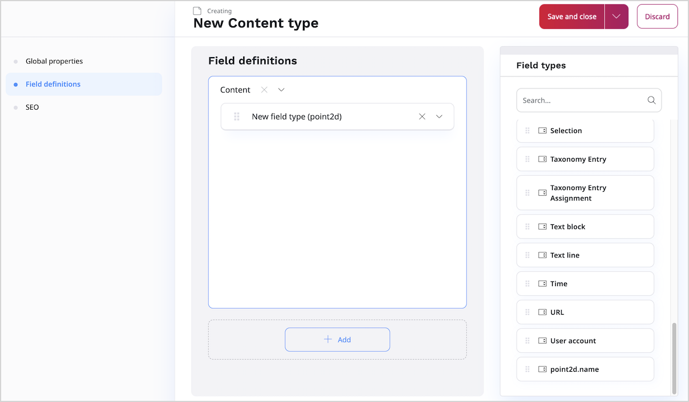
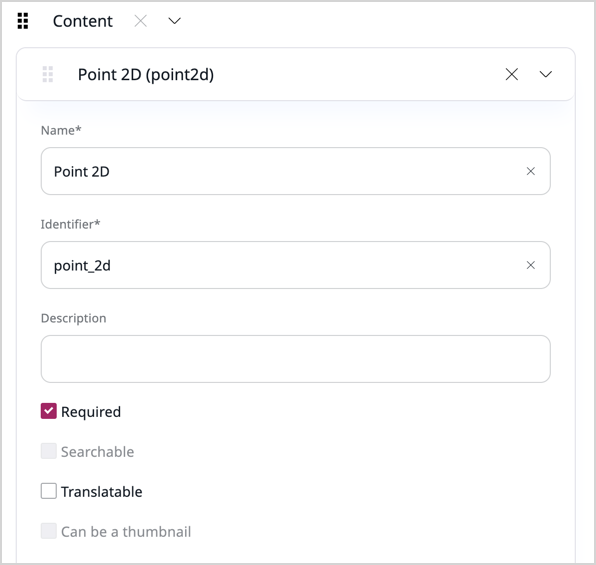
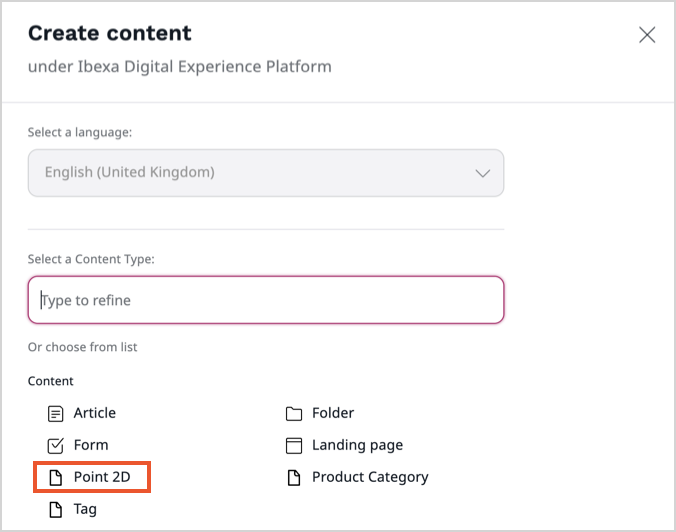
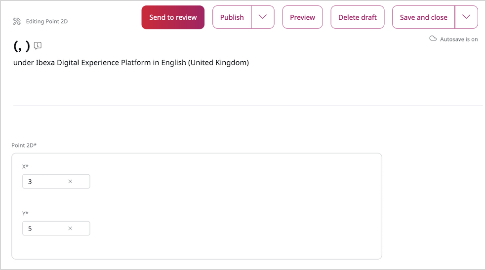
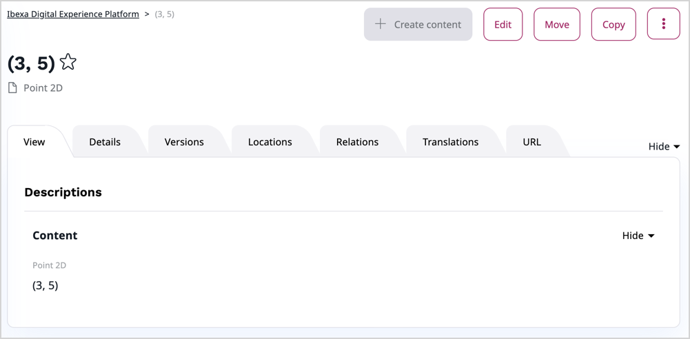

# Step 5 - Add a new Point 2D field

All actions in thi step are done in the admin interface also called the Back Office.
Go to the admin interface (<yourdomain>/admin) and log in with the default username: admin and the default password: publish. 

## Add new Content Type

In Back Office select **Admin** and navigate to **Content Types** tab.
Under **Content** category create new Content Type:

New Content Type should have following settings:

- **Name:** Point 2D
- **Identifier:** point_2d
- **Fields:** point2d.name

Next, define **point2d** according to below credentials:

|Field Type|Name|Identifier|Position|Required|Translatable|
|----------|----|----------|--------|--------|------------|
| point2d  |New Point 2D|`new_point2d_1` | 1 | no | no|

Save everything and go back to **Content/Content structure** tab.

## Create your content

In **Content structure** select **Create** from right sidebar menu. There, under **Content** you should see Point 2D Content Type you just added. Click it to create new content.

In **New Point 2D** tab you can fill in coordinates of your point e.g. 4x,5y. Provided coordinates will be used as a title for a new point.

Select **Publish** and you should see a new point **(4,5)** in a content tree.

