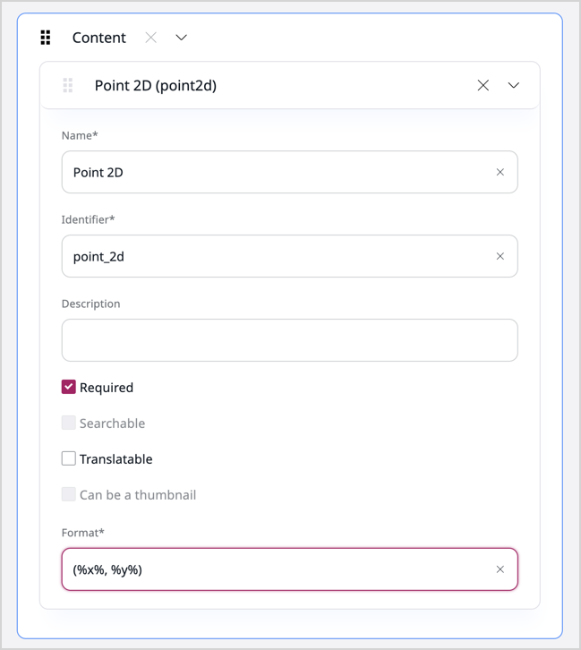

# Step 6 - Implement Point 2D settings

Implementing settings enables you to define the format for displaying the Field on the page.
To do so, you will create the `format` field where you will be able to change the way coordinates for Point 2D are displayed.

## Define Field Type format

In this step you will create the `format` field for Point 2D coordinates.
To do that, you need to define a `SettingsSchema` definition.
You will also specify coordinates as placeholder values `%x%` and `%y%`.

Open `src/FieldType/Point2D/Type.php` and add a `getSettingsSchema` method according to the following code block:

```php hl_lines="24 25 26 27 28 29 30 31 32"
<?php
declare(strict_types=1);

namespace App\FieldType\Point2D;

use App\Form\Type\Point2DSettingsType;
use App\Form\Type\Point2DType;
use eZ\Publish\API\Repository\Values\ContentType\FieldDefinition;
use eZ\Publish\SPI\FieldType\Generic\Type as GenericType;
use eZ\Publish\SPI\FieldType\Value;
use EzSystems\EzPlatformContentForms\Data\Content\FieldData;
use EzSystems\EzPlatformAdminUi\Form\Data\FieldDefinitionData;
use EzSystems\EzPlatformContentForms\FieldType\FieldValueFormMapperInterface;
use Symfony\Component\Form\FormInterface;

final class Type extends GenericType

{
    public function getFieldTypeIdentifier(): string
    {
        return 'point2d';
    }
    
    public function getSettingsSchema(): array
    {
        return [
            'format' => [
                'type' => 'string',
                'default' => '(%x%, %y%)',
            ],
        ];
    }
    
    public function mapFieldValueForm(FormInterface $fieldForm, FieldData $data)
    {
        $definition = $data->fieldDefinition;
        $fieldForm->add('value', Point2DType::class, [
            'required' => $definition->isRequired,
            'label' => $definition->getName()
        ]);
    }
}
```

## Add a format field

In this part you will define and implement the edit form for your Field Type. 

Define a `Point2DSettingsType` class and add a `format` field in `src/Form/Type/Point2DSettingsType.php`:

```php
<?php
declare(strict_types=1);

namespace App\Form\Type;

use Symfony\Component\Form\AbstractType;
use Symfony\Component\Form\Extension\Core\Type\TextType;
use Symfony\Component\Form\FormBuilderInterface;

final class Point2DSettingsType extends AbstractType

{
    public function buildForm(FormBuilderInterface $builder, array $options)
    {
        $builder->add('format', TextType::class);
    }
}
```

## FieldDefinitionFormMapper Interface

Now, enable the user to add the coordinates which will be validated.
In `src/FieldType/Point2D/Type.php` you will:
 
- implement the `FieldDefinitionFormMapperInterface` interface
- add a `mapFieldDefinitionForm` method at the end that will define the field settings

```php
<?php
namespace App\FieldType\Point2D;

use EzSystems\EzPlatformAdminUi\FieldType\FieldDefinitionFormMapperInterface;

// ...

final class Type extends GenericType implements FieldValueFormMapperInterface, FieldDefinitionFormMapperInterface

// ...

    public function mapFieldDefinitionForm(FormInterface $fieldDefinitionForm, FieldDefinitionData $data): void
    {
        $fieldDefinitionForm->add('fieldSettings', Point2DSettingsType::class, [
            'label' => false
        ]);
    }
```

??? tip "Complete `Type.php` code"

    ```php
    <?php
    declare(strict_types=1);
    
    namespace App\FieldType\Point2D;
    
    use App\Form\Type\Point2DSettingsType;
    use App\Form\Type\Point2DType;
    use eZ\Publish\API\Repository\Values\ContentType\FieldDefinition;
    use eZ\Publish\SPI\FieldType\Generic\Type as GenericType;
    use eZ\Publish\SPI\FieldType\Value;
    use EzSystems\EzPlatformContentForms\Data\Content\FieldData;
    use EzSystems\EzPlatformAdminUi\Form\Data\FieldDefinitionData;
    use EzSystems\EzPlatformAdminUi\FieldType\FieldDefinitionFormMapperInterface;
    use EzSystems\EzPlatformContentForms\FieldType\FieldValueFormMapperInterface;
    use Symfony\Component\Form\FormInterface;
    
    final class Type extends GenericType implements FieldValueFormMapperInterface, FieldDefinitionFormMapperInterface
    
    {
        public function getFieldTypeIdentifier(): string
        {
            return 'point2d';
        }
        public function getSettingsSchema(): array
        {
            return [
                'format' => [
                    'type' => 'string',
                    'default' => '(%x%, %y%)',
                ],
            ];
        }
        
        public function mapFieldValueForm(FormInterface $fieldForm, FieldData $data)
        {
            $definition = $data->fieldDefinition;
            $fieldForm->add('value', Point2DType::class, [
                'required' => $definition->isRequired,
                'label' => $definition->getName()
            ]);
        }
        
        public function mapFieldDefinitionForm(FormInterface $fieldDefinitionForm, FieldDefinitionData $data): void
        {
            $fieldDefinitionForm->add('fieldSettings', Point2DSettingsType::class, [
                'label' => false
            ]);
        }
    }
    ```

## Add a new tag

Next, add `FieldDefinitionFormMapper` as an extra tag definition for `App\FieldType\Point2D\Type` in `config/services.yaml`:

```yaml
tags:
    - { name: ezplatform.field_type.form_mapper.definition, fieldType: point2d }
```

## Field Type definition

To be able to display the new `format` field, you need to add a template for it.
Create `templates/point2d_field_type_definition.html.twig`:

```html+twig

    <div class="{{ group_class }}">
        {{- form_label(form.fieldSettings.format) -}}
        {{- form_errors(form.fieldSettings.format) -}}
        {{- form_widget(form.fieldSettings.format) -}}
    </div>

```

### Add configuration for the format field

Next, provide the template mapping in `config/packages/ezplatform.yaml`:

```yaml
ezplatform:
    system:
        default:
            # ...
            fielddefinition_edit_templates:
                - { template: 'point2d_field_type_definition.html.twig', priority: 0 }
```

## Redefine template

Finally, redefine the Point 2D template so it accommodates the new `format` field.

In `templates/point2d_field.html.twig` replace the content with:

```html+twig

    {{ fieldSettings.format|replace({
        '%x%': field.value.x,
        '%y%': field.value.y
    }) }}

```

## Add a new Content Type

Now, you can go to Admin in the Back Office and see the results of your work by editing the Point 2D Content Type.
Add new format `(%x%,%y%)` in the **Format** field as shown in the screen below.


