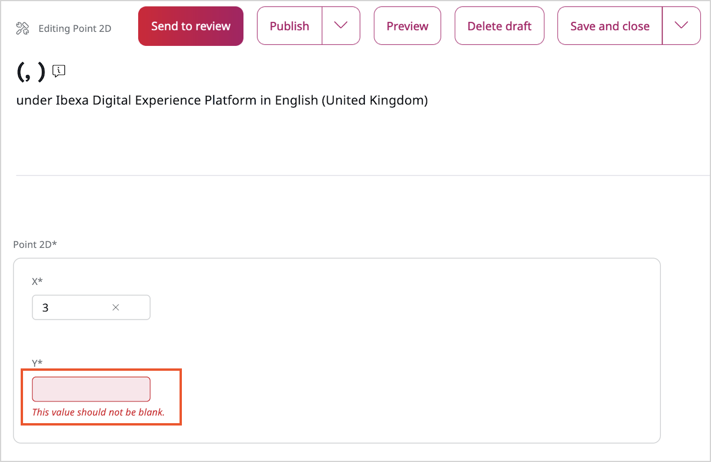

# Step 7 - Add basic validation

!!! tip

    You can find all files used and modified in this step on [GitHub](https://github.com/ezsystems/generic-field-type-tutorial/tree/Step_7).

To provide basic validation that ensures both coordinates are provided, add assertions to the `src/FieldType/Point2D/Value.php`:

```php
<?php

use Symfony\Component\Validator\Constraints as Assert;

final class Value implements ValueInterface

{  
   /**
     * @var float|null
     *
     * @Assert\NotBlank()
     */
    private $x;
     
    /**
     * @var float|null
     *
     * @Assert\NotBlank()
     */
    private $y;
    
 // ...   
}
```

As a result, if a user tries to publish the Point 2D with just one value, they will receive an error message.


