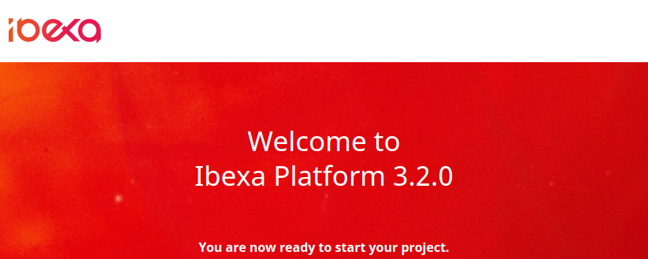

# Step 1 — Get ready

To begin the tutorial, you need a clean installation of [[= product_name =]].

Get it by following the [install [[= product_name =]]](../../getting_started/install_ez_platform.md) guide.
You will need a web server, a relational database and PHP.

The clean installation contains only a root Content item which displays a welcome page.

You will replace the welcome page with your own in step 3.
To remove it for now, delete the `config/packages/ezplatform_welcome_page.yaml` file.

You can now start creating the content model.
