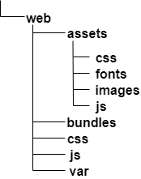

# Step 3 - Customize the front page

In this step you will create the global layout of your site, and display content using custom templates.

First, go to the root of the site (`<yourdomain>`). You should see the home page of the clean install, without any kind of layout.
You will customize this step by instructing Platform to use a custom template to render this Content item.

## Content rendering configuration

To use a custom template when rendering the root content, create a `content_view` configuration block for `ezpublish`.

Edit `app/config/ezplatform.yml`. At the end, add the following block (pay attention to indentation: `content_view` should be one level below `site_group`):

``` yaml
ezpublish:
    system:
        site_group:
            # existing keys, do not change them
            content_view:
                full:
                    home_page:
                        template: full/home_page.html.twig
                        match:
                            Id\Location: 2
```

This tells eZ Platform to use the `template` when rendering content with Location ID `2`.
`2` is the default Location for the root Content item.

`Id\Location` is one of several [view matchers](../../guide/content_rendering.md#configuring-views-the-viewprovider) that you can use to customize rendering depending on different criteria.

!!! note "Clear the cache"

    Each time you change the YAML files, you should clear the cache. It's not mandatory in dev environment.

    To clear the cache:

    ``` bash
    $ php app/console cache:clear
    ```

## Create template and layout

### Create the first template

Next, you need to create the template that you indicated in configuration.

For the time being, fill the template with a basic "Hello world" message.

Create a `home_page.html.twig` file in `app/Resources/views/full`:

``` html+twig
<div>
    <h1>Hello World!</h1>
</div>
```

Refresh the page and you will see a simple, unstyled version of the message.

### Add the site's main layout

Most sites have a general layout which includes things like header with a logo or footer.
It is displayed on every page, and the content of the page is placed inside it.

To add a template like this to your site, create a `main_layout.html.twig` file in `app/Resources/views` and paste the following code into it:

``` html+twig hl_lines="12 13 14 52 53 89 90 91 92"
<!DOCTYPE html>
<html lang="en">

    <head>
        <meta charset="utf-8">
        <meta http-equiv="X-UA-Compatible" content="IE=edge">
        <meta name="viewport" content="width=device-width, initial-scale=1">
        <meta name="description" content="eZ Platform beginner tutorial">

        <title>eZ Platform Beginner Tutorial</title>

        
            <link rel="stylesheet" href="{{ asset_url }}" />
        

        <link href='http://fonts.googleapis.com/css?family=Oswald' rel='stylesheet' type='text/css'>
        <link href='http://fonts.googleapis.com/css?family=Roboto+Slab' rel='stylesheet' type='text/css'>
        <link href='http://fonts.googleapis.com/css?family=Fjalla+One' rel='stylesheet' type='text/css'>
    </head>

    <body>
        <!-- Navigation -->
        <nav class="navbar navbar-default navbar-fixed-top" id="total-navbar">
            <div class="container">
                <!-- Brand and toggle -->
                <div class="navbar-header page-scroll">
                    <a class="navbar-brand" href="/">
                        
                    </a>
                </div>
            </div>
        </nav>

        <!-- Header -->
        <header class="below-navbar">
            <div class="container">
                <div class="row" id="banner">
                    <div class="col-xs-12">
                        <div class="banner-header-block">
                            
                            <h3 class="banner-header">{{ 'Discover new rides! Go Bike!'|trans }}</h3>
                        </div>
                    </div>
                </div>
            </div>
        </header>

        <section>
            <div class="container">
                <div class="row regular-content-size">
                    <div class="col-xs-12 box-style">
                        
                        
                    </div>
                </div>
            </div>
        </section>

        <!-- Footer -->
        <footer class="text-center">
            <div class="footer-color-one">
            </div>
            <div class="footer-color-two">
                <div class="container">
                    <div class="row regular-content-size">
                        <div class="col-xs-8 col-xs-offset-2 footer-links-block">
                            <ul class="list-inline footer-links">
                                <li><a href="#">{{ 'About Us'|trans }}</a></li>
                                <li><a href="/">{{ 'All Rides'|trans }}</a></li>
                                <li><a href="#">{{ 'Submit a Ride'|trans }}</a></li>
                                <li><a href="#">{{ 'My Account'|trans }}</a></li>
                                <li><a href="#">{{ 'FAQ'|trans }}</a></li>
                            </ul>
                        </div>
                    </div>
                </div>
            </div>
            <div class="footer-color-three">
                <div class="container">
                    <div class="row">
                        <div class="col-xs-12">
                            <p class="small">Website design &#38; content © copyright {{ "now"|date("Y") }} Ibexa. This website was made with eZ Platform</p>
                        </div>
                    </div>
                </div>
            </div>
        </footer>

        
            <script src="{{ asset_url }}"></script>
        

    </body>
</html>
```

For now the site has no stylesheets or assets. In the highlighted lines (12-14, 89-92) the template points to the path to store asset files, such as CSS stylesheets, JS scripts and images.

!!! tip

    This code goes through all files in `web/assets/css` and `web/assets/js` and loads them as stylesheets and JS scripts respectively.
    See [Symfony assetic doc](http://symfony.com/doc/2.8/frontend/assetic/asset_management.html#assets) for more information.

[Download assets.zip](img/assets.zip) which contains the prepared asset files. Then unpack its contents to the `web/assets/` directory, so that the structure looks like this:



### Extending templates

Now you need to indicate that the `app/Resources/views/full/home_page.html.twig` template should make use of the page layout.
Edit `home_page.html.twig` and replace it with the following code:

``` html+twig hl_lines="1 3 7"



    <div class="col-xs-10 col-xs-offset-1 text-justified">
        <h1>Hello World!</h1>
    </div>

```

The templating language Twig supports [template inheritance](http://twig.sensiolabs.org/doc/templates.html#template-inheritance).
Templates can contain named blocks. Any template can extend other templates, and modify the blocks defined by its parents.

The code above points to `main_layout.html.twig` in line 1. It also wraps your "Hello world" message in a `content` block.
If you look back at the main layout template, you can see an empty `` section (lines 52-53).
This is where the `home_page.html.twig` will be rendered.

Refresh the page and you should now see the "Hello world" placed inside a styled layout.


!!! tip

    If you are in prod environment, you need to regenerate the web assets. Run the following command:

    ​```
    php app/console assetic:dump --env=prod web
    ​```

!!! note "Clear the cache"

    Each time you change the templates, you should clear the cache. It's not mandatory in dev environment.

    To clear the cache:

    ``` bash
    $ php app/console cache:clear
    ```

At this point, the template is static. It doesn't render any dynamic data from the Repository.

You'll render a list of all Rides here in the next step.
But before that, you can use the existing page layout to render the content of a single Ride.

## Render a single Ride

### Create the Ride view

Create a Twig template `app/Resources/views/full/ride.html.twig` with the following code:

``` html+twig


<div class="col-xs-10 col-xs-offset-1 text-justified">
    <section>
        <div class="row regular-content-size">
            <div class="col-xs-12">
                <h3 class="center bottom-plus new-header">{{ content.name }}</h2>
            </div>
        </div>
    </section>
    <section>
        <div class="row regular-content-size">
            <div class="row">
                <div class="col-xs-6">
                    <h4 class="underscore">{{ 'Starting point'|trans }}</h4>
                    {{ ez_render_field(content, 'starting_point', {'parameters': { 'width': '100%', height: '200px', 'showMap': true, 'showInfo': false }}) }}
                </div>
                <div class="col-xs-6">
                    <h4 class="underscore">{{ 'Ending point'|trans }}</h4>
                    {{ ez_render_field(content, 'ending_point', {'parameters': { 'width': '100%', height: '200px', 'showMap': true, 'showInfo': false }}) }}
                </div>
            </div>
        </div>
    </section>
    <section>
        <div class="row regular-content-size">
            <div class="col-xs-12 padding-box">
                <div class="col-xs-2">
                    <div class="box-ride">
                        <p class="special-number">{{ ez_render_field( content, 'length') }} km</p>
                    </div>
                </div>
                <div class="col-xs-8">
                    <h4 class="underscore">{{ 'Description'|trans }}</h4>
                    {{ ez_render_field( content, 'description') }}
                </div>
            </div>
        </div>
    </section>
</div>

```

This template reuses `main_layout.html.twig` and again places the template in a `content` block.

!!! tip "Previewing available variables"

    You can see what variables are available in the current template with the `dump()` Twig function:

    ``` html+twig
    {{ dump() }}
    ```

    You can also dump a specific variable:

    ``` html+twig
    {{ dump(location) }}
    ```

Now you need to indicate when this template should be used.

!!! note

    When pasting YAML code, pay attention to indentation and levels.
    The code blocks shown here include the full structure of the YAML file to help you learn where to place new blocks.
    Be careful not to duplicate existing keys, because YAML does not allow it.

Go back to `app/config/ezplatform.yml` and add the following configuration (under the existing `content_view` and `full` keys:):

``` yaml
site_group:
    content_view:
        full:
            # existing keys, do not change them
            ride:
                template: full/ride.html.twig
                match:
                    Identifier\ContentType: ride
```

This tells the application to use this template whenever it renders the full view of a Ride.

### Check the Ride full view

Because you do not have a list of Rides on the front page yet, you cannot simply click a Ride to preview it.
But you still can see how the template works in two ways:

#### Preview in the Back Office

You can use the preview while editing in the Back Office to see how the content will be rendered in full view.


#### Go to the Ride page

You can also go directly to the URL of a Ride.
The URL for viewing a specific Content item is `http://<yourdomains>/view/content/<ContentId>/<language>/full/true/<LocationId>`.

You can find the Content ID and the Location ID of your Ride in the Admin, under the Details tab.


An example URL is `http://127.0.0.1:8000/view/content/53/eng-GB/full/true/55`,
where 53 is the Content ID and 55 is the Location ID of the Ride.
