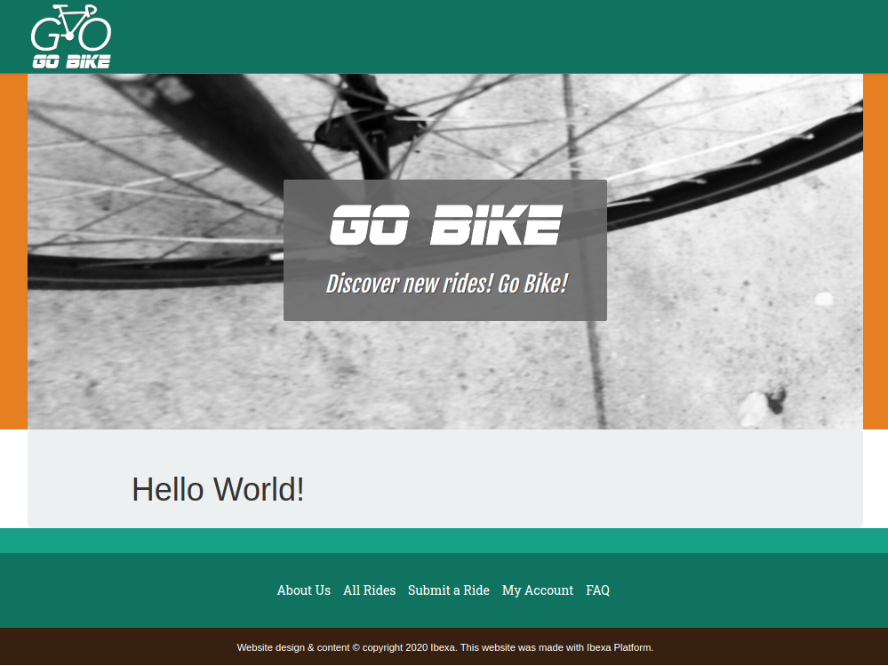

# Step 3 — Customize the front page

In this step you will create the global layout of your site, and display content using custom templates.

First, go to the root of the site (`<yourdomain>`). You should now see the home page of the clean install, without any kind of layout.
You will customize this step by instructing Platform to use a custom template to render this Content item.

## Content rendering configuration

To use a custom template when rendering the root content, create a `content_view` configuration block for `ezplatform`.

Edit `config/packages/ezplatform.yaml`.
Add the following block under `site` while paying attention to indentation - `content_view` should be one level below `site`:

``` yaml
ezplatform:
    system:
        site:
            content_view:
                full:
                    home_page:
                        template: full/home_page.html.twig
                        match:
                            Id\Location: 2
```

This tells [[= product_name =]] to use the `template` when rendering content with Location ID `2`.
`2` is the default Location for the root Content item.

`Id\Location` is one of several [view matchers](../../guide/content_rendering.md#configuring-views-the-viewprovider) that you can use to customize rendering depending on different criteria.

!!! note "Clear the cache"

    Each time you change the YAML files, you should clear the cache. It's not mandatory in dev environment.

    To clear the cache:

    ``` bash
    $ php bin/console cache:clear
    ```

## Create template and layout

### Create the first template

Next, you need to create the template that you indicated in configuration.

For the time being, fill the template with a basic "Hello world" message.

Create a `home_page.html.twig` file in `templates/full/`:

``` html+twig
<div>
    <h1>Hello World!</h1>
</div>
```

Refresh the page and you will see a simple, unstyled version of the message.

### Add the site's main layout

Most sites have a general layout which includes things like header with a logo or footer.
It is displayed on every page, and the content of the page is placed inside it.

To add a template like this to your site, create a `main_layout.html.twig` file in `templates/` and paste the following code into it:

``` html+twig hl_lines="12 89"
<!DOCTYPE html>
<html lang="en">

<head>
    <meta charset="utf-8">
    <meta http-equiv="X-UA-Compatible" content="IE=edge">
    <meta name="viewport" content="width=device-width, initial-scale=1">
    <meta name="description" content="Ibexa Platform beginner tutorial">

    <title>Ibexa Platform Beginner Tutorial</title>

    <script src="{{ asset('bundles/ezplatformadminuiassets/vendors/jquery/dist/jquery.min.js') }}"></script>

    {{ encore_entry_link_tags('tutorial') }}

    <link href='http://fonts.googleapis.com/css?family=Oswald' rel='stylesheet' type='text/css'>
    <link href='http://fonts.googleapis.com/css?family=Roboto+Slab' rel='stylesheet' type='text/css'>
    <link href='http://fonts.googleapis.com/css?family=Fjalla+One' rel='stylesheet' type='text/css'>
</head>

<body>
<!-- Navigation -->
<nav class="navbar navbar-default navbar-fixed-top" id="total-navbar">
    <div class="container">
        <!-- Brand and toggle -->
        <div class="navbar-header page-scroll">
            <a class="navbar-brand" href="/">
                
            </a>
        </div>
    </div>
</nav>

<!-- Header -->
<header class="below-navbar">
    <div class="container">
        <div class="row" id="banner">
            <div class="col-xs-12">
                <div class="banner-header-block">
                    
                    <h3 class="banner-header">{{ 'Discover new rides! Go Bike!'|trans }}</h3>
                </div>
            </div>
        </div>
    </div>
</header>

<section>
    <div class="container">
        <div class="row regular-content-size">
            <div class="col-xs-12 box-style">
                
                
            </div>
        </div>
    </div>
</section>

<!-- Footer -->
<footer class="text-center">
    <div class="footer-color-one">
    </div>
    <div class="footer-color-two">
        <div class="container">
            <div class="row regular-content-size">
                <div class="col-xs-8 col-xs-offset-2 footer-links-block">
                    <ul class="list-inline footer-links">
                        <li><a href="#">{{ 'About Us'|trans }}</a></li>
                        <li><a href="/">{{ 'All Rides'|trans }}</a></li>
                        <li><a href="#">{{ 'Submit a Ride'|trans }}</a></li>
                        <li><a href="#">{{ 'My Account'|trans }}</a></li>
                        <li><a href="#">{{ 'FAQ'|trans }}</a></li>
                    </ul>
                </div>
            </div>
        </div>
    </div>
    <div class="footer-color-three">
        <div class="container">
            <div class="row">
                <div class="col-xs-12">
                    <p class="small">Website design &#38; content © copyright {{ "now"|date("Y") }} Ibexa. This website was made with Ibexa Platform.</p>
                </div>
            </div>
        </div>
    </div>
</footer>

{{ encore_entry_script_tags('tutorial-js') }}

</body>
</html>
```

Note that in the highlighted lines (12 and 89) the template takes advantage of [Symfony Webpack Encore](https://symfony.com/doc/5.0/frontend.html#webpack-encore).
This tutorial will lead you through configuring Webpack, but first you need assets.

### Adding assets

The site has no stylesheets or assets yet. You need to download [`assets.zip`](img/assets.zip) which contains the prepared asset files.

Then unpack its contents to the following directories:

- `css`, `fonts`, and `js` folders to `assets/`
- `images` folder to `public/assets/`

Before proceeding, ensure that the structure of the added files looks like this:


### Configuring Webpack

In [[= product_name =]], you can add assets by using [Symfony Webpack Encore](https://symfony.com/doc/5.0/frontend.html#webpack-encore)
— an integration of Webpack that enables you to build bundles of CSS stylesheets and JS scripts and add them to the project.
For more details, see [importing assets from a bundle](../../guide/project_organization.md#importing-assets-from-a-bundle).

To create bundles, first, indicate which files to include in them.

Open the `webpack.config.js` file located in the root folder of your project.
Paste the following code right under `// Put your config here`:

``` javascript hl_lines="2 8"
Encore
    .addStyleEntry('tutorial', [
        path.resolve(__dirname, './assets/css/normalize.css'),
        path.resolve(__dirname, './assets/css/bootstrap.min.css'),
        path.resolve(__dirname, './assets/css/bootstrap-theme.css'),
        path.resolve(__dirname, './assets/css/style.css')
    ])
    .addEntry('tutorial-js', [
        path.resolve(__dirname, './assets/js/bootstrap.min.js')
    ]);
```

Note that `.addStyleEntry('tutorial', [])` and `.addEntry('tutorial-js', [])` refer respectively to
`{{  encore_entry_link_tags('tutorial') }}` and `{{ encore_entry_script_tags('tutorial-js') }}` from `main_layout.html.twig`.
This configuration creates a bundle consisting of files to be added to a template.

At this point the bundles are created and ready to be used.

### Extending templates

Now you have to add the `main_layout.html.twig` template that uses the assets to the `home_page.html.twig` template.

To add one template to another, edit `templates/full/home_page.html.twig` and replace it with the following code:

``` html+twig hl_lines="1 3 7"



    <div class="col-xs-10 col-xs-offset-1 text-justified">
        <h1>Hello World!</h1>
    </div>

```

The templating language Twig supports [template inheritance](http://twig.sensiolabs.org/doc/templates.html#template-inheritance).
Templates can contain named blocks. Any template can extend other templates, and modify the blocks defined by its parents.

The code above points to `main_layout.html.twig` in line 1. It also wraps your "Hello world" message in a `content` block.
If you look back at the main layout template, you can see an empty `` section (lines 52-53).
This is where the `home_page.html.twig` will be rendered.

Clear the cache and regenerate the assets by running the following commands:

``` bash
php bin/console cache:clear
php bin/console assets:install
yarn encore prod
```

Refresh the page and you should see the "Hello world" placed inside a styled layout.



At this point, the template is static. It does not render any dynamic data from the Repository.
