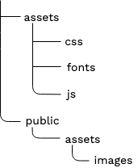

# Step 3 - Customize the front page

In this step you will create the global layout of your site, and display content using custom templates.

First, go to the root of the site (`<yourdomain>`). You should see the home page of the clean install, without any kind of layout.
You will customize this step by instructing Platform to use a custom template to render this Content item.

## Content rendering configuration

To use a custom template when rendering the root content, create a `content_view` configuration block for `ezpublish`.

Edit `config/packages/ezplatform.yaml`.
Add the following block under `system` while paying attention to indentation: `content_view` should be one level below `site_group`:

``` yaml
ezpublish:
    system:
        site_group:
            content_view:
                full:
                    home_page:
                        template: full/home_page.html.twig
                        match:
                            Id\Location: 2
```

This tells eZ Platform to use the `template` when rendering content with Location ID `2`.
`2` is the default Location for the root Content item.

`Id\Location` is one of several [view matchers](../../guide/content_rendering.md#configuring-views-the-viewprovider) that you can use to customize rendering depending on different criteria.

!!! note "Clear the cache"

    Each time you change the YAML files, you should clear the cache. It's not mandatory in dev environment.

    To clear the cache:

    ``` bash
    $ php bin/console cache:clear
    ```

## Create template and layout

### Create the first template

Next, you need to create the template that you indicated in configuration.

For the time being, fill the template with a basic "Hello world" message.

Create a `home_page.html.twig` file in `templates/full/`:

``` html+twig
<div>
    <h1>Hello World!</h1>
</div>
```

Refresh the page and you will see a simple, unstyled version of the message.

### Add the site's main layout

Most sites have a general layout which includes things like header with a logo or footer.
It is displayed on every page, and the content of the page is placed inside it.

To add a template like this to your site, create a `main_layout.html.twig` file in `templates/` and paste the following code into it:

``` html+twig hl_lines="12 87"
<!DOCTYPE html>
<html lang="en">

<head>
    <meta charset="utf-8">
    <meta http-equiv="X-UA-Compatible" content="IE=edge">
    <meta name="viewport" content="width=device-width, initial-scale=1">
    <meta name="description" content="eZ Platform beginner tutorial">

    <title>eZ Platform Beginner Tutorial</title>

    {{  encore_entry_link_tags('tutorial') }}

    <link href='http://fonts.googleapis.com/css?family=Oswald' rel='stylesheet' type='text/css'>
    <link href='http://fonts.googleapis.com/css?family=Roboto+Slab' rel='stylesheet' type='text/css'>
    <link href='http://fonts.googleapis.com/css?family=Fjalla+One' rel='stylesheet' type='text/css'>
</head>

<body>
<!-- Navigation -->
<nav class="navbar navbar-default navbar-fixed-top" id="total-navbar">
    <div class="container">
        <!-- Brand and toggle -->
        <div class="navbar-header page-scroll">
            <a class="navbar-brand" href="/">
                
            </a>
        </div>
    </div>
</nav>

<!-- Header -->
<header class="below-navbar">
    <div class="container">
        <div class="row" id="banner">
            <div class="col-xs-12">
                <div class="banner-header-block">
                    
                    <h3 class="banner-header">{{ 'Discover new rides! Go Bike!'|trans }}</h3>
                </div>
            </div>
        </div>
    </div>
</header>

<section>
    <div class="container">
        <div class="row regular-content-size">
            <div class="col-xs-12 box-style">
                
                
            </div>
        </div>
    </div>
</section>

<!-- Footer -->
<footer class="text-center">
    <div class="footer-color-one">
    </div>
    <div class="footer-color-two">
        <div class="container">
            <div class="row regular-content-size">
                <div class="col-xs-8 col-xs-offset-2 footer-links-block">
                    <ul class="list-inline footer-links">
                        <li><a href="#">{{ 'About Us'|trans }}</a></li>
                        <li><a href="/">{{ 'All Rides'|trans }}</a></li>
                        <li><a href="#">{{ 'Submit a Ride'|trans }}</a></li>
                        <li><a href="#">{{ 'My Account'|trans }}</a></li>
                        <li><a href="#">{{ 'FAQ'|trans }}</a></li>
                    </ul>
                </div>
            </div>
        </div>
    </div>
    <div class="footer-color-three">
        <div class="container">
            <div class="row">
                <div class="col-xs-12">
                    <p class="small">Website design &#38; content © copyright {{ "now"|date("Y") }} eZ Systems. This website was made with eZ Platform.</p>
                </div>
            </div>
        </div>
    </div>
</footer>

{{ encore_entry_script_tags('tutorial-js') }}

</body>
</html>
```

In the highlighted lines (12 and 87) the template takes advantage of [Symfony Webpack Encore](https://symfony.com/doc/current/frontend.html#webpack-encore)
— an integration of Webpack that enables you to build bundles of CSS stylesheets and JS scripts and add them to the project.

### Adding assets

Because for now the site has no stylesheets or asset, download [`assets.zip`](img/assets.zip) which contains the prepared asset files. 

Then unpack its contents to the following directories:

- `css`, `fonts`, and `js` folders to `assets/`
- `images` folder to `public/assets/`

Before proceeding, ensure that the structure of the added files looks like this:



### Configuring Webpack

Now you need to configure the Webpack to create bundles of CSS stylesheets and JS scripts.
First, you have to indicate which files to include in the bundles.

Open the `webpack.config.js` file located in the root folder of your project.
Paste the following code right under `// Put your config here`:

``` javascript hl_lines="3 9"
// Put your config here.
Encore
    .addStyleEntry('tutorial', [
        path.resolve(__dirname, './assets/css/normalize.css'),
        path.resolve(__dirname, './assets/css/bootstrap.min.css'),
        path.resolve(__dirname, './assets/css/bootstrap-theme.css'),
        path.resolve(__dirname, './assets/css/style.css')
    ])
    .addEntry('tutorial-js', [
        path.resolve(__dirname, './assets/js/jquery.min.js'),
        path.resolve(__dirname, './assets/js/bootstrap.min.js')
    ]);
``` 

Note that `.addStyleEntry('tutorial', [])` and `.addEntry('tutorial-js', [])` refer respectively to
`{{  encore_entry_link_tags('tutorial') }}` and `{{ encore_entry_script_tags('tutorial-js') }}` from `main_layout.html.twig`.
This configuration creates a bundle consisting of files to be added to a template.

Additionally, in the same file, uncomment these two following lines:

``` javascript
const projectConfig = Encore.getWebpackConfig();
module.exports = [ eZConfig, ...customConfigs, projectConfig ];
```

And comment out this line:

``` javascript
module.exports = [ eZConfig, ...customConfigs ];
```

??? tip " See the complete `webpack.config.js` file"

    ``` javascript hl_lines="16 17 18 19 20 21 22 23 24 25 26 30 31 34"
    const Encore = require('@symfony/webpack-encore');
    const path = require('path');
    const getEzConfig = require('./ez.webpack.config.js');
    const eZConfigManager = require('./ez.webpack.config.manager.js');
    const eZConfig = getEzConfig(Encore);
    const customConfigs = require('./ez.webpack.custom.configs.js');
    
    Encore.reset();
    Encore.setOutputPath('public/assets/build')
        .setPublicPath('/assets/build')
        .enableSassLoader()
        .enableReactPreset()
        .enableSingleRuntimeChunk();
    
    // Put your config here.
    Encore
        .addStyleEntry('tutorial', [
            path.resolve(__dirname, './assets/css/normalize.css'),
            path.resolve(__dirname, './assets/css/bootstrap.min.css'),
            path.resolve(__dirname, './assets/css/bootstrap-theme.css'),
            path.resolve(__dirname, './assets/css/style.css')
        ])
        .addEntry('tutorial-js', [
            path.resolve(__dirname, './assets/js/jquery.min.js'),
            path.resolve(__dirname, './assets/js/bootstrap.min.js')
        ]);
    
    // uncomment the two lines below, if you added a new entry 
    // (by Encore.addEntry() or Encore.addStyleEntry() method) to your own Encore configuration for your project
    const projectConfig = Encore.getWebpackConfig();
    module.exports = [ eZConfig, ...customConfigs, projectConfig ];
    
    // comment out this line if you've uncommented the above lines
    // module.exports = [ eZConfig, ...customConfigs ];
    ```

The final step in configuring the asset bundles is changing the output path for Webpack to build the assets.
In `config/packages/webpack_encore.yaml` change the `output_path` to the following:

``` yaml
output_path: '%kernel.project.dir%/public/assets/build'
```

At this point the bundles are created and ready to be used.

### Extending templates

Now you have to configure the `main_layout.html.twig` template that uses the assets to extend the `home_page.html.twig` template.

To add one template to another, edit `templates/full/home_page.html.twig` and replace it with the following code:

``` html+twig hl_lines="1 3 7"



    <div class="col-xs-10 col-xs-offset-1 text-justified">
        <h1>Hello World!</h1>
    </div>

```

The templating language Twig supports [template inheritance](http://twig.sensiolabs.org/doc/templates.html#template-inheritance).
Templates can contain named blocks. Any template can extend other templates, and modify the blocks defined by its parents.

The code above points to `main_layout.html.twig` in line 1. It also wraps your "Hello world" message in a `content` block.
If you look back at the main layout template, you can see an empty `` section (lines 52-53).
This is where the `home_page.html.twig` will be rendered.

Clear the cache and regenerate the assets by running the following commands:

​``` bash
$ php bin/console cache:clear
$ php bin/console assets:install
yarn encore prod 
​```

Refresh the page and you should now see the "Hello world" placed inside a styled layout.


At this point, the template is static. It does not render any dynamic data from the Repository.

You'll render a list of all Rides here in the next step.
But before that, you can use the existing page layout to render the content of a single Ride.

## Render a single Ride

### Create the Ride view

Create a Twig template `templates/full/ride.html.twig` with the following code:

``` html+twig


<div class="col-xs-10 col-xs-offset-1 text-justified">
    <section>
        <div class="row regular-content-size">
            <div class="col-xs-12">
                <h3 class="center bottom-plus new-header">{{ content.name }}</h2>
            </div>
        </div>
    </section>
    <section>
        <div class="row regular-content-size">
            <div class="row">
                <div class="col-xs-6">
                    <h4 class="underscore">{{ 'Starting point'|trans }}</h4>
                    {{ ez_render_field(content, 'starting_point', {'parameters': { 'width': '100%', height: '200px', 'showMap': true, 'showInfo': false }}) }}
                </div>
                <div class="col-xs-6">
                    <h4 class="underscore">{{ 'Ending point'|trans }}</h4>
                    {{ ez_render_field(content, 'ending_point', {'parameters': { 'width': '100%', height: '200px', 'showMap': true, 'showInfo': false }}) }}
                </div>
            </div>
        </div>
    </section>
    <section>
        <div class="row regular-content-size">
            <div class="col-xs-12 padding-box">
                <div class="col-xs-2">
                    <div class="box-ride">
                        <p class="special-number">{{ ez_render_field( content, 'length') }} km</p>
                    </div>
                </div>
                <div class="col-xs-8">
                    <h4 class="underscore">{{ 'Description'|trans }}</h4>
                    {{ ez_render_field( content, 'description') }}
                </div>
            </div>
        </div>
    </section>
</div>

```

This template reuses `main_layout.html.twig` and again places the template in a `content` block.

!!! tip "Previewing available variables"

    You can see what variables are available in the current template with the `dump()` Twig function:

    ``` html+twig
    {{ dump() }}
    ```

    You can also dump a specific variable:

    ``` html+twig
    {{ dump(location) }}
    ```

Now you need to indicate when this template should be used.

!!! note

    When pasting YAML code, pay attention to indentation and levels.
    The code blocks shown here include the full structure of the YAML file to help you learn where to place new blocks.
    Be careful not to duplicate existing keys, because YAML does not allow it.

Go back to `config/packages/ezplatform.yaml` and add the following configuration (under the existing `content_view` and `full` keys:):

``` yaml
site_group:
    content_view:
        full:
            # existing keys, do not change them
            ride:
                template: full/ride.html.twig
                match:
                    Identifier\ContentType: ride
```

This tells the application to use this template whenever it renders the full view of a Ride.

### Check the Ride full view

Because you do not have a list of Rides on the front page yet, you cannot simply click a Ride to preview it.
But you still can see how the template works in two ways:

#### Preview in the Back Office

You can use the preview while editing in the Back Office to see how the content will be rendered in full view.


#### Go to the Ride page

You can also go directly to the URL of a Ride.

The URL for a Ride Content item located in the "All Rides" Folder is `http://<yourdomain>/all-rides/<ride-name>`.
