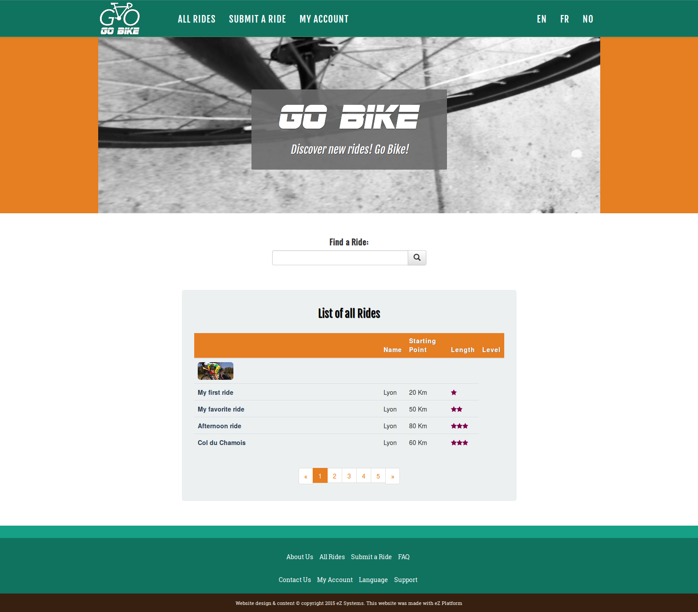
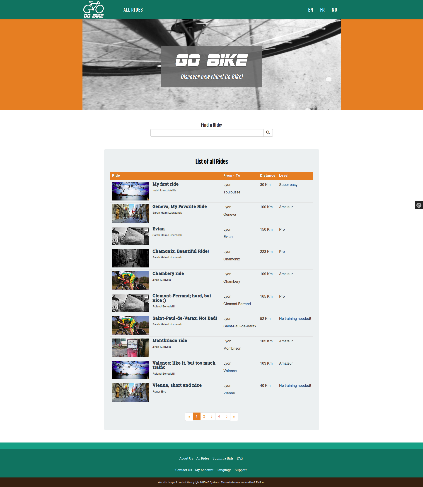
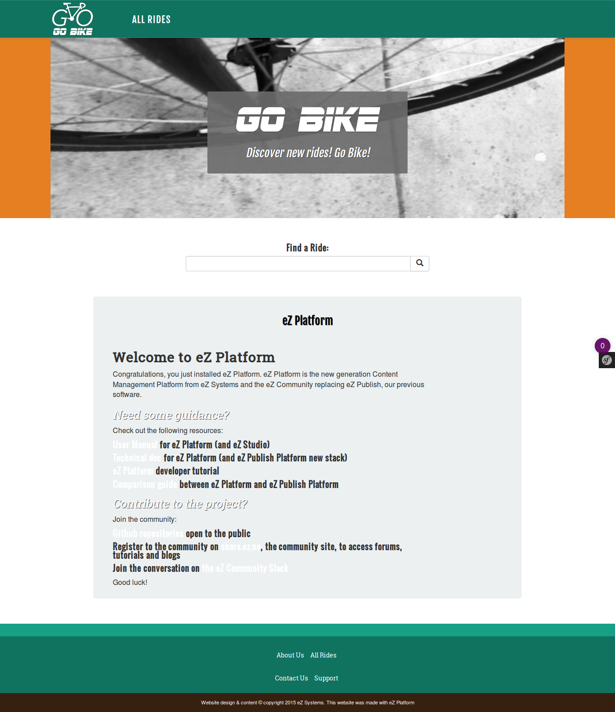

# Step 3 - Customizing the general layout

We will begin by customizing the global layout of our site, in order to end up with this rendering:



First, go to the root of your eZ Platform site. You should see the root folder of the clean install, without any kind of layout. You can go to `/admin`, edit this Content item and see that this page changes. When `/` is requested, eZ Platform renders the root content using the `ez_content:viewContent` controller. We will customize this step by instructing Platform to use a custom template to render this particular item.

!!! note

    eZ Platform organizes content as a tree. Each Content item is referenced by a Location, and each Location as a parent. The root content Location has the ID `2` by default.

## Content rendering configuration

To use a custom template when rendering the root content, let's create a `content_view` configuration block for `ezpublish`.

We will use the `default` namespace, but we could have used any siteaccess instead. Edit `app/config/ezplatform.yml`. At the end, add the following block, right after the language configuration (pay attention to indentation: `default` should be at the same level as `site_group`):

``` yaml
#ezplatform.yml
    system:
    #existing directives: don't touch them    
        default: #same level as site_group directive
            content_view:
                full:
                    root_folder:
                        template: "full/root_folder.html.twig"
                        match:
                            Id\Location: 2
```

This tells Platform to use the `template` when rendering any content referenced by the Location with the id `2`. There is a whole set of [view matchers](../../guide/content_rendering.md#view-provider-configuration) that can be used to customize rendering depending on any criterion.

!!! note "Clear the cache"

    Each time you change the YAML files, you could clear the cache. It's not mandatory in dev environment.

    To clear the cache:

    ``` bash
    $ php bin/console cache:clear
    ```

## Creating the template

1. [Download index.html](https://raw.githubusercontent.com/bdunogier/platform-workshop/master/src/Workshop/TutorialBundle/Resources/public/index.html)
1. Save it in `app/Resources/views` as `app/Resources/views/full/root_folder.html.twig`.
1. Refresh the site's root and you should see the site's structure, but without any styles or images. Let's fix this.
1. Edit the `root_folder.html.twig` template.

## Fixing the assets

The first thing to do is to fix the loading of stylesheets, scripts and design images.

1. [Download assets.zip](https://github.com/ezsystems/ezsc2015-beginner-tutorial/raw/master/assets.zip)
1. Then unpack its contents to the `web` directory of your project. You will end up with `web/assets/`, containing `css`, `js` and `images` subfolders.
    
1. In the template, in the` <html>` section, replace the `<link>` tags linking to bootstrap and custom CSS lines  (lines 15 to 21) with the following code:

``` html
<!--root_folder.html.twig-->

    <link rel="stylesheet" href="{{ asset_url }}" />

```

As explained in the [Symfony assetic doc](http://symfony.com/doc/current/cookbook/assetic/asset_management.html#including-css-stylesheets), this will iterate over the files in `web/assets/css` and load them as stylesheets.
Refresh the page and you should now see the static design of the site !

At the bottom of the template, you will find `<script>` tags that load jQuery and Bootstrap javascript (around line 360). Replace them with an equivalent block for scripts:

``` html
<!--root_folder.html.twig-->

    <script src="{{ asset_url }}"></script>

```

Let's finish this by fixing the design images. Locate the `` tag with `"images/128_bike_white_avenir.png"`. Change the `src` to `{{ asset('assets/images/128_bike_white_avenir.png') }}`:

``` html
<!--root_folder.html.twig-->

```

Do the same for `"images/logo_just_letters.png"`:

``` html
<!--root_folder.html.twig-->

```

Then change every image's path in the same way.

!!! tip
    The web assets file must be regenerated for the prod environment, so run the following command:

    ​```
    php app/console assetic:dump --env=prod web
    ​```

!!! note "Clear the cache"

    Each time you change the templates, you could clear the cache. It's not mandatory in dev environment.

    To clear the cache:

    ``` bash
    $ php bin/console cache:clear
    ```

 

Refresh the page. The design should now be in order, with the logo, fonts and colors as the first image of this page.



## Rendering the content

At this point, the `root_folder.html.twig` template is static. It doesn't render any dynamic data from the repository.

The root is rendered by the `ez_content:viewAction` controller action. This action assigns the currently viewed content as the `content` Twig variable. We will use that variable to display some of the fields from the root content. Replace the central section of the template, around line 90, with the following block:

``` html
<!--root_folder.html.twig-->
<section class="buttons">
    <div class="container">
        <div class="row regular-content-size">
            <div class="col-xs-10 col-xs-offset-1 box-style">
                <h3 class="center bottom-plus new-header">{{ ez_content_name(content) }}</h3>
                <div class="col-xs-10 text-justified">{{ ez_render_field(content, 'description') }}</div>
            </div>
        </div>
    </div>
</section>
```

The page will now show the values of title and description fields of the root Platform Content.



## Extracting the layout

The general layout of the site, with the navigation, footer, scripts, etc., is written down in the template we use to render the root. Let's extract the part that is common to all the pages so that we can re-use it.

Twig supports a powerful [template inheritance](http://twig.sensiolabs.org/doc/templates.html#template-inheritance) API. Templates may declare named blocks. Any template may extend other templates, and modify the blocks defined by its parents.

Create a new `app/Resources/views/pagelayout.html.twig` template and copy the contents of the current `root_folder.html.twig` into it.

Change the central section from the previous chapter as follows:

``` html
<!--pagelayout.html.twig-->
<section class="buttons">
    <div class="container">
        <div class="row regular-content-size">
            <div class="col-xs-10 col-xs-offset-1 box-style">
                
                
            </div>
        </div>
    </div>
</section>
```

This defines a block named "content". Other templates can add content to it, so that the result of the execution of the controller is contained within the site's general layout.

Edit `root_folder.html.twig` and replace the whole content of the file with the following code:

``` html


<h3 class="center bottom-plus new-header">{{ ez_content_name(content) }}</h3>
<div class="col-xs-10 text-justified">{{ ez_render_field(content, 'description') }}</div>

```

This will re-use `pagelayout.html.twig` and replace the `content` block with the title and description from the root folder. This should not change the web page.

We could easily create more blocks in the pagelayout so that templates can modify other parts of the page (footer, head, navigation), and we will over the course of this tutorial. We can now create more templates that inherit from `pagelayout.html.twig`, and customize how content is rendered.

Let's do it for the Ride Content Type.
