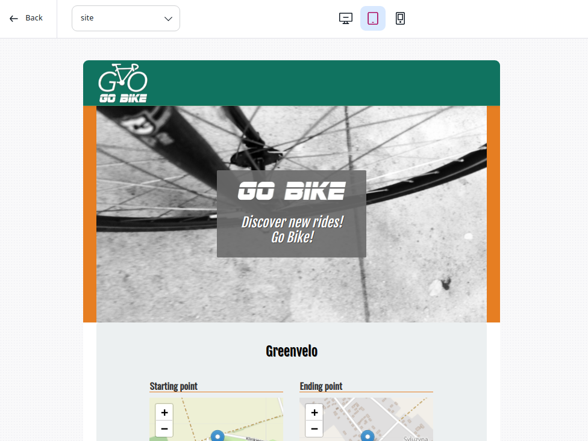

# Step 1 - Display content of a Ride


Now let's inject and display all Points of interest within the view.

### Creating the Ride view

Create a Twig template `app/Resources/views/full/ride.html.twig` and paste into it the following HTML and Twig tags:

``` html
<!--ride.html.twig-->


  <section>
    <div class="container">
      <div class="row regular-content-size">
        <div class="col-xs-10 col-xs-offset-1 row-padding">
          <div class="col-xs-12">
            <div class="col-xs-1 text-left">
              <h2>Ride:</h2>
            </div>
            <div class="col-xs-11 text-left">
              <h2 class="extra-padding-left">{{ ez_content_name( content ) }}</h2>
            </div>
          </div>
        </div>
      </div>
    </div>
  </section>
  <section>
    <div id="map-container">
      {{ ez_render_field(content, 'starting_point', {'parameters': { 'height': '330px', 'showMap': true, 'showInfo': false }}
      ) }}
    </div>
  </section>
  <section>
    <div class="container">
      <div class="row regular-content-size">
        <div class="col-xs-10 col-xs-offset-1 padding-box">
          <div class="col-xs-2">
            <div class="box-ride">
              <h3 class="special-number">{{ ez_render_field( content, 'length') }} Km</h3>
              <p class="pre-small special-number special-number-margin"><strong>{{ 'Level' }}</strong></p>
            </div>
          </div>
          <div class="col-xs-10">
            <div class="col-xs-5">
              <p>Created by: {{ ez_field_value( content, 'author') }}</p>
              <p>Start: {{ ez_field_value(content, 'starting_point') }}
              </p>
              <p>End: {{ ez_field_value(content, 'ending_point') }}</p>
            </div>
          </div>
        </div>
        <div class="col-xs-10 col-xs-offset-1 padding-box">
          <div class="col-xs-10">
            <div class="col-xs-2 text-right">
              <p>Description:</p>
            </div>
            <div class="col-xs-10 text-justify">
              {{ ez_render_field( content, 'description') }}
            </div>
          </div>
        </div>
      </div>
    </div>
  </section>
 
```

#### What is in this template?

You reuse your pagelayout.html.twig template, to have the menu, footer and CSS.

The Ride template is in a block and you use the Twig helpers to render the content of a Ride

!!! note

    See the [Twig Functions Reference](../../guide/content_rendering.md#twig-functions-reference) for more information on Twig helpers

!!! note

    Note: the Level Field is static for now and uses the translation capacity.

The Starting Point and Ending Point Google Maps rendering is not yet done. You will use the [MapLocation Field Type](../../guide/field_type_reference.md#maplocation-field-type) to render this Content Type.

### Add a new parameter to your override rule

We still haven't set any matching rule for our new Content Type Ride, so let's add one that will render a specific template for a Ride Content Type. 

``` yaml
# ezplatform.yml
default:
    content_view:
        full:
            full_ride:
                template: "full/ride.html.twig"
                match:
                    Identifier\ContentType: "ride"
```

### Check the Ride full view

#### Preview in the Admin

You can use the Preview while Editing in the Admin to preview your content rendered in the full view.



#### Go to the Ride page

You can also go the URL of the content. It is a URL like this one **http://127.0.0.1:8000/view/content/53/eng-GB/full/true/55** where 53 is the Content ID and 55 is the Location ID of my Ride.
The infos in the URL are http://&lt;yourhost&gt;/view/content/&lt;ContentId&gt;/&lt;language&gt;/full/true/&lt;LocationId&gt;

You will find the Content ID and the Location ID of your Ride in the Admin, under the Details tab.
 


## Points Of Interest

Go to Admin Panel &gt; Content Types, and under the "Content"  group, create the Point Of Interest Content Type.


## Create the Point Of Interest (POI) Content Type

A geographical location rides go through. Each ride may be related to as many points of interest as needed.

- **Name**: Point of interest
- **Identifier**: point\_of\_interest
- **Content name pattern**: &lt;name&gt; 

Then create all fields with the following information: 

- **Name**: identifier **name**; field type **textLine **(**Required** / **Searchable** / **Translatable**)
- **Description**: identifier **description**; field type **Rich Text **(**Searchable** / **Translatable**)
- **Photo**: identifier **photo**; field type **Image **(**Required**)
- **Photo Legend**: identifier **legend**; field type **Rich Text **(**Searchable** / **Translatable**)
- **Place**: identifier **place**; field type **MapLocation **(**Required** / **Searchable**)

!!! note

    The **content name pattern** defines how the name and URL part of Content items of this type will be built. It may include static strings, as well as references to field definitions, using their identifier.

    The value of the fields referenced in the pattern will be used to build the name. Most Field Types are able to render a textual representation of their value, but be aware that it is not implemented for some of them ([Selection Field Type](../../guide/field_type_reference.md#selection-field-type), [Relation Field Type](../../guide/field_type_reference.md#relation-field-type), [RelationList Field Type](../../guide/field_type_reference.md#relationlist-field-type)).

Now, validate the Content Type creation form. It will save the Point Of Interest Content Type.
Create some Points Of Interest in the Content tree.

Note that you will need pictures (for the Photo, the image Field) to represent them.

## Edit the Ride Content Type

Now edit the Ride in order to add a Content Relation Multiple between the two Content Types.


Then link some Points Of Interests to a Ride in the Admin interface.

## Ride view improvements

### Display the list of POI

By default, there are only 4 variables in a view: `noLayout`, `viewbaseLayout`, `content` and `location`.

It is possible to inject whatever variable you want in a specific view.

You will find more info here: [Custom controllers](../../guide/content_rendering.md#custom-controllers) and [View provider configuration](../../guide/content_rendering.md#view-provider-configuration).

## Create your Point of Interest line view

Now, we need to create the line view for Point of Interest.

Declare a new override rule into your `app/config/ezplatform.yml`:

``` yaml
# ezplatform.yml
    system:
        default:
            content_view:
                #full views here
                line:
                    line_point_of_interest:
                        template: 'line/point_of_interest.html.twig'
                        match:
                            Identifier\ContentType: ['point_of_interest']
```

Create your template for the line view of a Point of Interest `app/Resources/views/line/point_of_interest.html.twig`:

``` html
<!--point\_of\_interest.html.twig-->
<section>
<div class="col-xs-4 photos-box">
  <a href="#bikeModal{{ content.id }}" class="portfolio-link" data-toggle="modal">
    <div class="caption">
      <div class="caption-content">
        <i class="fa fa-search-plus fa-3x"></i>
      </div>
    </div>
    {{ ez_render_field( content, 'photo', { parameters: { 'alias': 'small'},
    attr: { 'class': 'img-responsive img-rounded', 'alt':'' }}) }}
    {##}
  </a>
</div>

{# MODAL #}
<div class="bike-modal modal fade" id="bikeModal{{ content.id }}" tabindex="-1" role="dialog" aria-hidden="true">
  <div class="modal-content">
    <div class="close-modal" data-dismiss="modal">
      <div class="lr">
        <div class="rl">
        </div>
      </div>
    </div>
    <div class="container">
      <div class="row">
        <div class="col-xs-8 col-xs-offset-2">
          <div class="modal-body text-center">
            <h2>Photo: {{ ez_content_name( content ) }}</h2>
            <hr class="featurette-divider">
            {{ ez_render_field( content, 'photo', { parameters: { 'alias': 'large'},
            attr: { 'class': 'img-responsive img-rounded' }}) }}
            {##}
            {{ ez_render_field( content, 'description', { attr: { 'class': 'padding-box text-justify' }}) }}
          </div>
        </div>
      </div>
    </div>
  </div>
</div>
</section>
```

### Integrate the Points of Interest in the Ride view

#### Create the RideController

In the AppBundle directory, create a PHP file: `/src/AppBundle/Controller/RideController.php`

``` php
// /src/AppBundle/Controller/RideController.php
<?php
namespace AppBundle\Controller;
use eZ\Publish\API\Repository\Values\Content\Query;
use eZ\Publish\API\Repository\Values\Content\Query\Criterion;
use eZ\Bundle\EzPublishCoreBundle\Controller;
use eZ\Publish\API\Repository\Values\Content\Query\SortClause;
use eZ\Publish\Core\Repository\Values\Content\Location;
class RideController extends Controller
{
  /**
   * Action used to display a ride
   *  - Adds the list of all related Points of interest to the response.
   *
   * @param Location $location
   * @param $viewType
   * @param bool $layout
   * @param array $params
   * @return mixed
   */
  public function viewRideWithPOIAction(Location $location, $viewType, $layout = false, array $params = array())
  {
    $repository = $this->getRepository();
    $contentService = $repository->getContentService();
    $currentLocation = $location;
    $currentContent = $contentService->loadContentByContentInfo($currentLocation->getContentInfo());
    $pointOfInterestListId = $currentContent->getFieldValue('pois'); //points of interest
    $pointOfInterestList = array();
    foreach ($pointOfInterestListId->destinationContentIds as $pointId)
    {
      $pointOfInterestList[$pointId] = $contentService->loadContent($pointId);
    }
    return $this->get('ez_content')->viewLocation(
      $location->id,
      $viewType,
      $layout,
      array('pointOfInterestList' => $pointOfInterestList) + $params
    );
  }
}
```

Update the `/app/config/ezplatform.yml` file to mention the RideController

``` yaml
# /app/config/ezplatform.yml
        default:
            content_view:
                full:
                    full_ride:
                        template: "full/ride.html.twig"
                        controller: "AppBundle:Ride:viewRideWithPOI"
                        match:
                            Identifier\ContentType: "ride"
```

### Add the Point Of Interest in the Ride full view

Add the following lines (at the end of the Ride full view file, before the closing tag

``

``` html
<!--/app/Resources/views/full/ride.html.twig-->

    <div class="container">
        <div class="row regular-content-size">
            <div class="col-xs-10 col-xs-offset-1 padding-box">
                <section class="photos">
                    <div class="col-xs-10">
                        <h4 class="underscore-green">Points of interest:</h4>
                    </div>
                    
                        {{ render( controller( "ez_content:viewLocation", { 'locationId': point.contentInfo.mainLocationId, 'viewType': 'line'} )) }}
                    
                </section>
            </div>
        </div>
    </div>

```

Then check the Ride page again to see the Points of Interest!

Remember: `http://<yourhost>/view/content/<ContentId>/<language>/full/true/<LocationId>`
