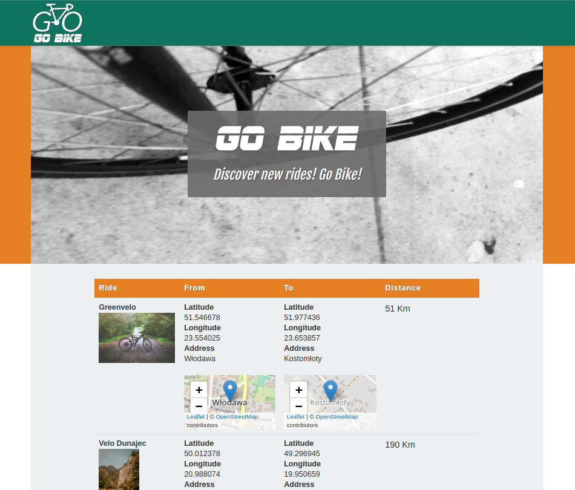

# Step 5 - Display the list of Rides on the homepage



## Customize your homepage template

Let's modify the `Resources/views/content/full/root_folder.html.twig ` adding a call to a subrequest to display the list of all existing Rides with pagination:

``` html
<!--root\_folder.html.twig-->



    <script src="http://maps.google.com/maps/api/js?sensor=false"></script>

    <h3 class="center bottom-plus new-header">{{ ez_content_name(content) }}</h3>
    <div class="col-xs-10 text-justified">
    {{ render( controller( "AppBundle:Homepage:getAllRides" ) ) }}
    </div>
 
```

!!! note

    For the moment, we use a simple `render()` Twig function but when we talk about cache, we will use `render_esi`.

## Create your sub controller to display list of Rides

Create your `/src/AppBundle/Controller/HomepageController.php `with the method `getAllRidesAction`:

``` php
// HomepageController.php

<?php
namespace AppBundle\Controller;
use eZ\Publish\API\Repository\Values\Content\Query;
use eZ\Publish\API\Repository\Values\Content\Query\Criterion;
use eZ\Publish\Core\MVC\Symfony\Controller\Controller;
use eZ\Publish\API\Repository\Values\Content\Query\SortClause;
use eZ\Publish\Core\Pagination\Pagerfanta\ContentSearchAdapter;
use Pagerfanta\Pagerfanta;
use Symfony\Component\HttpFoundation\Request;
class HomepageController extends Controller
{
  public function getAllRidesAction(Request $request)
  {
    $repository = $this->getRepository();
    $locationService = $repository->getLocationService();
    $contentService = $repository->getContentService();
    $rootLocationId = $this->getConfigResolver()->getParameter('content.tree_root.location_id');
    $rootLocation = $locationService->loadLocation($rootLocationId);
    $currentLocationId = 2;
    $currentLocation = $locationService->loadLocation($currentLocationId);
    $currentContent = $contentService->loadContentByContentInfo($currentLocation->contentInfo);
    $query = new Query();
    $query->query = new Criterion\LogicalAnd(
      array(
        new Criterion\Subtree($rootLocation->pathString),
        new Criterion\Visibility(Criterion\Visibility::VISIBLE),
        new Criterion\ContentTypeIdentifier(array('ride'))
      )
    );
    $query->sortClauses = array(
      new SortClause\DatePublished(Query::SORT_ASC)
    );
    $pager = new Pagerfanta(
      new ContentSearchAdapter($query, $this->getRepository()->getSearchService())
    );
    //FIXME : get $limit value from a custom parameter
    $limit = 10;
    $pager->setMaxPerPage($limit);
    $pager->setCurrentPage($request->get('page', 1));
    return $this->render(
      'list/rides.html.twig',
      array(
        'location' => $currentLocation,
        'content' => $currentContent,
        'pagerRides' => $pager,
      )
    );
  }
}
```

## Create template to display the list of Rides

Create `app/Resources/views/list/rides.html.twig `template. You use a `<table>` to display the list of rides. The `<head>` of the `<table>` is in this Ride list template and each `<tr>` (line of the table) is in the line ride template.

So each time you use the line Ride template, you have to remember the choice of using a `<tr>`.

``` html
<!--rides.html.twig-->
<div class="row regular-content-size">
  <div class="col-xs-10 col-xs-offset-1 box-style">
    <h3 class="center bottom-plus new-header">List of all Rides</h3>
    {# Loop over the page results #}
    
      
        <table class="table table-hover">
        <thead>
        <tr class="table-header">
          <th> Ride</th>
          <th>From</th>
          <th> To</th>
          <th>Distance</th>
          <th>Level</th>
        </tr>
        </thead>
        <tbody>
      
      {{ render( controller( 'ez_content:viewLocation', { 'locationId': ride.versionInfo.contentInfo.mainLocationId, 'viewType': 'line' } )) }}
      
        </tbody>
        </table>
      
    
  </div>
</div>
```

The next step is to create the override rule to use a dedicated template for the view line of Rides.

To do so, you need to configure your Bundle to inject override configuration.

## Use a custom template to display view line of a Ride

You add the rule for the line\_ride template to be used in your `app/config/ezplatform.yml `file.

``` yaml
# ezplatform.yml
system:
    site_group:
        content_view:
            line:
                line_ride:
                    template: "line/ride.html.twig"
                    match:
                        Identifier\ContentType: "ride"
```

Create your `app/Resources/views/line/ride.html.twig `template.

*Remember, it's only one line of a table, so you will find a `<tr>` tag with some `<td>` tags.*

``` html
<!--ride.html.twig-->
<tr>
    <td>
        <strong>
            <a href="{{ path( "ez_urlalias", { 'locationId': content.contentInfo.mainLocationId } ) }}"
               target="_self">
                {{ ez_content_name( content ) }}
            </a>
        </strong>
    </td>
    <td>
        {{ ez_render_field(content, 'starting_point', {'parameters': {'width': '100%', 'height': '100px', 'showMap': true, 'showInfo': true }}
        ) }}
    </td>
    <td>
        {{ ez_render_field(content, 'ending_point', {'parameters': {'width': '100%', 'height': '100px', 'showMap': true, 'showInfo': true }}
        ) }}
    </td>
    <td>
        <p>{{ ez_render_field( content, 'length' ) }} Km</p>
    </td>
    <td>
        <p>{{ ez_render_field( content, 'level' ) }}</p>
    </td>
</tr>
```

Go to the homepage of your Tutorial website, and you will see the list of Rides!

## Congrats!

### Success: you have just built your first website

Now you have created your first website with eZ Platform.

The website is simple and efficient.

**You learned:**

- How to do a quick install of eZ Platform
- How the files in an eZ Platform project are organized
- Where you should put your asset files
- How to param your eZ Platform to use templating
- How to use Twig templates to display the content from your database

!!! note "WORK IN PROGRESS"

    This tutorial is a work in progress, let us know on [Slack](http://share.ez.no/get-involved/exchange#slack) or [Forums](http://share.ez.no/forums/suggestions) what Features you want to implement first after this Tutorial. Thank you!

    If you would like a sneak peek at our efforts, take a look at the [Beginner Tutorial Component in Jira](https://jira.ez.no/issues/?jql=component%20%3D%20%22Beginner%20Tutorial%22%20AND%20project%20%3D%20EZP).
