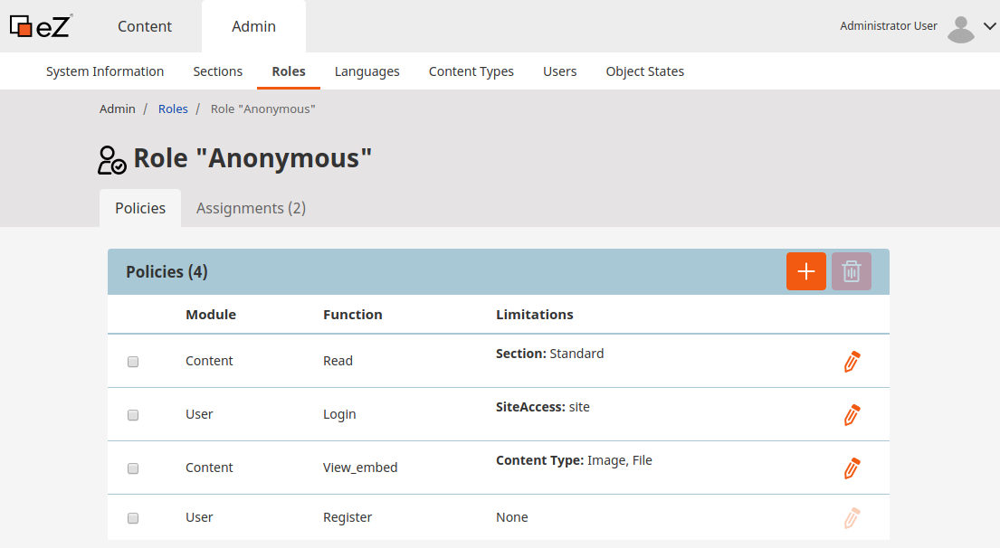

# Step 6 - Enabling account registration

We are trying to let our friends write their bike trips directly into our website. We would like to let them create Rides. As an Administrator of the website you could create the Users yourself but in order to let them place their own content, first, you want to let them create their own accounts.

## Make registration possible

From the Admin Panel, go to the _Roles_ management screen and click on the _Anonymous_ Role name to edit it.

For the Anonymous User, you will add the _User/Register_ policy. This will enable the access to the Register form for everyone on your website.

!!! note

    See the documentation about [Registering new users to learn how to assign a group](../../guide/user_generated_content/#registering-new-users) to the newly registered Users.
Then go to the URL: http://127.0.0.1/register and create a new user.

You will update the design of this page after checking that the new user is working.

The Users are created in the _Guest accounts_ group, and the User you have just created will have the Roles used by the _Guest accounts_ User group.
Now, we have 2 options:

* **Add the right to create Rides to _Guest accounts_.** This will enable the Ride creation for whoever has registered on the Go Bike website. In this case, you may not want to give the Publish Content permission.
* **Create a group dedicated to our Go Bike Members** and give this group the right to create Rides. Then you will have to add the Users to the Go Bike Members group so they can benefit from the Roles of the group. In this case, once the User is "_validated_" as trusted, they will be able to create and publish their own content.

In this Tutorial, you will use the second option.

## Create a User Group for the Go Bike Members

From the Admin Panel in the _Users_ screen, click on the *Create* button and _filter by Group_ by checking "_Users_" to see only the users-related Content Types. Create a User Group named `Go Bike Members`.

## Create a Folder for the Rides from the Go Bike Members

In the Content creation screen, select _Folder_ and create a new Folder named `Members Rides` into the Folder `All Rides` already existing. The Go Bike Members will have the access rights in creation mode only in this Folder.

## Set permissions for Go Bike Members

From the Admin Panel in the _Roles_ screen, create a new Role named *Bikers*.

Now, you will set the Policies for the _Bikers_ Role.

- User/Login
- User/Password
- Content/Create with Limitations: only Rides and Points of Interest in the `Members Rides` subtree only
- Content/Publish with Limitations: only Rides and Points of Interest in the `Members Rides` subtree only
- Content/edit where owner is _"Self"_
- Content/read
- Content/versionread

!!! note
    The Limitations are a powerful tool for fine-tuning the permission management of the Users.
    See [the documentation about Limitations for a more technical approach](../../guide/repository/#usergrouplimitation)

    See also the Cookbook [Authenticating a user with multiple user providers](../../cookbook/authenticating_a_user_with_multiple_user_providers/)

Once the Policies are set, assign your Role *Bikers* to the User Group *Go Bike Members*.

## Try the validation of your future Go Bike Users

Log in the back office as an Administrator and go to the Users page. Select the user you have just created and Move them into your *Go Bike Member* user group.

## Create content as a Go Bike Member

Then log in again into the back office with your new user credentials.
You have now the possibility to create new Rides and Points of Interest only.
