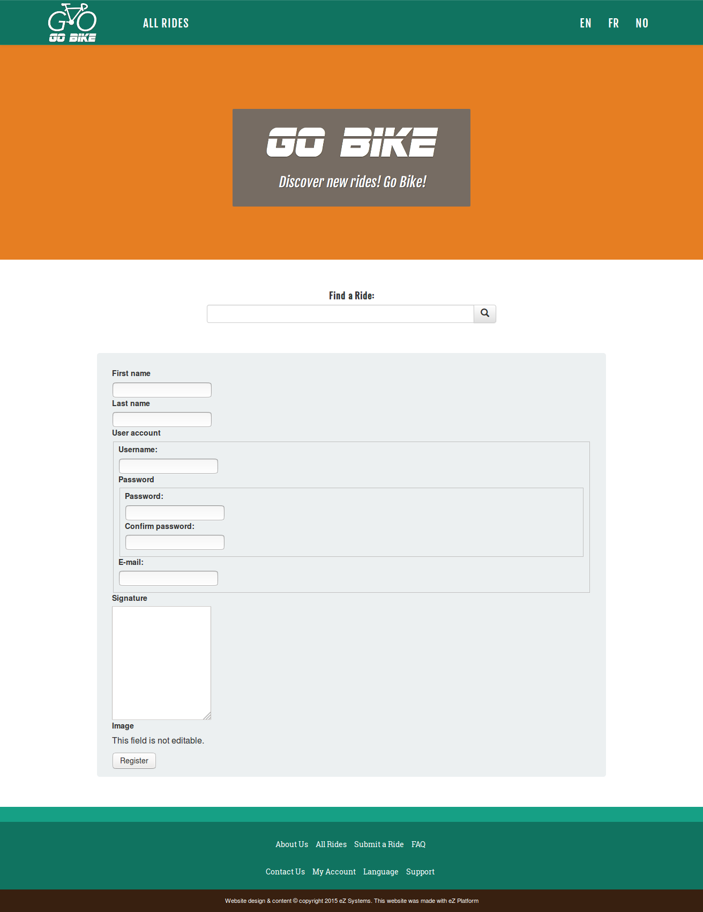

# Step 7 - Customizing the user forms

We want to have a consistent design in our web site. When using the pagelayout for the register forms, you see the same design as the rest of the website. We want to welcome our new users with a pretty register page.

### Use a views.yml file

In order to have a better file structure, we will extract the YAML keys regarding the presentation and put them into their own separate file. Create an `app/config/views.yml` file and move the following code referring to templating to this file from `ezplatform.yml` (and remove corresponding code from `ezplatform.yml`):

```yaml
ezpublish:
    system:
        site_group:
            pagelayout: pagelayout.html.twig
            content_view:
                    full:
                        full_ride:
                            template: "full/ride.html.twig"
                            controller: "AppBundle:Ride:viewRideWithPOI"
                            match:
                                Identifier\ContentType: "ride"
                        root_folder:
                            template: "full/root_folder.html.twig"
                            match:
                                Id\Location: 2
                    line:
                        line_point_of_interest:
                            template: 'line/point_of_interest.html.twig'
                            match:
                                Identifier\ContentType: ['point_of_interest']
                        line_ride:
                            template: "line/ride.html.twig"
                            match:
                                Identifier\ContentType: "ride"
```

And at the beginnning of the `ezplatform.yml` file, add the following lines to import the content of views.yml:

```yaml
imports:
    - { resource: views.yml }
```

!!! note


    You can clear the cache with the command we have seen before: `php app/console cache:clear` to check that it works like before.
​    

And at the same level as `pagelayout` add a `user` key so the beginning of your `views.yml` file looks like this:

```yaml
ezpublish:
    system:
        site_group:
            pagelayout: pagelayout.html.twig
            user:
                layout: pagelayout.html.twig
```

Then clear the cache with the command we have seen before: `php app/console cache:clear` to see the consequences of the addition you made.

When you get the `<yourdomain>/register` URL, you should have this view where you see that the pagelayout is used.



## Use custom template for register forms

At the same level as `pagelayout` add a `user_registration` key so the beginning of your `views.yml` file looks like this:

```yaml
ezpublish:
    system:
        site_group:
            pagelayout: 'pagelayout.html.twig'
            user:
                layout: 'pagelayout.html.twig''
            user_registration:
                templates:
                    form: 'user/registration_form.html.twig'
                    confirmation: 'user/registration_confirmation.html.twig'
```

## Create the overriding templates files

You will create 3 Twig templates to manage the registration and the login forms, including confirmation page.

 * `registration_form.html.twig`: the main form file
 * `registration_content_form.html.twig`: the file with the design details for each field
 * `registration_confirmation.html.twig`: the page the user will see after registration

!!! note
    All the Twig templates come from the eZPlatform Demo, you can view them in the Github repository: https://github.com/ezsystems/ezplatform-demo/tree/master/app/Resources/views/themes/demo/user

### Create the register form custom template

Let's begin with the register form. Create the file `/app/Resources/views/user/registration_form.html.twig` and fill it with these Twig tags.

``` html



    

    {{ parent() }}



    

    <div class="container">
        <section class="user-form col-md-6 col-md-offset-3">
            <h2>{{ 'Member Registration'|trans }}</h2>
            <div class="legend">* {{ 'All fields are required'|trans }}</div>

            {{ registrationForm.display_form(form) }}
        </section>
    </div>

```
In line 10, you see the import Twig function, that is calling the `user/registration_content_form.html.twig` file. So create this file along the previous file, and fill it with these Twig tags:
```html

    {{ form_start(form) }}

    
        

        
            
                <div class="row">
            
            <div class="col-md-6">
                <div class="field-name">
                    <label class="required">{{ fieldForm.children.value.vars.label }}:</label>
                </div>
                {{ form_errors(fieldForm.value) }}
                {{ form_widget(fieldForm.value, {
                    'contentData': form.vars.data
                }) }}
            </div>
            
                </div>
            
        

        
            <div class="row">
                <div class="col-md-6">
                    {{ form_widget(fieldForm.value, {
                        'contentData': form.vars.data
                    }) }}
                </div>
            </div>
        

        
    

    <div class="row">
        <div class="col-md-4 col-md-offset-4">
            {{ form_widget(form.publish, {'attr': {
                'class': 'btn btn-block btn-primary'
            }}) }}
        </div>
    </div>

    {{ form_end(form) }}

```
If you want to check the look of your new page, first clear the cache, then get your <yourdomain>/register URL.

### Create the confirmation page template

Now create a file `app/Resources/views/user/registration_confirmation.html.twig` alongside the previous files.

Place these Twig tags in the file:
```html



  

  {{ parent() }}



  <div class="container">
    <section class="user-form-confirmation col-md-4 col-md-offset-4">
      <h2>{{ 'Registration completed'|trans }}</h2>

      <div class="row confirmation-label">
        {{ 'You are all set up and ready to go'|trans }}
      </div>

      <div class="row">
        <div class="col-md-4 col-md-offset-4">
          <button type="button" class="btn btn-block btn-primary"
                  onclick="window.location='{{ path('login') }}';">{{ 'Log in'|trans }}</button>
        </div>
      </div>
    </section>
  </div>


```

This way you have learned how to customize the user registration of your website.
