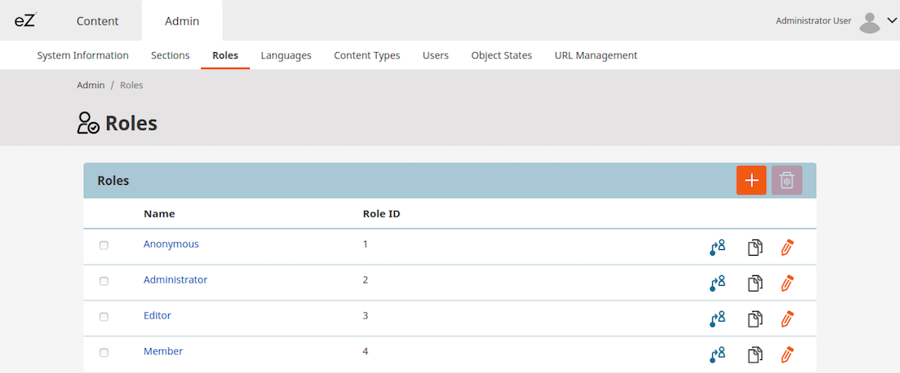
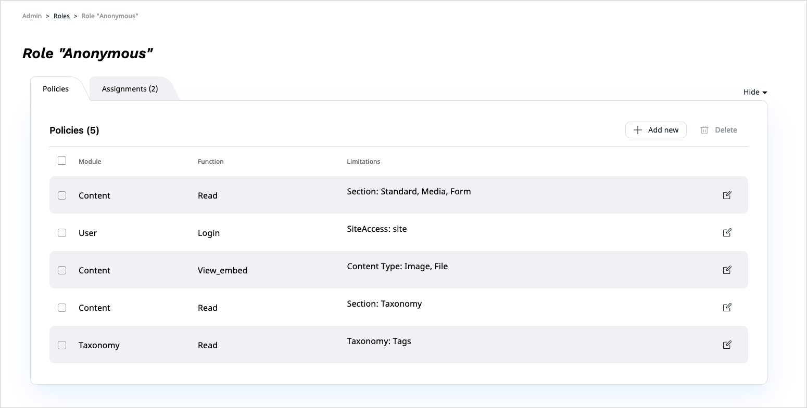
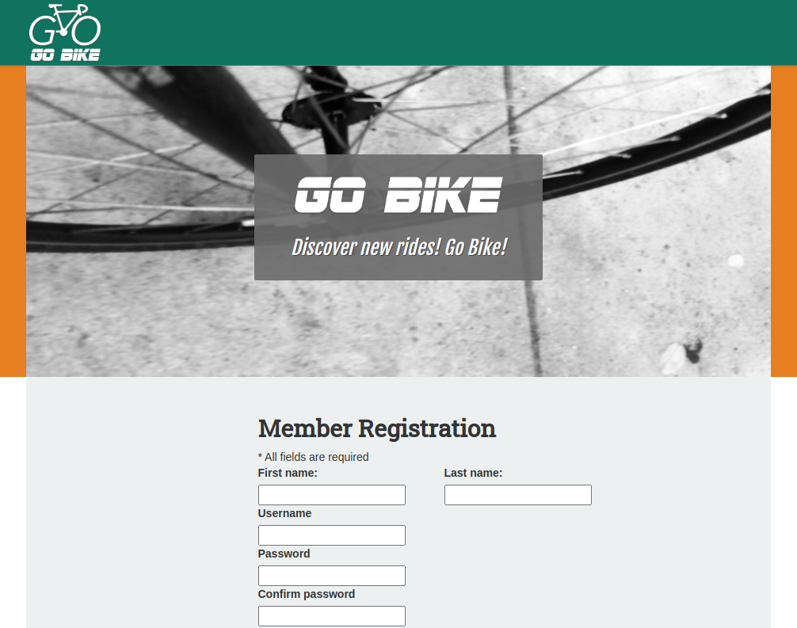

# Step 8 — Enable account registration

In this step you will enable other users to create accounts on your site, access the Back Office and create content.

## Enable registration

From **Admin**, go to the **Roles** management screen and click on the **Anonymous** Role.



Add the `User/Register` Policy to the Anonymous User. This will allow any visitor to the website to access the registration form.



Then go to `<yourdomain>/register`. The registration form is unstyled, so you need to add templates to it.

## Customize registration forms

In the `config/packages/views.yaml` file add a `user_registration` key under `site`, at the same level as `content_view`:

``` yaml
ezplatform:
    system:
        site:
            # existing content_view keys
            user_registration:
                templates:
                    form: user/registration_form.html.twig
```

This indicates which template will be used to render the registration form.

Create the file `templates/user/registration_form.html.twig`:

``` html+twig hl_lines="10"



    

    {{ parent() }}



    

    <div class="container">
        <section class="user-form col-md-6 col-md-offset-3">
            <h2>{{ 'Member Registration'|trans }}</h2>
            <div class="legend">* {{ 'All fields are required'|trans }}</div>

            {{ registrationForm.display_form(form) }}
        </section>
    </div>

```

In line 10 you can see that another file is imported: `registration_content_form.html.twig`.
The second template will render the actual fields of the registration form. Create this file as well (as `templates/user/registration_content_form.html.twig`):

``` html+twig

    {{ form_start(form) }}

    
        

        
            
                <div class="row">
            
            <div class="col-md-6">
                <div class="field-name">
                    <label class="required">{{ fieldForm.children.value.vars.label }}:</label>
                </div>
                {{ form_errors(fieldForm.value) }}
                {{ form_widget(fieldForm.value, {
                    'contentData': form.vars.data
                }) }}
            </div>
            
                </div>
            
        

        
            <div class="row">
                <div class="col-md-6">
                    {{ form_widget(fieldForm.value, {
                        'contentData': form.vars.data
                    }) }}
                </div>
            </div>
        

        
    

    <div class="row">
        <div class="col-md-4 col-md-offset-4">
            {{ form_widget(form.register, {'attr': {
                'class': 'btn btn-block btn-primary'
            }}) }}
        </div>
    </div>

    {{ form_end(form) }}

```

The third template you need to prepare covers the confirmation page that is displayed when a user completes the registration.
First, point to the new template in the configuration. Add a `confirmation` key to `config/packages/views.yaml`:

``` yaml hl_lines="4"
user_registration:
    templates:
        form: user/registration_form.html.twig
        confirmation: user/registration_confirmation.html.twig
```

Then create the `templates/user/registration_confirmation.html.twig` template:

``` html+twig



  

  {{ parent() }}



    <div class="container">
        <section class="user-form-confirmation col-md-4 col-md-offset-4">
            <h2>{{ 'Registration completed'|trans }}</h2>

            <div class="row confirmation-label">
                {{ 'You are all set up and ready to go'|trans }}
            </div>

            <div class="row">
                <div class="col-md-4 col-md-offset-4">
                    <button type="button" class="btn btn-block btn-primary" onclick="window.location='{{ path('login') }}';">{{ 'Log in'|trans }}</button>
                </div>
            </div>
        </section>
    </div>

```

Now return to `<yourdomain>/register`:



Fill in the form and register a user.

!!! tip

    If you log in as the new user at this point, you need to go to the Back Office (`<yourdomain>/admin`)
    to log out again re-log in as Admin.

## Set up Permissions

Users created through the registration form are placed in the _Guest accounts_ User Group.
The User you have just created will have the Roles assigned to this group.

!!! tip

    You can change the group in which new Users are placed (but you don't need to do it for this tutorial).
    See [Registering new users](../../../guide/user_management/#registering-new-users) for more information.

At this point you don't want anyone who registers to be able to add content to the website.
That's why you'll create a new User Group with additional permissions.
When the administrator accepts a new User, they can move them to this new group.

### Create a User Group

In Admin go to the **Users** screen, activate the *Create* button create a User Group named `Go Bike Members`.

### Create a Folder for contributed Rides

Go to the `All Rides` Folder and create inside it a new Folder named `Member Rides`.
Go Bike Members will only be able to create Content in this Folder.

### Set permissions for Go Bike Members

From Admin in the **Roles** screen, create a new Role named *Contributors*.

Now add the following Policies to the Contributors Role.

- User/Login
- User/Password
- Content/Read
- Content/Versionread
- Content/Create with Limitations: Content Type limited to Ride and Landmark Content Types and Subtree to the `Member Rides`
- Content/Publish with Limitations: Content Type limited to Ride and Landmark Content Types and Subtree to the `Member Rides`
- Content/Edit with Limitation: Owner limited to `Self`
- Section/View
- Content/Reverserelatedlist

!!! tip

    The Limitations are a powerful tool for fine-tuning the permission management of the Users.
    See [the documentation about Limitations for more technical details](../../guide/limitation_reference.md#content-type-group-limitation)

Once the Policies are set, go to the "Assignments" tab and assign the Role to the User Group *Go Bike Members*.

Next, go to the Users page. Select the user you have just created and move them into the *Go Bike Members* user group.

### Create content as a Go Bike Member

Log out as admin and then log in again into the Back Office with the credentials of the new user.
You now have the ability to create new Rides and Landmarks in the selected folder.

## Congratulations!

Now you have created your first website with [[= product_name =]].

**You learned how to:**

- create a content model
- organize files in an [[= product_name =]] project
- configure views for different Content Types
- add assets to an [[= product_name =]] project
- use and configure Webpack Encore
- use Twig templates and controllers to display content
- enable user registration
- manage user permissions
