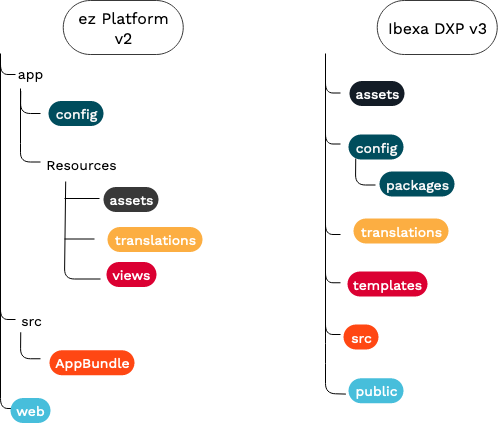

# Upgrading eZ Platform to v3.0

The following upgrade documentation describes how to perform upgrade eZ Platform from v2.5 to v3.0.

If you are upgrading from a version lower than v2.5, follow the [standard update procedure](../updating/updating_ez_platform.md) first.
Do not proceed with an upgrade to v3.0 before you complete an update to v2.5.

## 1\. Familiarize yourself with a new project structure

!!! tip

    For details on all changes related to the switch to Symfony 5,
    see [Symfony upgrade guide for 4.0](https://github.com/symfony/symfony/blob/4.4/UPGRADE-4.0.md)
    and [for 5.0](https://github.com/symfony/symfony/blob/5.0/UPGRADE-5.0.md)

The latest Symfony versions changed the organization of your project into folders and bundles.
When updating to eZ Platform v3 you need to move your files and modify file paths and namespace references.



#### Configuration

Configuration files have been moved from `app/Resources/config` to `config`.
Package-specific configuration is placed in `config/packages` (e.g. `config/packages/ezplatform_admin_ui.yaml`).
This folder also contains `config/packages/ezplatform.yaml`, which contains all settings coming in from Kernel.

#### PHP code and bundle organization

Since Symfony 4 your code is no longer organized in bundles.
`AppBundle` has been removed from eZ Platform.
You need to move all your PHP code, such as controllers or event listeners, to the `src` folder.
Use the `App` namespace for your custom code instead.

#### View templates

Templates are no longer stored in `app/Resources/views`.
You need to move all your templates to the `templates` folder in your project's root.

#### Translations

Translation files have been moved out of `app/Resources/translations` into `translations` in your project's root.

#### `web` and assets

Content of the `web` folder is now placed in `public`.
Content of `app/Resources/assets` has been moved to `assets`.

!!! note

    You also need to update paths that refer to the old location,
    for example in [`webpack.config.js`](../guide/project_organization.md#importing-configuration-from-a-bundle).

## 2\. Check out and update the app

1\. [Check out a tagged version](../updating/1_check_out_version.md)

2\. [Merge composer.json](../updating/2_merge_composer.md)

3\. [Update the app](../updating/3_update_app.md)

## 3\. Make changes to your code

!!! note "Full list of deprecations"

    If you encounter any issue during the upgrade,
    see [eZ Platform v3.0 deprecations](../releases/ez_platform_v3.0_deprecations.md#template-organization)
    for details of all required changes to your code.
    
### Automatic code refactoring - non-essential step

To simplify the process of adapting your code to Symfony 5, you can use [Rector, a reconstructor tool](https://github.com/rectorphp/rector)
that will automatically refactor your Symfony and PHPunit code.

To properly refactor your code, you might need to run the Rector `process` command for each Symfony version from 4.0 to 5.0 in turn:

`vendor/bin/rector process src --set symfony40`

You can find all the available sets in [the Rector repository](https://github.com/rectorphp/rector/tree/v0.7.65/config/set). 
Keep in mind that after automatic refactoring finishes there might be some code chunks that you need to fix manually.

### Third-party dependencies

Because eZ Platform v3 is based on Symfony 5, you need to make sure that all additional third-party dependencies
that your project uses have been adapted to Symfony 5.

### Templates

#### Back-Office templates

The naming and location of templates in the Back Office have been changed.
If you extend or modify these templates, you need to adapt your code.

For the full list of template changes, see [the list of removals and deprecations](../releases/ez_platform_v3.0_deprecations.md#template-organization).

#### Twig functions and filters

A number of [Twig functions, filters and helpers have been renamed](../releases/ez_platform_v3.0_deprecations.md#functions-renamed).
If your templates use them, you need to update them.

#### Templating component

[The templating component integration is now deprecated.](https://symfony.com/blog/new-in-symfony-4-3-deprecated-the-templating-component-integration)
As a result, the way to indicate a template path has changed.

For example:

- **Use:** `"@@EzPlatformUser/user_settings/list.html.twig"` **instead of:** `"EzPlatformUserBundle:user_settings:list.html.twig"`
- **Use:** `` **instead of:** ``

#### Form templates

Content Type editing has been [moved from `repository-forms` to `ezplatform-admin-ui`](../releases/ez_platform_v3.0_deprecations.md#content-type-forms).

Forms for content creation have been [moved from `repository-forms` to `ezplatform-content-forms`](../releases/ez_platform_v3.0_deprecations.md#repository-forms).

If your templates extend any of those built-in templates, you need to update their paths.

#### Deprecated controller actions

If your templates still use the deprecated `viewLocation` and `embedLocation` actions of `ViewController`,
you need to rewrite them to use `viewAction` and `embedAction` respectively.

#### Referencing controller actions

To reference a controller, you now need to use `serviceOrFqcn::method` syntax instead of
`bundle:controller:action`:

**Use:** `controller: My\ExampleBundle\Controller\DefaultController::articleViewAction`

**Instead of:** `controller: AcmeExampleBundle:Default:articleView`

### Configuration

#### `ezpublish` configuration key

The main YAML configuration key is now [`ezplatform` instead of `ezpublish`](../releases/ez_platform_v3.0_deprecations.md#configuration-through-ezplatform).
You need to change your configuration files to make use of the new key. For example:

**Use:**

``` yaml
ezplatform:
    system:
        default:
            # ...
```

**instead of:**

``` yaml
ezpublish:
    system:
        default:
            # ...
```

#### Resolving settings

If you used dynamic settings (through `$setting$`),
or got settings from the ConfigResolver in a class constructor,
you now need to rewrite your code to inject the ConfigResolver and get the relevant setting:

**Use:**

``` php
use eZ\Publish\Core\MVC\ConfigResolverInterface;

class MyService
{
    /** @var \eZ\Publish\Core\MVC\ConfigResolverInterface */
    private $configResolver;

    public function __construct(ConfigResolverInterface $configResolver)
    {
        $this->configResolver = $configResolver;
    }

    public function myMethodWhichUsesSetting(): void
    {
        $setting = $this->configResolver->getParameter('setting');
    }
}
```

**instead of:**

``` php
use eZ\Publish\Core\MVC\ConfigResolverInterface;

class MyService
{
    public function __construct(ConfigResolverInterface $configResolver)
    {
        $this->setting = $configResolver->getParameter('setting');
    }
}
```

### Field Types

You need to adapt your custom Field Types to the new Field Type architecture.

#### `eZ\Publish\SPI\FieldType\FieldType` interface

The `eZ\Publish\SPI\FieldType\FieldType` interface is now an abstract class.
You need to replace `implements FieldType` in your Field Type code with `extends FieldType`.

#### Deprecated `getName` method

The deprecated method `getName` from the `eZ\Publish\SPI\FieldType\FieldType` interface has been changed.
Now it accepts two additional parameters: `FieldDefinition $fieldDefinition` and `string $languageCode`.

In your code you need to change the `getName` signature
to `function getName(Value $value, FieldDefinition $fieldDefinition, string $languageCode): string;`.

#### `eZ\Publish\SPI\FieldType\Nameable` interface

The `eZ\Publish\SPI\FieldType\Nameable` interface has been removed.
In your code you need to remove implementations of `Nameable` and replace them with
`eZ\Publish\SPI\FieldType\FieldType::getName`.

#### Deprecated tags

You need to replace deprecated tags in service configuration:

|Deprecated tag|Current tag|
|---|---|
|ezpublish.fieldType.parameterProvider|ezplatform.field_type.parameter_provider|
|ezpublish.fieldType.externalStorageHandler|ezplatform.field_type.external_storage_handler|
|ezpublish.fieldType.externalStorageHandler.gateway|ezplatform.field_type.external_storage_handler.gateway|
|ezpublish.fieldType|ezplatform.field_type|
|ezpublish.fieldType.indexable|ezplatform.field_type.indexable|
|ezpublish.storageEngine.legacy.converter|ezplatform.field_type.legacy_storage.converter|
|ez.fieldFormMapper.definition|ezplatform.field_type.form_mapper.definition|
|ez.fieldFormMapper.value|ezplatform.field_type.form_mapper.value|

#### Moved classes

You need to replace importing the following classes:

|Previous location|Current location|
|---|---|
|EzSystems\RepositoryForms\Data\Content\FieldData|EzSystems\EzPlatformContentForms\Data\Content\FieldData|
|EzSystems\RepositoryForms\Data\FieldDefinitionData|EzSystems\EzPlatformAdminUi\Form\Data\FieldDefinitionData|
|EzSystems\RepositoryForms\FieldType\FieldDefinitionFormMapperInterface|EzSystems\EzPlatformAdminUi\FieldType\FieldDefinitionFormMapperInterface|
|EzSystems\RepositoryForms\FieldType\FieldValueFormMapperInterface|EzSystems\EzPlatformContentForms\FieldType\FieldValueFormMapperInterface|

#### Extending Field Type templates

If you extended templates for `ezobjectrelationlist_field`, `ezimageasset_field`, or `ezobjectrelation_field` Fields
using ``,
you now need to extend `EzSystemsPlatformHttpCache` instead, if you wish to make use of cache:
``.

### Signal Slots and Events

If you used Signal Slots to listen for events in you custom code,
you need to rewrite them using Symfony Events and Listeners instead.

The application now triggers two Events per operation: one before and one after the relevant thing happens
(see for example [Bookmark events](https://github.com/ezsystems/ezplatform-kernel/blob/v1.0.0/eZ/Publish/Core/Event/BookmarkService.php)).

To use them, create [Event Listeners](https://symfony.com/doc/5.0/event_dispatcher.html) in your code,
for example:

**Use:**

``` php
public static function getSubscribedEvents(): array
{
    return [
        CreateBookmarkEvent::class => 'onCreateBookmark',
    ]
}

public function onCreateBookmark(CreateBookmarkEvent $event): void
{
    /// your code
}
```

**instead of:**

``` php
public function receive(Signal $signal)
{
    if (!($signal instanceof CreateBookmarkSignal)) {
        return;
    }
}

// your code
```

### Online Editor and RichText

#### RichText

Deprecated code related to the RichText Field Type has been removed from `ezpublish-kernel`.

If your code still relies on the `eZ\Publish\Core\FieldType\RichText` namespace, you need to rewrite it
to use `EzSystems\EzPlatformRichText\eZ\RichText` instead.

#### Extra buttons

Configuring custom Online Editor buttons with `ezrichtext.alloy_editor.extra_buttons` is deprecated.

If you added custom buttons in this way, you need to rewrite your code to use
`ezplatform.system.<siteacces>.fieldtypes.ezrichtext.toolbars.<toolbar_identifier>.buttons` instead.

### Workflow

[`flex-workflow` has been combined with `ezplatform-workflow`](../releases/ez_platform_v3.0_deprecations.md#flex-workflow) in the form of a Quick Review functionality.

If you used custom subscribers for events in workflow, you can now rewrite this code
to use [custom actions](../extending/extending_workflow.md#adding-custom-actions).

To migrate your content which had been using Flex Workflow to the new Quick Review workflow,
run the following command:

`php bin/console ezplatform:migrate:flex-workflow`

### Universal Discovery Widget

If you extended the Universal Discovery Widget
(e.g. added your own tabs or triggered opening the UDW for your own customizations),
you need to rewrite this extension using the [new YAML configuration](../extending/extending_udw.md).

### Back Office extensibility

If you added custom tab groups in the Back Office,
you now need to [make use of the `TabsComponent`](../extending/extending_tabs.md#adding-a-new-tab-group).

### HTTP cache

HTTP cache bundle now uses FOS Cache Bundle v2.
If your code makes use of HTTP cache bundle, see [the list of changes and deprecations](../releases/ez_platform_v3.0_deprecations.md#http-cache-bundle).

### REST

If your code extends the REST API, you need to modify namespaces.
The `eZ\Publish\Core\REST` and `eZ\Publish\Core\REST\Common\` namespaces have been replaced by `EzSystems\EzPlatformRest`.
This is due to the fact that REST code has been moved from Kernel to a new `ezpublish-rest` package.

#### Custom installers

eZ Platform provides extension point to create named custom installer which can be used instead of the native one.
To use it, execute the Symfony command:

``` bash
php ./bin/console ezplatform:install <installer type name>
```

In eZ Platform v3.0, service definitions around that extension point have changed:

1\. The deprecated Clean Installer has been dropped from `ezpublish-kernel` package.
If your project uses custom installer and has relied on Clean Installer service definition (`ezplatform.installer.clean_installer`)
you need to switch to Core Installer.

**Use:**
    
``` php
services:
    Acme\App\Installer\MyCustomInstaller:
        parent: EzSystems\PlatformInstallerBundle\Installer\CoreInstaller
```

**instead of**:
    
``` php
services:
    Acme\App\Installer\MyCustomInstaller:
        parent: ezplatform.installer.clean_installer
```

`CoreInstaller` relies on [`DoctrineSchemaBundle`](https://github.com/ezsystems/doctrine-dbal-schema).
Custom schema can be installed defining Symfony Event Subscriber subscribing to `EzSystems\DoctrineSchema\API\Event\SchemaBuilderEvents::BUILD_SCHEMA` event.

2\. The deprecated Symfony Service definition `ezplatform.installer.db_based_installer` has been removed in favor of its FQCN-named definition.

**Use:**

``` php
services:
    Acme\App\Installer\MyCustomInstaller:
        parent: EzSystems\PlatformInstallerBundle\Installer\DbBasedInstaller
```

**instead of:**

``` php
services:
    Acme\App\Installer\MyCustomInstaller:
        parent: ezplatform.installer.db_based_installer
```

### Other changes

#### User checker

Add the user checker to firewall by adding the following line to `config/packages/security.yaml`:

``` yaml hl_lines="5"
security:
    firewalls:
        ezpublish_front:
            # ...
            user_checker: eZ\Publish\Core\MVC\Symfony\Security\UserChecker
            # ...
```

#### Command

If your custom commands use `Symfony\Bundle\FrameworkBundle\Command\ContainerAwareCommand`
you need to rewrite them to use `Symfony\Component\Console\Command\Command` instead,
because `ContainerAwareCommand` is deprecated.

#### Permission-related methods

Some deprecated [permission-related methods](../releases/ez_platform_v3.0_deprecations.md#permission-related-methods) have been removed.
If your code uses them, you need to rewrite it to use the permission resolver.

#### Container parameters

A numer of Symfony Dependency Injection Container parameters [have been dropped](https://github.com/ezsystems/ezplatform-kernel/blob/v1.0.0/doc/bc/1.0/dropped-container-parameters.md).

To check if your code uses them, search for all occurrences of `ezpublish\..*\.class` (regular expression pattern)
and [decorate Symfony services](https://symfony.com/doc/5.0/service_container/service_decoration.html) instead.

#### QueryTypes

If your code relies on automatically registering QueryTypes through the naming convention `<Bundle>\QueryType\*QueryType`,
you need to register your QueryTypes as services and tag them with `ezpublish.query`, or enable their automatic configuration (`autoconfigure: true`).

#### Symfony namespaces

The following Symfony namespaces have changed. You need to update your code if it uses any of them:

|Use|Instead of|
|---|---|
|Symfony\Contracts\Translation\TranslatorInterface|Symfony\Component\Translation\TranslatorInterface|
|Symfony\Contracts\EventDispatcher\Event|Symfony\Component\EventDispatcher\Event|

#### Deprecations

For a full list of changes, see [Deprecations and backwards compatibility breaks](../releases/ez_platform_v3.0_deprecations.md)

### Site Factory

For production, it is recommended to create the `ezsite` and `ezsite_public_access` tables manually importing their schemas definition:

??? "Table structure for table `ezsite` and `ezsite_public_access` (MySQL)"

    ```sql
    DROP TABLE IF EXISTS `ezsite`;
    
    CREATE TABLE `ezsite` (
      `id` int(11) NOT NULL AUTO_INCREMENT,
      `name` varchar(255) COLLATE utf8mb4_unicode_520_ci NOT NULL DEFAULT '',
      `created` int(11) NOT NULL,
      PRIMARY KEY (`id`)
    ) ENGINE=InnoDB DEFAULT CHARSET=utf8mb4;
    
    --
    --
    
    DROP TABLE IF EXISTS `ezsite_public_access`;
    
    CREATE TABLE `ezsite_public_access` (
      `public_access_identifier` varchar(255) COLLATE utf8mb4_unicode_520_ci NOT NULL,
      `site_id` int(11) NOT NULL,
      `site_access_group` varchar(255) COLLATE utf8mb4_unicode_520_ci NOT NULL DEFAULT '',
      `status` int(11) NOT NULL,
      `config` text COLLATE utf8mb4_unicode_520_ci NOT NULL,
      `site_matcher_host` varchar(255) COLLATE utf8mb4_unicode_520_ci DEFAULT NULL,
      PRIMARY KEY (`public_access_identifier`),
      KEY `ezsite_public_access_site_id` (`site_id`),
      CONSTRAINT `fk_ezsite_public_access_site_id` FOREIGN KEY (`site_id`) REFERENCES `ezsite` (`id`)
    ) ENGINE=InnoDB DEFAULT CHARSET=utf8mb4;
    ```

??? "Table structure for table `ezsite` and `ezsite_public_access` (PostgreSQL)"

    ```sql
    DROP TABLE IF EXISTS ezsite;
    
    CREATE SEQUENCE ezsite_seq;
    
    CREATE TABLE ezsite (
      id int NOT NULL DEFAULT NEXTVAL ('ezsite_seq'),
      name varchar(255) NOT NULL DEFAULT '',
      created int NOT NULL,
      PRIMARY KEY (id)
    ) ;
    
    --
    --
    
    DROP TABLE IF EXISTS ezsite_public_access;
    
    CREATE TABLE ezsite_public_access (
      public_access_identifier varchar(255) NOT NULL,
      site_id int NOT NULL,
      site_access_group varchar(255) NOT NULL DEFAULT '',
      status int NOT NULL,
      config text NOT NULL,
      site_matcher_host varchar(255) DEFAULT NULL,
      PRIMARY KEY (public_access_identifier),
      CONSTRAINT fk_ezsite_public_access_site_id FOREIGN KEY (site_id) REFERENCES ezsite (id)
    ) ;
    
    CREATE INDEX ezsite_public_access_site_id ON ezsite_public_access (site_id);
    ```

### Update Apache/Nginx configuration

Make sure that you Apache/Nginx configuration is up to date with Symfony 5.
Refer to [the provided `vhost.template`](https://github.com/ezsystems/ezplatform/blob/master/doc/apache2/vhost.template)
for an example.

## 4\. Update the database

Apply the following database update script:

`mysql -u <username> -p <password> <database_name> < upgrade/db/mysql/ezplatform-2.5.latest-to-3.0.0.sql`

or for PostgreSQL:

`psql <database_name> < upgrade/db/postgresql/ezplatform-2.5.latest-to-3.0.0.sql`

!!! enterprise

    ### Date-based publisher database update

    Apply the following database update script for the Date-based publisher.

    For MySQL:

    ``` sql
    BEGIN;
    ALTER TABLE  `ezdatebasedpublisher_scheduled_version`
    CHANGE COLUMN `publication_date` `date` INT(11) NOT NULL;
    ALTER TABLE  `ezdatebasedpublisher_scheduled_version`
    ADD COLUMN `action` VARCHAR(32);
    UPDATE `ezdatebasedpublisher_scheduled_version` SET `action` = 'publish';
    ALTER TABLE  `ezdatebasedpublisher_scheduled_version` CHANGE COLUMN `action` `action` VARCHAR(32) NOT NULL;
    COMMIT;
    ```

    For PostgreSQL:

    ``` sql
    BEGIN;
    ALTER TABLE ezdatebasedpublisher_scheduled_version RENAME COLUMN publication_date TO date;
    ALTER TABLE ezdatebasedpublisher_scheduled_version ADD COLUMN action VARCHAR(32);
    UPDATE ezdatebasedpublisher_scheduled_version SET action = 'publish';
    ALTER TABLE ezdatebasedpublisher_scheduled_version ALTER COLUMN action SET NOT NULL ;
    COMMIT;
    ```

## 5\. Continue with the update procedure

At this point you can continue with the standard update procedure:

5\. [Platform.sh changes](../updating/5_platform_sh_changes.md)

6\. [Dump assets](../updating/../updating/6_dump_assets.md)

7\. [Commit, test and merge](../updating/7_commit_test_merge.md)
