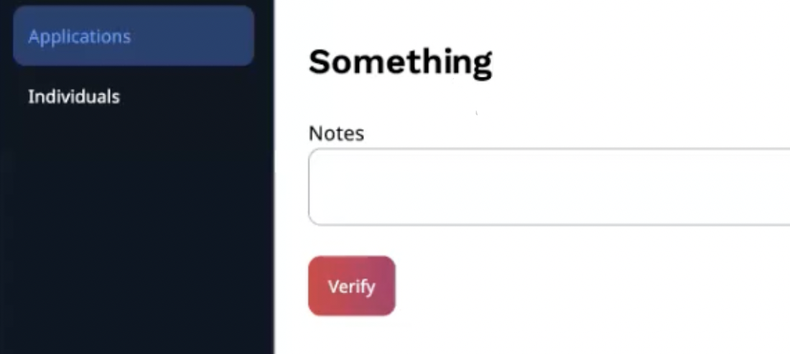
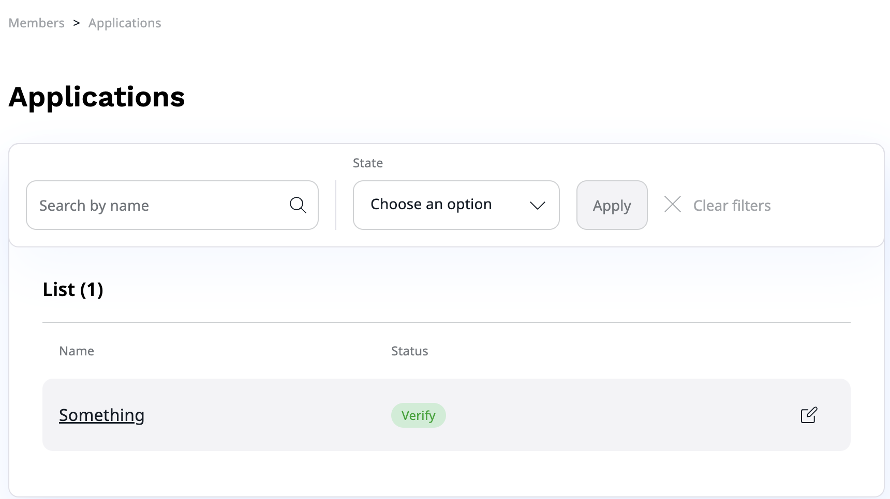

# Customer Portal applications

New business customers can apply for a company by themselves.
Applications go through the approval process in the Back Office where they can be accepted, rejected or put on hold.
If they are accepted, the business partner will receive an invitation link to the Customer Portal,
where they can set up their team and manage their account.

For more information on company self-registration, see [user guide documentation](https://doc.ibexa.co/projects/userguide/en/latest/shop_administration/company_self_registration/).
If provided options are too limited, you can customize an approval process by yourself.

## Customization of an approval process

In this procedure, you will add a new status to the approval process of business application.

### Add new status

First, go to `config/packages/ibexa.yaml` and new `verify` status to the configuration:

```yaml
ibexa:
    system:
        default:
            corporate_accounts:
                application:
                    states: [ 'new', 'accept', 'on_hold', 'reject', 'verify' ]
```

### Create new Form Type

Next, create a new form type in `src/Form/VerifyType.php`.
It will be displayed after you select **Verify** in the Back Office **Applications** section.

``` php
[[= include_file('code_samples/customer_portal/src/Form/VerifyType.php', 20, 21) =]]
```

Line 28 defines where the form should be displayed, line 20 adds **note** field, and line 21 adds the **verify** button.

### Create event subscriber to pass the form

Add event subscriber that will pass new Form Type to the frontend.
Create `src/Corporate/EventSubscriber/ApplicationDetailsViewSubscriber.php` following below example:

``` php
[[= include_file('code_samples/customer_portal/src/Corporate/EventSubscriber/ApplicationDetailsViewSubscriber.php', 39) =]]
```

In line 39 you can see `verify_form` parameter that adds new form to the reviewing application view.

### Add form template

To be able to see the changes you need to add
a new template `templates/themes/admin/corporate_account/application/details.html.twig`.

``` html+twig
[[= include_file('code_samples/customer_portal/templates/themes/admin/corporate_account/application/details.html.twig') =]]
```

It will overwrite the default view and add **Verify** button to the review view.
To check the progress, got to **Members** -> **Applications** -> select one application from the list -> inspect application review view for a new button.



### Create event subscriber to verify state

Now, you need to pass the information that the button has been selected to the list of applications to change the application status.
Create another event subscriber that will pass the information
from the created form `src/Corporate/EventSubscriber/VerifyStateEventSubscriber.php`.

``` php
[[= include_file('code_samples/customer_portal/src/Corporate/EventSubscriber/VerifyStateEventSubscriber.php', 46) =]]
```

In line 46, you can see that it handles changes to verify status.
The subscriber only informs that the status has been changed.
It is visible in line 72.

Now, if you click **Verify** button in the review application view, the application will get **Verify** status.


