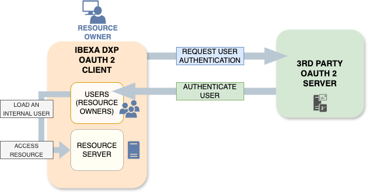

# OAuth client

You can use OAuth2 to securely authenticate users with external Authorization Servers.



[[= product_name =]] uses an integration with [`knpuniversity/oauth2-client-bundle`](https://github.com/knpuniversity/oauth2-client-bundle)
to provide OAuth2 authentication.

## Configure OAuth2 client

### Configure connection to Authorization Server

Details of the configuration depend on the OAuth2 Authorization Server that you want to use.
For sample configurations for different providers,
see [`knpuniversity/oauth2-client-bundle` configuration](https://github.com/knpuniversity/oauth2-client-bundle#configuration).
Some client types require additional packages.
(Missing package is, at least, indicated in an error message.)

For example, the following configuration creates a `google` client for Google OAuth2 Authorization Server to log users in.
The two environment variables `OAUTH_GOOGLE_CLIENT_ID` and `OAUTH_GOOGLE_CLIENT_SECRET`
correspond to [the set-up on Google side](https://support.google.com/cloud/answer/6158849).

``` yaml
[[= include_file('code_samples/user_management/oauth_google/config/packages/knpu_oauth2_client.yaml') =]]
```

To use the `google` client type, you must install the following package:

```bash
composer require league/oauth2-google
```

### Enable OAuth2 client

The client must be associated to a [SiteAccess scope](multisite_configuration.md#scope).

In the following example, the OAuth2 client `google` is enabled for the `admin` SiteAccess:

``` yaml
[[= include_file('code_samples/user_management/oauth_google/config/packages/oauth.yaml') =]]
```

## Configure firewall

In `config/packages/security.yaml`, enable the `oauth2_connect` firewall and replace the `ibexa_front` firewall with the `ibexa_oauth2_front` one.

``` yaml
[[= include_file('code_samples/user_management/oauth_google/config/packages/security.yaml') =]]
```

The `guard.authenticators` setting specifies the [Guard authenticators]([[= symfony_doc =]]/security/guard_authentication.html) to be used.

By adding the `Ibexa\Bundle\OAuth2Client\Security\Authenticator\OAuth2Authenticator` guard authenticator you add a possibility to use OAuth2 on those routes.

## Resource owner mappers

Resource owner mappers map the data received from the OAuth2 authorization server to user information in the Repository.

Resource owner mappers must implement the `Ibexa\Contracts\OAuth2Client\ResourceOwner\ResourceOwnerMapper` interface.
Four implementations of `ResourceOwnerMapper` are proposed by default:

- `ResourceOwnerToExistingUserMapper` is the base class extended by the following mappers:
    - `ResourceOwnerIdToUserMapper` doesn't create a new user, but loads a user (resource owner) based on their identifier.
    - `ResourceOwnerEmailToUserMapper` doesn't create a new user, but loads a user (resource owner) based on their email.
- `ResourceOwnerToExistingOrNewUserMapper` checks if the user exists and loads them if they do.
  If they don't, the mapper creates a new user in the Repository.

To use `ResourceOwnerToExistingOrNewUserMapper`, you need to extend it in your custom mapper.

!!! tip "OAuth User content type"

    When you implement your own mapper for external login,
    it is good practice to create a special User content type for users registered in this way.
    This is because users who register through an external service do not have a separate password in the system.
    Instead, they log in by their external service's password.

    To avoid issues with password restrictions in the built-in User content type,
    create a special content type (for example, "OAuth User"), without restrictions on the password.

    This new content type must also contain the User (`ezuser`) Field.

The following example shows how to create a Resource Owner mapper for the `google` client from previous examples.

Create a resource owner mapper for Google login in `src/OAuth/GoogleResourceOwnerMapper.php`.
The mapper extends `ResourceOwnerToExistingOrNewUserMapper`,
which enables it to create a new user in the Repository if the user doesn't exist yet.

The mapper loads a user (line 51) or creates a new one (line 61),
based on the information from `resourceOwner`, that's the OAuth2 authorization server.

The new username is set with a `google:` prefix (lines 19, 106), to avoid conflicts with users registered in a regular way.

``` php hl_lines="19 51 61 106"
[[= include_file('code_samples/user_management/oauth_google/src/OAuth/GoogleResourceOwnerMapper.php') =]]
```

Configure the service by using the `ibexa.oauth2_client.resource_owner_mapper` tag to associate it with the `google` client:

``` yaml
[[= include_file('code_samples/user_management/oauth_google/config/custom_services.yaml', 0, 6) =]]
```

## Add login button

After you have activated the OAuth2 client for the `admin` SiteAccess,
here is how to add a **Log in with Google** to the Back Office login form.

Create the following template file in `templates/themes/admin/account/login/oauth2_login.html.twig`:

``` html+twig
[[= include_file('code_samples/user_management/oauth_google/templates/themes/admin/account/login/oauth2_login.html.twig') =]]
```

For more information about the OAuth connection URL Twig functions,
see [`ibexa_oauth2_connect_path`](url_twig_functions.md#ibexa_oauth2_connect_path)
and [`ibexa_oauth2_connect_url`](url_twig_functions.md#ibexa_oauth2_connect_url).

Finally, add the template to the login form by using the `login-form-after` [component](custom_components.md):

``` yaml
services:
    #…

[[= include_file('code_samples/user_management/oauth_google/config/custom_services.yaml', 7, 13) =]]
```


