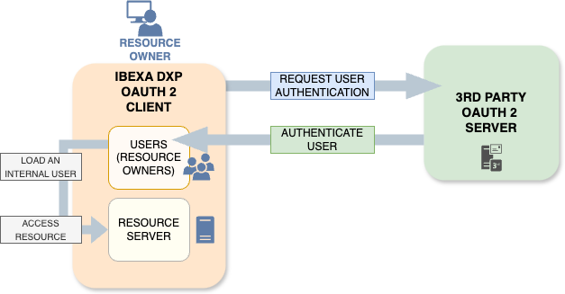

# OAuth client

You can use OAuth2 to securely authenticate users with external Authorization Servers.

TODO: Limitations. Ibexa DXP OAuth client won't access to resources on a third party Resource Server, not even if it's the same organisation as the Authorization Server. For example, you can access Google user information after some used is Google account to log into an Ibexa DXP.



[[= product_name =]] uses an integration with [`knpuniversity/oauth2-client-bundle`](https://github.com/knpuniversity/oauth2-client-bundle)
to provide OAuth2 authentication.

## Configure OAuth2 client

### Configure connexion to Authorization Server

Details of the configuration depend on the OAuth2 Authorization Server that you want to use.
For sample configurations for different providers,
see [`knpuniversity/oauth2-client-bundle` configuration](https://github.com/knpuniversity/oauth2-client-bundle#configuration).
Notice that some client types need additional packages.
(If the package is missing, at least, it will be indicated in an error message.)

For example, the following configuration create a `google` client for Google OAuth2 Authorisation Server to log users in.
The two environment variables `OAUTH_GOOGLE_CLIENT_ID` and `OAUTH_GOOGLE_CLIENT_SECRET`
correspond to [the set-up on Google side](https://support.google.com/cloud/answer/6158849).

``` yaml
[[= include_file('code_samples/user_management/oauth_google/config/packages/knpu_oauth2_client.yaml') =]]
```

To use the `google` type, the following package must be added:

```bash
composer require league/oauth2-google
```

### Enable OAuth2 client

The client must be associated to a [SiteAccess scope](multisite_configuration.md#scope).

In the following example, the previous OAuth2 client `google` is enabled for the `admin` SiteAccess:

``` yaml
[[= include_file('code_samples/user_management/oauth_google/config/packages/oauth.yaml') =]]
```

## Configure firewall

TODO: What happens when the OAuth client is at a SiteAccess level while Firewalls are not SiteAccess aware?
Can `admin` can still work if only `site` as an OAuth client? 
Maybe domains in firewall configs to have regular auth on `admin` dedicated domain and OAuth on `site` dedicated domain?

In `config/packages/security.yaml`,
enable the `oauth2_connect` firewall,
and replace the `ibexa_front` firewall with the `ibexa_oauth2_front` one.

``` yaml
[[= include_file('code_samples/user_management/oauth_google/config/packages/security.yaml') =]]
```

The `guard.authenticators` setting specifies the [Guard authenticators]([[= symfony_doc =]]/security/guard_authentication.html) to use.

The addition of the `Ibexa\Bundle\OAuth2Client\Security\Authenticator\OAuth2Authenticator` guard authenticator adds the possibility to use OAuth2 on those routes.

## Resource owner mappers

Resource owner mappers map the data received from the OAuth2 provider to user information in the Repository.

Resource owner mappers must implement the `Ibexa\Contracts\OAuth2Client\ResourceOwner\ResourceOwnerMapper` interface.
There are four existing implementations of `ResourceOwnerMapper`:

- `ResourceOwnerToExistingUserMapper` is the base class that is extended by the following mappers:
    - `ResourceOwnerIdToUserMapper` does not create a new user, but loads a user (resource owner) based on their identifier.
    - `ResourceOwnerEmailToUserMapper` does not create a new user, but loads a user (resource owner) based on their email.
- `ResourceOwnerToExistingOrNewUserMapper` checks if the user exists and loads them if they do.
  If they do not, the mapper creates a new user in the Repository.

To use `ResourceOwnerToExistingOrNewUserMapper` you need to extend it in your custom mapper.

!!! tip "OAuth User Content Type"

    When you implement your own mapper for external login,
    it is good practice to create a special User Content Type for users registered in this way.
    
    This is because users who register through an external service do not have a separate password in the system.
    Instead, they log in by their external service's password.
    
    To avoid issues with password restrictions in the built-in User Content Type,
    create a special Content Type (for example, "OAuth User"), without restrictions on the password.
    
    This new Content Type must also contain the User (`ezuser`) Field.

The following example is the creation of a Resource Owner mapper for the `google` client from previous examples.

Create a resource owner mapper for Google login in `src/OAuth/GoogleResourceOwnerMapper.php`.
The mapper extends `ResourceOwnerToExistingOrNewUserMapper`,
which enables it to create a new user in the Repository if the user does not exist yet.

The mapper loads a user (line 51) or creates a new one (line 61),
based on the information from `resourceOwner`, that is the OAuth provider.

The new username is set with a `google:` prefix (lines 19, 106), to avoid conflicts with users registered in a regular way.

``` php hl_lines="19 51 61 106"
[[= include_file('code_samples/user_management/oauth_google/src/OAuth/GoogleResourceOwnerMapper.php') =]]
```

Configure the service by using the `ibexa.oauth2_client.resource_owner_mapper` tag to associate it with the `google` client:

``` yaml
[[= include_file('code_samples/user_management/oauth_google/config/custom_services.yaml', 0, 6) =]]
```

## Add login button

Continuing previous example activating the OAuth2 client for the `admin` SiteAccess,
here is how to add a **Log in with Google** to the Back Office login form.

Create the following template file in `templates/themes/admin/account/login/oauth2_login.html.twig`:

``` html+twig
[[= include_file('code_samples/user_management/oauth_google/templates/themes/admin/account/login/oauth2_login.html.twig') =]]
```

TODO: Make this Twig func def clearer

The `ibexa_oauth2_connect_path` Twig function builds a path (a URI without scheme nor host) to the `/oauth2/connect/{identifier}` (`ibexa.oauth2.connect`) route (previously mentioned in the `oauth2_connect`).
Its first argument is the client identifier.
Its optional second argument is a hash of GET parameters as keys, and their values.
Its optional third argument is a boolean indicating if the generated URL must be relative or not (default is `false` for an absolute URl stating with `/`).

The `ibexa_oauth2_connect_url` Twig function is also available to build URL including the domain or host.
Its first argument is the client identifier.
Its optional second argument is a hash of GET parameters as keys, and their values.
Its optional third argument is a boolean indicating if the generated URL must be scheme-relative (starting with `//` followed by the host) or not (default is `false` for an absolute URl starting with the scheme `https://` or `http://`).


Finally, add the template to the login form by using the `login-form-after` [component](custom_components.md):

``` yaml
services:
    #…

[[= include_file('code_samples/user_management/oauth_google/config/custom_services.yaml', 7, 13) =]]
```


