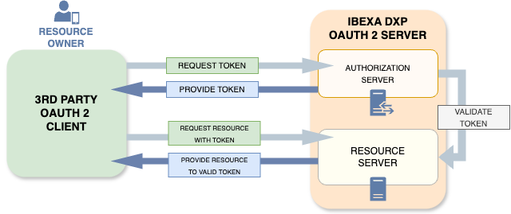

# OAuth Server

Your [[= product_name =]] instance can be used as an OAuth2 server, combining the roles of an Authorization Server and a Resource Server.
Client applications, such as mobile apps, are able to authenticate a user, and then access this user's resources.



## Server installation

[[= product_name =]] Oauth2 server package is `ibexa/oauth2-server` and is not part of the default installation.
You can install it with the following command:

```bash
composer require ibexa/oauth2-server --with-all-dependencies
```

Then, in `config/bundles.php`, at the end of an array with a list of bundles, add the following two lines :

```php
<?php

return [
    // A lot of bundles…
    Ibexa\Bundle\OAuth2Server\IbexaOAuth2ServerBundle::class => ['all' => true],
    League\Bundle\OAuth2ServerBundle\LeagueOAuth2ServerBundle::class => ['all' => true],
];
```

Add the tables needed by the bundle:

=== "MySQL"

    ```bash
    mysql -u <username> -p <password> <database_name> -e 'SET FOREIGN_KEY_CHECKS=0;'
    php bin/console ibexa:doctrine:schema:dump-sql vendor/ibexa/oauth2-server/src/bundle/Resources/config/schema.yaml | mysql -u <username> -p <password> <database_name>
    mysql -u <username> -p <password> <database_name> -e 'SET FOREIGN_KEY_CHECKS=1;'
    ```

=== "PostgreSQL"

    ```bash
    php bin/console ibexa:doctrine:schema:dump-sql --force-platform=postgres vendor/ibexa/oauth2-server/src/bundle/Resources/config/schema.yaml | psql <database_name>
    ```

## Authorization Server configuration

### Keys

To configure the server, you need private and public keys.
For more information, see [Generating public and private keys](https://oauth2.thephpleague.com/installation/#generating-public-and-private-keys).

You also need an encryption key.
For more information, see [Generating encryption keys](https://oauth2.thephpleague.com/installation/#generating-encryption-keys).

Set the following environment variables:

```
OAUTH2_PUBLIC_KEY_PATH=/somewhere/safe/key.public
OAUTH2_PRIVATE_KEY_PATH=/somewhere/safe/key.private
OAUTH2_PRIVATE_KEY_PASSPHRASE=some_passphrase_or_empty
OAUTH2_ENCRYPTION_KEY=1234567890123456789012345678901234567890
```

### Service, routes, and security configurations

Uncomment the whole service configuration file: `config/packages/ibexa_oauth2_server.yaml`.
Tweak the values if necessary.

Uncomment the whole routes configuration file: `config/routes/ibexa_oauth2_server.yaml`.

In `config/packages/security.yaml`, uncomment the following three lines under the `access_control` key:

```yaml
security:
    #…

    # Uncomment authorize access control if you wish to use product as an OAuth2 Server
    access_control:
        - { path: ^/authorize/jwks$, roles: ~ }
        - { path: ^/authorize, roles: IS_AUTHENTICATED_REMEMBERED }
```

In `config/packages/security.yaml`, uncomment the three following lines under the `oauth2_token` key:

```yaml
security:
    #…
    firewall:
        #…

        # Uncomment oauth2_token firewall if you wish to use product as an OAuth2 Server.
        # Use oauth2 guard any other (for example ibexa_front) firewall you wish to be
        # exposed as OAuth2-available resource. Example:
        #    guard:
        #        authenticators:
        #            - Ibexa\OAuth2Server\Security\Guard\OAuth2Authenticator
        oauth2_token:
            pattern: ^/token$
            security: false
```

## Resource Server configuration

To allow resource routes to be accessible through OAuth authorization,
you must define a firewall by using `Ibexa\OAuth2Server\Security\Guard\OAuth2Authenticator`.

The following firewall example allows the REST API to be accessed as an OAuth resource.
It must be placed before the firewall with a less restrictive pattern like `ibexa_front`.

```yaml
    #…
    firewall:
        #…

        ibexa_rest_oauth:
            pattern: ^/api/ibexa/v2
            user_checker: Ibexa\Core\MVC\Symfony\Security\UserChecker
            anonymous: ~
            guard:
                authenticators:
                    - Ibexa\OAuth2Server\Security\Guard\OAuth2Authenticator
                entry_point: Ibexa\OAuth2Server\Security\Guard\OAuth2Authenticator
            stateless: true

        ibexa_front:
            pattern: ^/
            #…
```

## Client

### Add a client

You need the client redirect URIs to create a client.
You also need to agree on an identifier and a secret with the client.
There is only one `default` [scope](https://oauth.net/2/scope/).

Use `league:oauth2-server:create-client` command to create a client.
For example:

```bash
php bin/console league:oauth2-server:create-client 'Example OAuth2 Client' example-oauth2-client 9876543210987654321098765432109876543210 --scope=default \
  --redirect-uri=https://example.com/oauth2-callback
```

!!! note

    You can call `--redirect-uri` multiple times.

Alternatively, you could add redirect URIs after you create a client, by using the `league:oauth2-server:update-client` command.
For example:

```bash
php bin/console league:oauth2-server:update-client example-oauth2-client \
  --add-redirect-uri=https://example.com/another-oauth2-callback
```

Other commands let you list all the configured clients (`league:oauth2-server:list-clients`)
or delete a client (`league:oauth2-server:delete-client`).

!!! note

    For a list of all the commands that you can use maintain your clients, in a terminal, run `bin/console list league:oauth2-server`.
    To see usage details for each of the commands, run `bin/console help <command>` . 

    For more information, see the package's [online documentation](https://github.com/thephpleague/oauth2-server-bundle/blob/master/docs/basic-setup.md).

### Information needed by the client

Your OAuth2 client needs the following information to be able to use your Oauth server:

- The URL of the [[= product_name =]] used as an oauth server
- The client identifier
- The client secret
- The scope (`default`)
