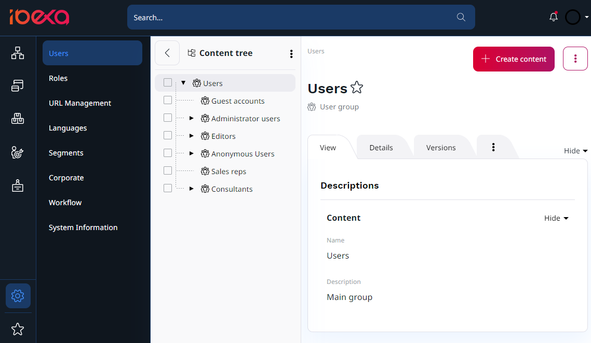
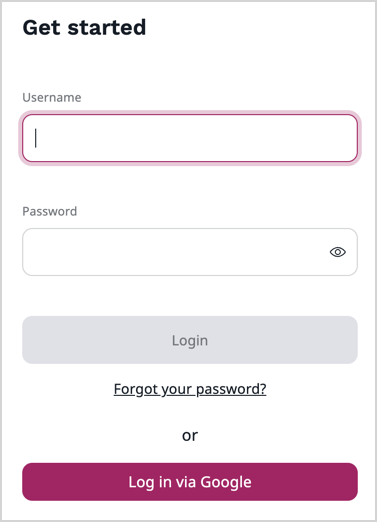

# User management product guide

User management is a fundamental aspect of any system. 
[[= product-name =]] offers a comprehensive and feature-rich user management system that allows organizations to efficiently manage their digital ecosystem.

## What is user management

User management refers to the process of granting, configuring, and controlling access for users by administrators. 
This encompasses the creation of user accounts, assigning roles and permissions, setting authentication methods, and managing user-related data.

## Availability

User management is available in all [[= product_name =]] versions.

## How does user management work

[[= product-name =]] simplifies user management with an intuitive and powerful system of accounts, Roles, Permissions, groups and Segments.
You can find all User Groups and Users in the **Admin Panel** by selecting **Users**. 
Here, you can manage users, their relations, Roles and Policies.

Here's how it works:

- user accounts - create and manage user accounts. This includes capturing user information, such as name, email, and profile details.

- Roles and Permissions - define Roles and assign Permissions to them. This ensures that users have appropriate access to content and functionalities. Roles can be customized to match the organization's specific needs.

- authentication methods - enable multiple authentication methods, including traditional username and password, OAuth, and external service logins. This flexibility allows organizations to adapt to various user authentication requirements.

- user segmentation - Segment users based on criteria such as demographics, behavior, or preferences. This segmentation enables personalized content delivery and targeted marketing.

- invitations - invite users to join a platform. This is useful for onboarding new users or sending invitations for exclusive content or events.

- Customer Groups - organize users into Customer Groups, which helps in delivering tailored experiences and content to specific segments.

## Capabilities

### User Roles and Permissions

Ibexa allows you to define custom user Roles with granular Permissions, ensuring that users have access to only the specific parts of the system they need. 
Furthermore, you can create user groups to simplify Permission management.
Assign multiple users to a group to ensure consistency and ease of access control.
This helps maintain effortless security and control.

### Customer Groups

The customer group functionality allows for targeted content delivery and service offerings.
Set specific permissions for customer groups to control who can access and edit certain content ot get specific recommendations.

Possible uses:

Product Recommendations - Create customer groups based on product preferences and offer tailored product recommendations.

Targeted Marketing Campaigns - Segment users by demographics or behavior and deliver targeted marketing campaigns that resonate with specific groups.

Content Access Control - Restrict access to premium or specialized content to specific customer groups, such as paid subscribers or loyal customers.

The detailed capabilities of [[= product_name_base =]] User Management, along with these practical use cases, provide organizations with the tools they need to deliver personalized, secure, and efficient user experiences while ensuring that user access and content delivery align with their business goals and strategies.

### Custom Policies

Tailor user access control to your unique requirements using custom policies. Define complex rules and access criteria for different users or groups.

### Limitations

Implement limitations on user actions based on specific criteria, such as time-based restrictions or geographic locations.

### Synchronization with external systems

Integrate Ibexa with your existing systems, such as LDAP or SAML, to ensure seamless user management across your organization.

### Authentication methods

Ibexa offers flexibility in authentication methods to cater to different user bases and security requirements.

The system's OAuth integration allows users to log in with their existing social media or third-party credentials, supporting OAuth 2.0 for easy integration with services like Google, Facebook, and Twitter.

Available options:

- [Username and password](user_management.md) - ideal for most users, this traditional method offers a secure login process with username and password.
- [OAuth](oauth_authentication.md) - integrating OAuth authentication allows users to log in using their existing social media or third-party credentials, streamlining the registration process.
- [external service](add_login_through_external_service.md) - for enterprise users, integration with an external service like Active Directory or LDAP ensures that user authentication aligns with the organization's existing systems.

### Invitations

The [invitation system](invitations.md) streamlines user onboarding and engagement.
Track the status of invitations, including when they were sent, whether they were accepted, and the actions taken by users who accepted them.

### User segmentation and personalization

[[= product_name_base =]]'s segmentation and personalization features allow organizations to deliver customized user experiences.
Track user behavior, such as page views, search queries, and interactions, to create Segments and Segment Groups for users who share similar actions.

Possible uses:

- Demographics - Segment users based on demographic data such as age, location, and gender to personalize content, promotions, and recommendations.
- Behavior - Tailor content based on user behavior, such as frequent content consumption, shopping patterns, or search history, ensuring users see what they're interested in.
- Preferences - Utilize user preferences to offer a customized experience, from language preferences to content type preferences.

## Benefits

### Improved user experience

With role-based access control and personalized content, users have a more engaging and relevant experience on your platform.

### Enhanced security

The flexible authentication methods and Permission management help safeguard sensitive data and maintain security.

With the ability to define and manage user Roles and Permissions, clients can ensure that sensitive data and actions are protected.
User management helps prevent unauthorized access.

### Efficient user onboarding

Invitations and easy account creation streamline the process of onboarding new users.

### Targeted marketing

Customer groups and user segmentation capabilities allow for targeted and effective marketing campaigns.

### Content governance

Clients can enforce content governance by controlling who can edit and publish content. 
This ensures quality and consistency in their digital properties.

### Content relevance

By delivering content that resonates with different user segments, clients can increase user engagement and retention.

### Customizability

Clients can adapt the user management system to their unique needs. 
Custom policies and limitations enable tailored solutions that align with their specific use cases.

